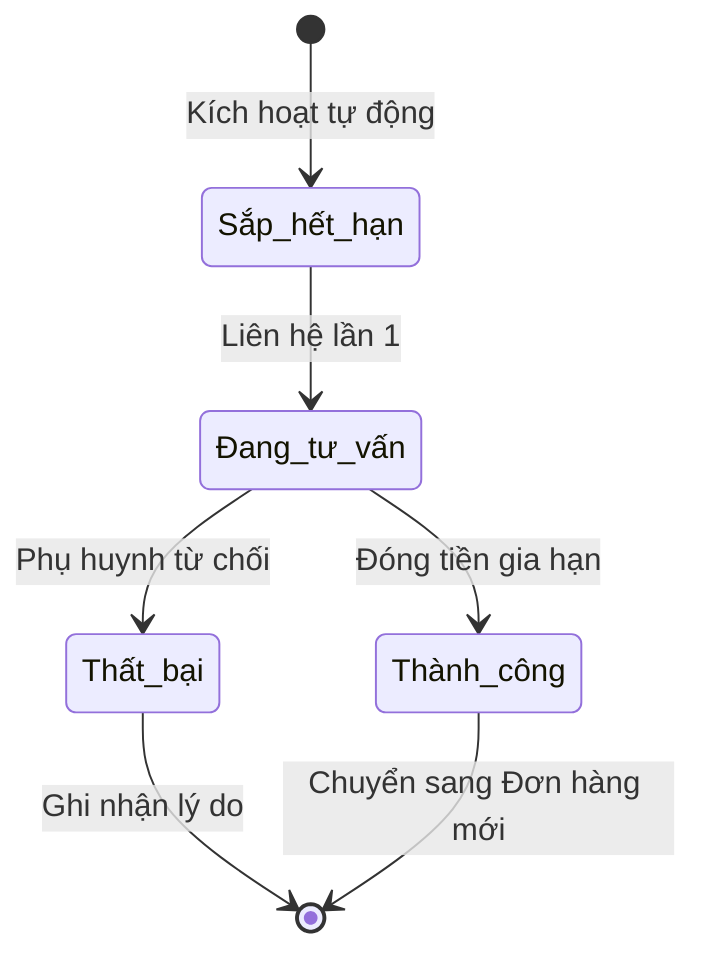

# BF-CARE-02: Chiến dịch Tái phí

> **Capability:** CAP-CARE (Năng lực Chăm sóc Học viên)
> **Giai đoạn:** 2 - Vận hành
> **Nhóm chức năng:** Chăm sóc
> **Mã màn hình:** `renewal`, `expiring_soon_care`

---

## 1. Mô tả tổng quan

Phân hệ quản lý quy trình tái phí (renewal) và giữ chân học viên (retention). Hệ thống theo dõi học viên sắp hết hạn (dựa trên số buổi học hoặc thời hạn gói học), tự động đưa vào danh sách phễu chăm sóc tái phí, quản lý việc tư vấn, đề xuất lộ trình tiếp theo và thống kê tỷ lệ chuyển đổi.

## 2. Đối tượng sử dụng (Vai trò)

- **Chuyên viên Chăm sóc (CSM):** Người trực tiếp liên hệ phụ huynh để tư vấn gia hạn khóa học.
- **Quản lý Chi nhánh:** Theo dõi tỷ lệ tái phí của cơ sở và hỗ trợ chốt các ca khó.
- **Nhân viên Bán hàng (Sales):** Nhận bàn giao để lên đơn hàng nếu trung tâm có quy trình chốt sale tách biệt.

## 3. Ranh giới Nghiệp vụ (Scope)

### Có bao gồm (In Scope)
- Cấu hình điều kiện cảnh báo sắp hết hạn (Ví dụ: còn 5 buổi, hoặc còn 15 ngày).
- Quản lý danh sách (Phễu) học viên cần chăm sóc tái phí.
- Ghi nhận lịch sử tương tác, lý do từ chối (nếu có), hoặc nguyện vọng học tiếp.
- Đề xuất chương trình học tiếp theo (Upsell/Cross-sell).

### Không bao gồm (Out of Scope)
- Tạo Đơn hàng và thu tiền → Thuộc `CAP-COM` và `CAP-FIN`.
- Xử lý khiếu nại, chăm sóc định kỳ → Xử lý tại `BF-CARE-01`.

## 4. Mô hình Dữ liệu Nghiệp vụ (Data Entities)

| Tên Thực thể | Trường định danh | Thuộc tính quan trọng | Ràng buộc quan hệ | Diễn giải |
|--------------|------------------|-----------------------|-------------------|----------|
| Hồ sơ Tái phí | Mã hồ sơ | Trạng thái, Lý do từ chối (nếu có), Ngày hết hạn dự kiến | Trỏ về Mã Học viên | Vé theo dõi tiến trình chốt tái phí. |
| Lý do Từ chối | Mã lý do | Tên lý do (Chuyển nhà, Học phí cao) | Độc lập | Danh mục lý do để báo cáo. |

### 4.1. Vòng đời Trạng thái (Status Lifecycle)

*Sơ đồ dưới đây xác định tất cả trạng thái hợp lệ và các phép chuyển đổi được phép đối với Hồ sơ Tái phí.*

**Quy tắc chuyển đổi:**

| Từ trạng thái | Sang trạng thái | Điều kiện bắt buộc | Vai trò được phép |
|---------------|-----------------|---------------------|-------------------|
| Bất kỳ | Thành công | Có Đơn hàng mới phát sinh (CAP-COM) | Hệ thống tự động |
| Đang tư vấn | Thất bại | Phải chọn Lý do từ chối | Chuyên viên Chăm sóc |

### 4.2. Ví dụ Dữ liệu mẫu

*Giúp AI và Lập trình viên tạo dữ liệu kiểm thử chính xác.*

| Tình huống | Dữ liệu đầu vào | Kết quả mong đợi |
|------------|-----------------|-------------------|
| Tự động cảnh báo | Học viên B còn 4 buổi học (Ngưỡng cảnh báo = 5) | Hồ sơ chuyển vào Phễu Tái phí, trạng thái "Sắp hết hạn". |
| Báo cáo thất bại | Phụ huynh chuyển trường, chọn lý do "Chuyển nơi ở" | Hồ sơ đóng lại ở trạng thái Thất bại. |
| Gia hạn thành công | Học viên B đóng tiền gói mới ở quầy | Hệ thống tự bắt sự kiện từ Đơn hàng, đóng hồ sơ tái phí thành "Thành công". |

## 5. Quy tắc Nghiệp vụ Tổng thể (Business Rules)

1. **[RULE-CARE-02-01] Tự động đóng phễu:** Khi học viên có Đơn hàng mới được ghi nhận thanh toán thành công trong `CAP-COM`, trạng thái Tái phí của họ phải được hệ thống TỰ ĐỘNG chuyển sang "Thành công" và loại khỏi Phễu hiện tại. Không bắt nhân viên thao tác tay.
2. **[RULE-CARE-02-02] Ngưỡng cảnh báo:** Học viên sẽ tự động lọt vào danh sách "Sắp hết hạn" nếu thời lượng học còn lại chạm ngưỡng thiết lập hệ thống (Ví dụ: <= 10% tổng số buổi, hoặc <= 30 ngày).

## 6. Danh sách Yêu cầu Người dùng (User Stories)

| Mã Yêu cầu | Tên Yêu cầu (Loại màn hình) | Đường dẫn truy cập | Trạng thái |
|------------|-----------------------------|--------------------|------------|
| US-CARE-02-01 | Quản lý Phễu Tái phí (Danh sách) | /app/renewal | Đang soạn thảo |
| US-CARE-02-02 | Chi tiết & Ghi nhận Tư vấn Tái phí (Bảng nổi) | Không có | Đang soạn thảo |

---

## 7. Chỉ dẫn cho AI Agent & Lập trình viên (Business Architecture)

- Tuân thủ chặt chẽ cấu trúc thực thể ở mục 4. Phải đảm bảo tính toàn vẹn dữ liệu nghiệp vụ (dữ liệu bảng con phải trỏ đúng mã có thật của bảng cha).
- Mọi trạng thái liệt kê trong sơ đồ 4.1 phải được ánh xạ đầy đủ vào hệ thống.
- Giao diện và luồng xử lý phải tuân thủ bảng chuyển đổi trạng thái (chỉ hiển thị các hành động hợp lệ theo từng trạng thái và phân quyền).

### ⛔ Hàng rào An toàn (Guardrails)
- **KHÔNG** thêm trường dữ liệu hoặc thực thể ngoài danh sách quy định ở mục 4.
- **KHÔNG** thay đổi cấu trúc quan hệ thực thể mà chưa được phê duyệt từ Product Owner.
- **KHÔNG** tạo trạng thái nghiệp vụ mới ngoài sơ đồ ở mục 4.1. Mọi sự thay đổi vòng đời phải được cập nhật vào tài liệu này trước.

