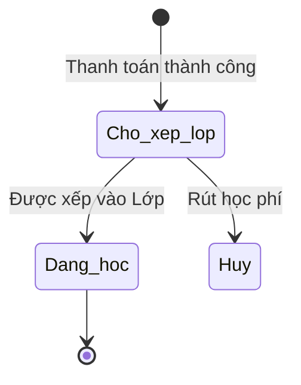

# BF-CLS-01: Xếp lớp (Enrollment to Class)

> **Capability:** CAP-OPS (Năng lực Quản lý Học viên & Vận hành Lớp)
> **Giai đoạn:** 2 - Vận hành
> **Nhóm chức năng:** Quản lý Học viên
> **Mã màn hình:** `class_assignment`

---

## 1. Mô tả tổng quan

Quy trình xếp học viên vào các Lớp học (Class) phù hợp dựa trên trình độ, độ tuổi và nhu cầu. Quản lý việc chuyển đổi trạng thái của học viên từ "Chờ xếp lớp" (Waitlist) sang "Đang học" (Enrolled).

## 2. Đối tượng sử dụng (Vai trò)

- **Nhân viên Giáo vụ (Vận hành):** Phụ trách xếp lịch và xếp lớp cho học viên tại cơ sở.
- **Quản lý Chi nhánh:** Giám sát tiến độ xếp lớp, đảm bảo không có học viên tồn đọng quá hạn.

## 3. Ranh giới Nghiệp vụ (Scope)

### Có bao gồm (In Scope)
- Quản lý danh sách học viên đang ở trạng thái chờ xếp lớp (Waitlist).
- Gợi ý các Lớp học phù hợp dựa trên trình độ (Level) và Chương trình học (Program).
- Thực hiện thao tác Ghi danh (Enroll) học viên vào 1 Lớp học.
- Xếp lớp hàng loạt cho nhiều học viên cùng lúc.

### Không bao gồm (Out of Scope)
- Thu phí học viên → Xử lý tại `CAP-FIN`.
- Đánh giá đầu vào xếp trình độ → Xử lý tại `BF-ENR-01` (CAP-ADM).

## 4. Mô hình Dữ liệu Nghiệp vụ (Data Entities)

| Tên Thực thể | Trường định danh | Thuộc tính quan trọng | Ràng buộc quan hệ | Diễn giải |
|--------------|------------------|-----------------------|-------------------|----------|
| Bản ghi Xếp lớp (Enrollment) | Mã xếp lớp | Ngày bắt đầu, Trạng thái (Đang học/Bảo lưu) | Trỏ về Mã Học viên & Mã Lớp | Bằng chứng học viên thuộc về Lớp. |
| Danh sách Chờ (Waitlist) | Mã chờ | Ngày đóng tiền, Trình độ đề xuất | Trỏ về Mã Học viên | Học viên đã chốt nhưng chưa có lớp. |

### 4.1. Vòng đời Trạng thái (Status Lifecycle)

*Sơ đồ dưới đây xác định vòng đời trạng thái quá trình chờ xếp lớp của học viên.*

**Quy tắc chuyển đổi:**

| Từ trạng thái | Sang trạng thái | Điều kiện bắt buộc | Vai trò được phép |
|---------------|-----------------|---------------------|-------------------|
| Bất kỳ | Chờ xếp lớp | Có Đơn hàng thành công nhưng chưa có Lớp | Hệ thống tự động |
| Chờ xếp lớp | Đang học | Lớp học được chọn phải còn chỗ trống | Nhân viên Giáo vụ |

### 4.2. Ví dụ Dữ liệu mẫu

*Giúp AI và Lập trình viên tạo dữ liệu kiểm thử chính xác.*

| Tình huống | Dữ liệu đầu vào | Kết quả mong đợi |
|------------|-----------------|-------------------|
| Xếp lớp thành công | Chọn Học viên A, Xếp vào Lớp IELTS-01 (còn 2 chỗ) | Học viên A vào danh sách lớp, Lớp còn 1 chỗ. |
| Quá sĩ số | Xếp vào Lớp IELTS-02 (đã đủ 15/15) | Báo lỗi: "Lớp học đã đạt sĩ số tối đa", chặn lưu. |
| Sai trình độ | Học viên A (Pre-IELTS) xếp vào Lớp IELTS 6.5 | Bật cảnh báo: "Trình độ học viên không khớp với Lớp", nhưng vẫn cho lưu (override). |

## 5. Quy tắc Nghiệp vụ Tổng thể (Business Rules)

1. **[RULE-CLS-01-01] Sĩ số (Capacity):** Mặc định KHÔNG cho phép xếp lớp nếu số lượng học viên vượt quá Sĩ số tối đa (Max Capacity) của lớp, trừ trường hợp có quyền Quản lý ghi đè (Override).
2. **[RULE-CLS-01-02] Trình độ (Level Matching):** Hệ thống phải bật cảnh báo nếu Giáo vụ cố tình xếp học viên vào lớp có Trình độ (Level) khác với kết quả bài Kiểm tra đầu vào (Placement Test).

## 6. Danh sách Yêu cầu Người dùng (User Stories)

| Mã Yêu cầu | Tên Yêu cầu (Loại màn hình) | Đường dẫn truy cập | Trạng thái |
|------------|-----------------------------|--------------------|------------|
| US-CLS01-01 | Quản lý danh sách HV chờ xếp lớp (Danh sách) | /app/class_assignment | ✅ Đã chuẩn hóa |
| US-CLS01-02 | Thêm Học viên từ màn hình Chi tiết Lớp (Bảng nổi) | Nằm trong Chi tiết Lớp | ✅ Đã chuẩn hóa |
| US-CLS01-03 | Xếp lớp hàng loạt (Chức năng) | Nằm trong Danh sách chờ | ✅ Đã chuẩn hóa |

---

## 7. Chỉ dẫn cho AI Agent & Lập trình viên (Business Architecture)

- Tuân thủ chặt chẽ cấu trúc thực thể ở mục 4. Phải đảm bảo tính toàn vẹn dữ liệu nghiệp vụ (dữ liệu bảng con phải trỏ đúng mã có thật của bảng cha).
- Mọi trạng thái liệt kê trong sơ đồ 4.1 phải được ánh xạ đầy đủ vào hệ thống.
- Giao diện và luồng xử lý phải tuân thủ bảng chuyển đổi trạng thái (chỉ hiển thị các hành động hợp lệ theo từng trạng thái và phân quyền).

### ⛔ Hàng rào An toàn (Guardrails)
- **KHÔNG** thêm trường dữ liệu hoặc thực thể ngoài danh sách quy định ở mục 4.
- **KHÔNG** thay đổi cấu trúc quan hệ thực thể mà chưa được phê duyệt từ Product Owner.
- **KHÔNG** tạo trạng thái nghiệp vụ mới ngoài sơ đồ ở mục 4.1. Mọi sự thay đổi vòng đời phải được cập nhật vào tài liệu này trước.

