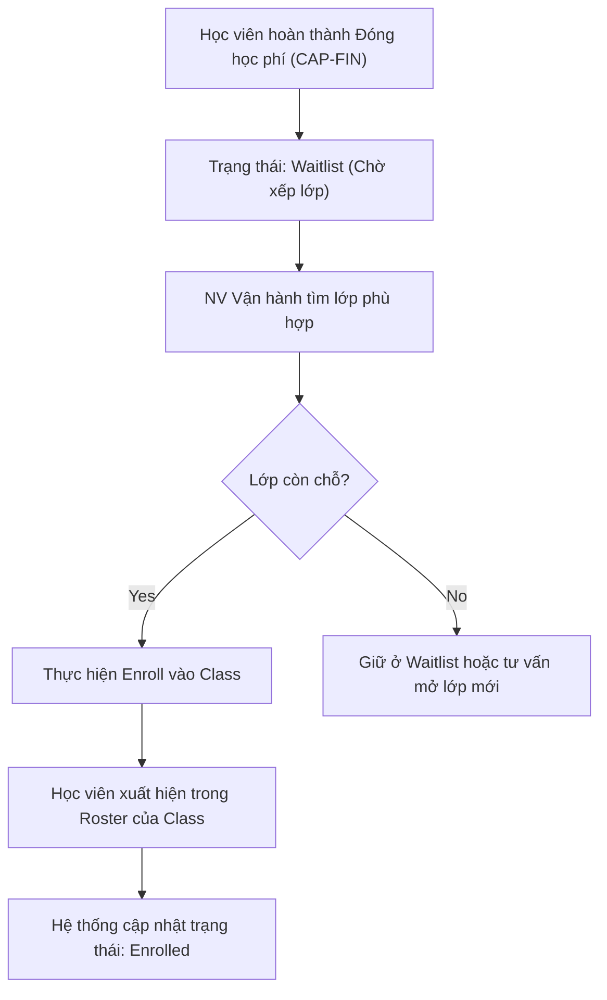

# BF-CLS-01: Xếp lớp (Enrollment to Class)

> **Giai đoạn:** 6 — Lớp học & Học viên
> **Capability:** CAP-OPS
> **Nhóm sidebar:** Vận hành
> **Menu ID:** `class_assignment`

---

## 1. Mô tả nghiệp vụ

Quy trình xếp học viên vào các Lớp học (Class) phù hợp dựa trên trình độ, độ tuổi và nhu cầu. Quản lý việc chuyển đổi trạng thái của học viên từ "Chờ xếp lớp" (Waitlist) sang "Đang học" (Enrolled).

## 2. Đối tượng sử dụng (Actors)

- Admin
- Branch Manager

## 3. Phạm vi (Scope)

### Trong phạm vi (In Scope)
- Tìm kiếm và lọc học viên đang ở trạng thái chờ xếp lớp.
- Gợi ý các Lớp học phù hợp dựa trên trình độ (Level) và Chương trình học (Program).
- Thực hiện thao tác Ghi danh (Enroll) học viên vào 1 Class.
- Quản lý danh sách chờ (Waitlist) nếu lớp đã đầy.

### Ngoài phạm vi (Out of Scope)
- Thu phí học viên (Xử lý tại `CAP-FIN`).
- Đánh giá đầu vào xếp trình độ (Xử lý tại `BF-ADM-01` hoặc `BF-SAL-03`).

## 4. Nghiệp vụ liên quan

- **Upstream:** `BF-SAL-01` (Học viên hoàn thành thanh toán -> Đẩy vào danh sách chờ xếp lớp).
- **Downstream:** `BF-CLS-03` (Sau khi xếp lớp, học viên xuất hiện trong Roster của Lớp).

## 5. User Stories

| Tài liệu | Trạng thái |
|----------|------------|
| [US-CLS01-01: Quản lý danh sách HV chờ xếp lớp](./US-CLS01-01-quan-ly-danh-sach-hv-cho-xep-lop.md) | ✅ Đã viết |

> US-CLS01-01 đã gộp cả 3 luồng: Xem danh sách, Gợi ý lớp phù hợp, và Thao tác xếp lớp + kiểm tra sĩ số.

## 6. Luồng vận hành tổng thể (End-to-End Flow)

## 7. Quy tắc nghiệp vụ (Business Rules)

1. Sĩ số (Capacity): Không cho phép xếp lớp nếu số lượng học viên vượt quá Capacity tối đa của lớp (trừ khi có quyền Admin override).
2. Trình độ (Level Matching): Cảnh báo nếu xếp học viên vào lớp có Level khác với kết quả bài Test đầu vào.

## 8. Dữ liệu chính (Key Data)

| Entity | Mô tả |
|--------|-------|
| Enrollment Record | Dữ liệu nối giữa Học viên và Class, ghi nhận ngày bắt đầu học. |
| Waitlist | Danh sách học viên đã đóng tiền nhưng chưa có lớp. |

## 9. Ghi chú triển khai

- **Backend:** `EnrollmentService`.
- **Frontend:** Màn hình 2-panel: Panel trái (Danh sách HV chờ) + Panel phải (Danh sách lớp còn chỗ).
- **Gaps:** Chưa rõ luồng cho học viên chuyển trung tâm (Transfer Branch).
