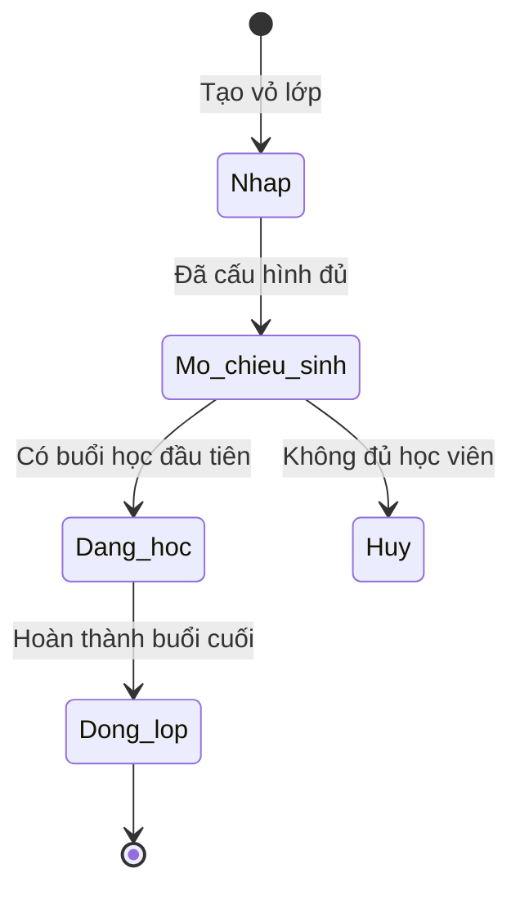

# BF-CLS-02: Quản lý Lớp học (Class Lifecycle & Syllabus Attachment)

> **Capability:** CAP-OPS (Năng lực Quản lý Học viên & Vận hành Lớp)
> **Giai đoạn:** 2 - Vận hành
> **Nhóm chức năng:** Quản lý Học viên
> **Mã màn hình:** `classes`

---

## 1. Mô tả tổng quan

Phân hệ thiết lập và quản lý các "vỏ hộp" Lớp học (Class) dài hạn. Quá trình này bao gồm việc khởi tạo Lớp, gắn Khung chương trình (Syllabus) vào Lớp để định hình số lượng và chủ đề của các Buổi học (Session) sẽ được sinh ra, cũng như quản lý vòng đời trạng thái của Lớp từ khi mở chiêu sinh cho đến khi kết thúc khóa.

## 2. Đối tượng sử dụng (Vai trò)

- **Quản lý Chi nhánh:** Phê duyệt việc mở lớp mới dựa trên nhu cầu học viên chờ.
- **Nhân viên Giáo vụ (Vận hành):** Trực tiếp khởi tạo, cấu hình và theo dõi Lớp.
- **Giáo viên:** (Chỉ có quyền xem thông tin Lớp học mà mình được phân công).

## 3. Ranh giới Nghiệp vụ (Scope)

### Có bao gồm (In Scope)
- Tạo mới thông tin Lớp học (Tên lớp, Sĩ số tối đa, Chương trình, Trình độ).
- Gắn một Khung chương trình (Syllabus) cụ thể đã được ban hành vào Lớp.
- Theo dõi tiến độ tổng thể của Lớp (số bài đã học / tổng số bài).
- Thao tác chuyển đổi trạng thái Lớp học (Mở lớp, Đang học, Đóng lớp).

### Không bao gồm (Out of Scope)
- Xếp thời khóa biểu cụ thể và sinh Buổi học (Session) → Xử lý tại `BF-OPS-02`.
- Xếp học viên vào lớp → Xử lý tại `BF-CLS-03` (trạng thái Chờ xếp lớp).
- Phân công Giáo viên chủ nhiệm → Xử lý tại `BF-CLS-04`.

## 4. Mô hình Dữ liệu Nghiệp vụ (Data Entities)

| Tên Thực thể | Trường định danh | Thuộc tính quan trọng | Ràng buộc quan hệ | Diễn giải |
|--------------|------------------|-----------------------|-------------------|----------|
| Lớp học (Class) | Mã lớp | Tên lớp, Trạng thái, Sĩ số tối đa, Tiến độ học | Độc lập | Thực thể chứa người, tĩnh trong suốt kỳ học. |
| Chi tiết Khung (Syllabus) | Mã khung lớp | Phiên bản, Trạng thái gắn kết | Trỏ về Lớp & Syllabus gốc | Chốt cứng Khung chương trình tại thời điểm mở lớp. |

### 4.1. Vòng đời Trạng thái (Status Lifecycle)

*Sơ đồ dưới đây xác định tất cả trạng thái hợp lệ và các phép chuyển đổi được phép đối với một Lớp học.*

**Quy tắc chuyển đổi:**

| Từ trạng thái | Sang trạng thái | Điều kiện bắt buộc | Vai trò được phép |
|---------------|-----------------|---------------------|-------------------|
| Nháp | Mở chiêu sinh | Lớp phải được gắn 1 Syllabus hợp lệ | Quản lý Chi nhánh / Giáo vụ |
| Mở chiêu sinh | Đang học | Buổi học (Session) đầu tiên chuyển sang trạng thái 'Đã hoàn thành' | Hệ thống tự động |
| Đang học | Đóng lớp | Buổi học (Session) cuối cùng chuyển sang trạng thái 'Đã hoàn thành' | Hệ thống tự động hoặc Giáo vụ |

### 4.2. Ví dụ Dữ liệu mẫu

*Giúp AI và Lập trình viên tạo dữ liệu kiểm thử chính xác.*

| Tình huống | Dữ liệu đầu vào | Kết quả mong đợi |
|------------|-----------------|-------------------|
| Tạo Lớp mới | Tên: "IELTS 5.0 - Tối 246", Sĩ số: 15, Syllabus: v1.0 | Lớp được tạo trạng thái "Nháp", sẵn sàng chờ xếp lịch. |
| Khóa Syllabus | Lớp chuyển sang "Đang học", Giáo vụ cố tình gỡ Syllabus | Hệ thống chặn và báo lỗi: "Không thể thay đổi Khung chương trình khi Lớp đang vận hành". |
| Lớp hoàn thành | Buổi học thứ 30/30 kết thúc và điểm danh xong | Lớp TỰ ĐỘNG chuyển trạng thái thành "Đóng lớp". |

## 5. Quy tắc Nghiệp vụ Tổng thể (Business Rules)

1. **[RULE-CLS-02-01] Chốt phiên bản Khung chương trình:** Khi Lớp đã được gắn Syllabus và chuyển sang trạng thái `Mở chiêu sinh` hoặc `Đang học`, cấu trúc bài học của Lớp đó bị khóa cứng theo phiên bản Syllabus đã chọn. Nếu Phòng Học thuật có cập nhật bản Syllabus mới, Lớp này KHÔNG bị ảnh hưởng (Tính kế thừa tách biệt).
2. **[RULE-CLS-02-02] Ngày kết thúc linh hoạt:** Ngày dự kiến kết thúc (End Date) của Lớp là dữ liệu động, được hệ thống tự tính toán và cập nhật liên tục dựa trên ngày tổ chức thực tế của Buổi học (Session) cuối cùng.

## 6. Danh sách Yêu cầu Người dùng (User Stories)

| Mã Yêu cầu | Tên Yêu cầu (Loại màn hình) | Đường dẫn truy cập | Trạng thái |
|------------|-----------------------------|--------------------|------------|
| US-CLS02-01 | Quản lý danh sách Lớp học (Danh sách) | /app/classes | Đang soạn thảo |
| US-CLS02-02 | Tạo/Cập nhật thông tin Lớp học (Biểu mẫu) | Không có | Đang soạn thảo |
| US-CLS02-03 | Xem Dashboard tổng quan tiến độ Lớp (Chi tiết) | /app/classes/[id] | Đang soạn thảo |

---

## 7. Chỉ dẫn cho AI Agent & Lập trình viên (Business Architecture)

- Tuân thủ chặt chẽ cấu trúc thực thể ở mục 4. Phải đảm bảo tính toàn vẹn dữ liệu nghiệp vụ (dữ liệu bảng con phải trỏ đúng mã có thật của bảng cha).
- Mọi trạng thái liệt kê trong sơ đồ 4.1 phải được ánh xạ đầy đủ vào hệ thống.
- Giao diện và luồng xử lý phải tuân thủ bảng chuyển đổi trạng thái (chỉ hiển thị các hành động hợp lệ theo từng trạng thái và phân quyền).

### ⛔ Hàng rào An toàn (Guardrails)
- **KHÔNG** thêm trường dữ liệu hoặc thực thể ngoài danh sách quy định ở mục 4.
- **KHÔNG** thay đổi cấu trúc quan hệ thực thể mà chưa được phê duyệt từ Product Owner.
- **KHÔNG** tạo trạng thái nghiệp vụ mới ngoài sơ đồ ở mục 4.1. Mọi sự thay đổi vòng đời phải được cập nhật vào tài liệu này trước.

