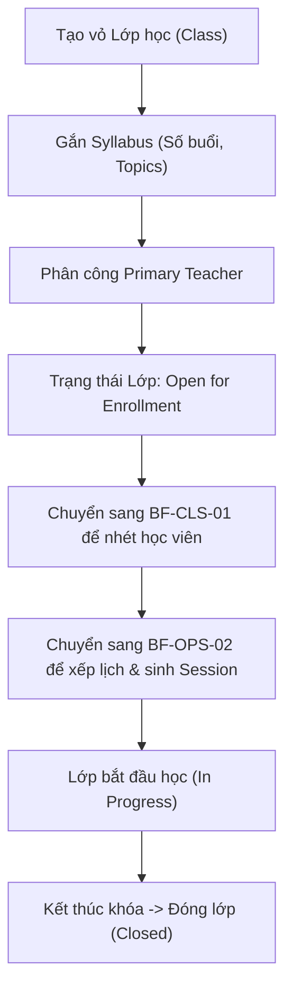

# BF-CLS-02: Quản lý Lớp học (Class Lifecycle & Syllabus Attachment)

> **Giai đoạn:** 6 — Lớp học & Học viên
> **Capability:** CAP-OPS
> **Nhóm sidebar:** Vận hành
> **Menu ID:** `classes`

---

## 1. Mô tả nghiệp vụ

Tạo và quản lý các "vỏ hộp" Lớp học (Class) dài hạn. Gắn Khung chương trình (Syllabus) vào Lớp để định hình số lượng và chủ đề của các Buổi học (Session) sẽ được sinh ra. Quản lý trạng thái vòng đời của Lớp: Mới tạo (Draft) -> Đang mở (Open) -> Đang học (In Progress) -> Đóng/Tốt nghiệp (Closed).

## 2. Đối tượng sử dụng (Actors)

- Admin
- Branch Manager
- Teacher (Chỉ xem lớp mình được phân công)

## 3. Phạm vi (Scope)

### Trong phạm vi (In Scope)
- CRUD Lớp học (Tên lớp, Sĩ số tối đa, Ngày bắt đầu/kết thúc dự kiến).
- Gắn một Syllabus (Khung chương trình) cụ thể vào Lớp.
- Đóng mở trạng thái Lớp học.
- Theo dõi tiến độ chung của Lớp (đã học bao nhiêu bài trên tổng số).

### Ngoài phạm vi (Out of Scope)
- Xếp thời khóa biểu và sinh Session (Xử lý tại `BF-OPS-02`).
- Nhét học viên vào lớp (Xử lý tại `BF-CLS-01`).
- Phân công Giáo viên chủ nhiệm chính (Xử lý tại `BF-CLS-04`).

## 4. Nghiệp vụ liên quan

- **Upstream:** `BF-ACD-02` (Syllabus phải được ban hành thì mới gắn vào Lớp được).
- **Downstream:** `BF-OPS-02` (Lớp phải được tạo xong thì mới Xếp lịch được).

## 5. User Stories

- [ ] US-CLS02-01: Quản lý danh sách các Lớp học (Class List View).
- [ ] US-CLS02-02: Tạo mới vỏ Lớp học (Chỉ thiết lập thông tin cơ bản).
- [ ] US-CLS02-03: Gắn Khung chương trình (Syllabus) vào Lớp.
- [ ] US-CLS02-04: Xem Dashboard chi tiết tiến độ của Lớp học.
- [ ] US-CLS02-05: Thao tác đóng lớp (Kết thúc khóa / Tốt nghiệp).

## 6. Luồng vận hành tổng thể (End-to-End Flow)

## 7. Quy tắc nghiệp vụ (Business Rules)

1. Syllabus không thể bị thay đổi nếu Lớp đã bắt đầu học (In Progress).
2. Ngày kết thúc (End Date) của Lớp là dữ liệu động, tự tính toán dựa trên ngày kết thúc của Session cuối cùng.

## 8. Dữ liệu chính (Key Data)

| Entity | Mô tả |
|--------|-------|
| Class | Chứa metadata của lớp (Name, Capacity, Level, Status). |
| Class-Syllabus Mapping | Khóa ngoại liên kết Class với 1 phiên bản Syllabus cụ thể. |

## 9. Ghi chú triển khai

- **Backend:** `ClassService`.
- **Frontend:** `ClassList` và `ClassDetail` view.
- **Gaps:** Cần xác định luồng khi trung tâm muốn đổi Syllabus giữa chừng (Có cho phép không hay bắt buộc tạo Lớp mới?).
