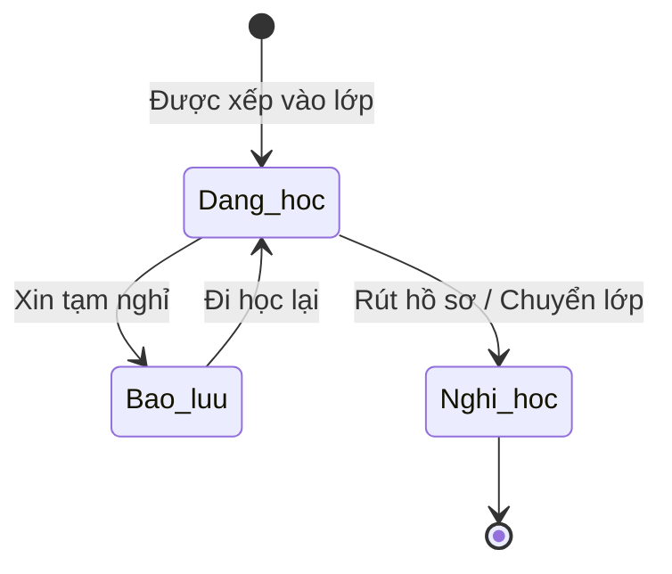

# BF-CLS-03: Quản lý Học viên (Class Roster)

> **Capability:** CAP-OPS (Năng lực Quản lý Học viên & Vận hành Lớp)
> **Giai đoạn:** 2 - Vận hành
> **Nhóm chức năng:** Quản lý Học viên
> **Mã màn hình:** `students`

---

## 1. Mô tả tổng quan

Phân hệ quản lý danh sách Học viên đang theo học (Roster) trong một Lớp cụ thể. Cung cấp góc nhìn 360 độ về học viên: Lịch sử điểm danh, Điểm số, Báo cáo học tập, và Lịch sử chuyển lớp/bảo lưu. Đây là tính năng phục vụ Giáo viên và Giáo vụ theo sát tình hình học tập của học viên trong khuôn khổ một lớp.

## 2. Đối tượng sử dụng (Vai trò)

- **Nhân viên Giáo vụ (Vận hành):** Theo dõi bao quát tình hình lớp, xử lý các yêu cầu bảo lưu/chuyển lớp.
- **Giáo viên:** Theo sát học viên, xem điểm danh, nhận xét và kết quả học tập để điều chỉnh phương pháp dạy.
- **Chuyên viên Chăm sóc (CSM):** Dùng dữ liệu này để tư vấn phụ huynh.

## 3. Ranh giới Nghiệp vụ (Scope)

### Có bao gồm (In Scope)
- Hiển thị danh sách Học viên tổng quát trên toàn cơ sở (Danh sách vận hành).
- Hiển thị danh sách Học viên (Roster) của một Lớp học cụ thể.
- Màn hình Student 360° View tổng hợp toàn bộ lịch sử (Điểm danh, Điểm, Nhận xét).
- Đánh dấu sao, gắn nhãn (tag) chú ý nhanh cho học viên (ví dụ: Học yếu, Cá biệt).

### Không bao gồm (Out of Scope)
- Đăng ký ghi danh mới hoặc thu tiền → Thuộc `CAP-COM`, `CAP-FIN`.
- Quản lý hồ sơ gốc (Tên, SĐT, Địa chỉ) → Xử lý tại `BF-MDM-01`.
- Điểm danh & Nhập điểm (hành động nhập liệu) → Xử lý tại `BF-CLS-05`.

## 4. Mô hình Dữ liệu Nghiệp vụ (Data Entities)

| Tên Thực thể | Trường định danh | Thuộc tính quan trọng | Ràng buộc quan hệ | Diễn giải |
|--------------|------------------|-----------------------|-------------------|----------|
| Hồ sơ Vận hành (Student Roster) | Mã hồ sơ Roster | Trạng thái (Đang học/Bảo lưu), Nhãn chú ý | Trỏ về Lớp & Học viên gốc | Dữ liệu gắn kết người-lớp. |

### 4.1. Vòng đời Trạng thái (Status Lifecycle)

*Sơ đồ dưới đây xác định trạng thái của một Học viên bên trong một Lớp học.*

**Quy tắc chuyển đổi:**

| Từ trạng thái | Sang trạng thái | Điều kiện bắt buộc | Vai trò được phép |
|---------------|-----------------|---------------------|-------------------|
| Đang học | Bảo lưu | Có phiếu yêu cầu bảo lưu hợp lệ | Giáo vụ / Quản lý |
| Bất kỳ | Nghỉ học | Xác nhận hoàn phí hoặc đã xếp sang lớp khác | Giáo vụ / Quản lý |

### 4.2. Ví dụ Dữ liệu mẫu

*Giúp AI và Lập trình viên tạo dữ liệu kiểm thử chính xác.*

| Tình huống | Dữ liệu đầu vào | Kết quả mong đợi |
|------------|-----------------|-------------------|
| Xem 360 độ | Chọn Học viên A trong Lớp IELTS-01 | Màn hình hiển thị: A vắng 2 buổi, điểm Mid-term 6.5. |
| Gắn thẻ (Tag) | Gắn thẻ "Cần kèm cặp" cho Học viên B | Thẻ hiện lên đỏ bên cạnh tên B trong danh sách lớp. |

## 5. Quy tắc Nghiệp vụ Tổng thể (Business Rules)

1. **[RULE-CLS-03-01] Hiển thị lịch sử:** Học viên đã chuyển lớp (Transfer) hoặc đang bảo lưu (Suspend) VẪN HIỂN THỊ trong danh sách của lớp cũ để tra cứu lịch sử, nhưng tên bị làm mờ và gắn nhãn "Đã nghỉ/Bảo lưu".
2. **[RULE-CLS-03-02] Phân quyền xem (Data Privacy):** Giáo viên chỉ được xem thông tin học thuật (Điểm, Nhận xét, Điểm danh), KHÔNG ĐƯỢC XEM thông tin tài chính (Học phí, Công nợ) của học viên.

## 6. Danh sách Yêu cầu Người dùng (User Stories)

| Mã Yêu cầu | Tên Yêu cầu (Loại màn hình) | Đường dẫn truy cập | Trạng thái |
|------------|-----------------------------|--------------------|------------|
| US-CLS03-01 | Quản lý danh sách Học viên cơ sở (Danh sách) | /app/students | Đã chuẩn hóa |
| US-CLS03-02 | Xem Roster lớp học (Bảng trong chi tiết lớp) | /app/classes/[id] | Đã chuẩn hóa |
| US-CLS03-04 | Xem chi tiết Hồ sơ Student 360° (Tab chi tiết) | /app/students/[id] | Đã chuẩn hóa |

---

## 7. Chỉ dẫn cho AI Agent & Lập trình viên (Business Architecture)

- Tuân thủ chặt chẽ cấu trúc thực thể ở mục 4. Phải đảm bảo tính toàn vẹn dữ liệu nghiệp vụ (dữ liệu bảng con phải trỏ đúng mã có thật của bảng cha).
- Mọi trạng thái liệt kê trong sơ đồ 4.1 phải được ánh xạ đầy đủ vào hệ thống.
- Giao diện và luồng xử lý phải tuân thủ bảng chuyển đổi trạng thái (chỉ hiển thị các hành động hợp lệ theo từng trạng thái và phân quyền).

### ⛔ Hàng rào An toàn (Guardrails)
- **KHÔNG** thêm trường dữ liệu hoặc thực thể ngoài danh sách quy định ở mục 4.
- **KHÔNG** thay đổi cấu trúc quan hệ thực thể mà chưa được phê duyệt từ Product Owner.
- **KHÔNG** tạo trạng thái nghiệp vụ mới ngoài sơ đồ ở mục 4.1. Mọi sự thay đổi vòng đời phải được cập nhật vào tài liệu này trước.

