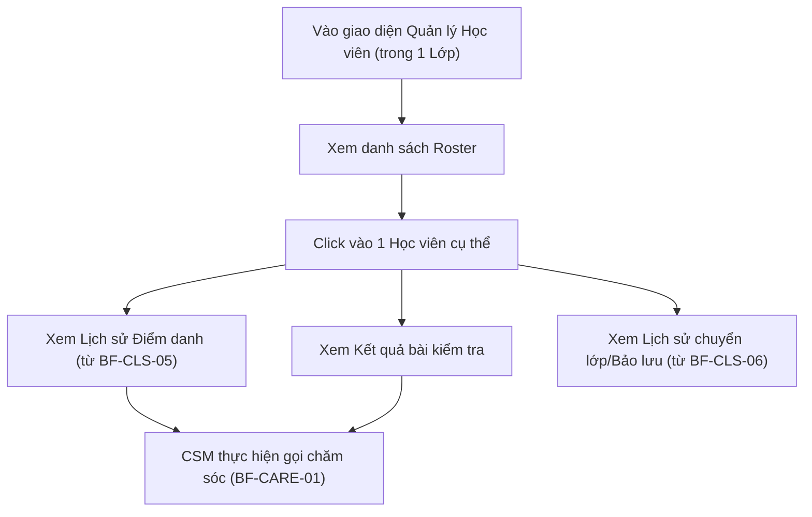

# BF-CLS-03: Quản lý Học viên (Class Roster Management)

> **Giai đoạn:** 6 — Lớp học & Học viên
> **Capability:** CAP-OPS
> **Nhóm sidebar:** Vận hành
> **Menu ID:** `students`

---

## 1. Mô tả nghiệp vụ

Quản lý danh sách Học viên đang theo học (Roster) trong một Lớp cụ thể. Cung cấp góc nhìn 360 độ về học viên: Lịch sử điểm danh, Điểm số, Báo cáo học tập, và Lịch sử chuyển lớp/bảo lưu. Đây là tính năng phục vụ Giáo viên và CSM theo sát tình hình học sinh.

## 2. Đối tượng sử dụng (Actors)

- Admin
- Branch Manager
- Teacher (Xem học viên lớp mình)
- CSM (Chăm sóc học viên)

## 3. Phạm vi (Scope)

### Trong phạm vi (In Scope)
- Hiển thị danh sách Học viên tổng quát trên toàn cơ sở (Chỉ tập trung vào học viên Active/Suspended).
- Hiển thị danh sách Roster của một Lớp học cụ thể.
- Đánh dấu sao, gắn tag ghi chú nhanh trên màn hình danh sách.

### Ngoài phạm vi (Out of Scope)
- Đăng ký mới hoặc thu học phí (Xử lý tại `CAP-COM`, `CAP-FIN`).
- Thay đổi thông tin cá nhân gốc của học viên (Xử lý tại `CAP-MDM`, `BF-PRF-01`).

## 4. Nghiệp vụ liên quan

- **Upstream:** `BF-CLS-01` (Học viên được xếp vào lớp sẽ xuất hiện ở đây).
- **Downstream:** `BF-CARE-01` (CSM sử dụng dữ liệu từ màn hình này để gọi điện chăm sóc học viên).

## 5. User Stories

### Danh sách (List Views)
- [ ] US-CLS03-01: Quản lý danh sách Học viên cơ sở (Operational Master List).
- [ ] US-CLS03-02: Xem danh sách học viên đang học trong 1 lớp (Class Roster).
- [ ] US-CLS03-03: Đánh dấu sao / Gắn tag chú ý cho học viên đặc biệt.

### Chi tiết Học viên — Student 360° View (Kích hoạt khi click vào 1 HV)
- [ ] US-CLS03-04: Tab Tổng quan — Thông tin cá nhân & Lớp đang học.
- [ ] US-CLS03-05: Tab Lịch sử Điểm danh (Attendance History).
- [ ] US-CLS03-06: Tab Lịch sử Nhận xét & Đánh giá (Feedback History).
- [ ] US-CLS03-07: Tab Đơn hàng & Gói đăng ký (Orders & Packages).
- [ ] US-CLS03-08: Tab Năng lực & Trình độ (Proficiency).
- [ ] US-CLS03-09: Tab Lịch sử Buổi học (Session Learning History).
- [ ] US-CLS03-10: Tab Bài tập về nhà (Homework).
- [ ] US-CLS03-11: Tab Chăm sóc & Ticket (Care Tickets).
- [ ] US-CLS03-12: Tab Ghi chú Vận hành (Operational Notes).
- [ ] US-CLS03-13: Tab Nhật ký thao tác (Audit Log).
- [ ] US-CLS03-14: Tab Lịch sử Trạng thái (Status Change History).
- [ ] US-CLS03-15: Tab Lịch học sắp tới (Upcoming Schedule).
- [ ] US-CLS03-16: Tab Thông tin Phụ huynh (Guardian Quick View).

## 6. Luồng vận hành tổng thể (End-to-End Flow)

## 7. Quy tắc nghiệp vụ (Business Rules)

1. Học viên đã chuyển lớp (Transfer) hoặc đang bảo lưu (Suspend) vẫn hiển thị trong lịch sử của lớp nhưng được gắn tag trạng thái mờ (Inactive).
2. Giáo viên chỉ được xem thông tin học thuật, không được xem chi tiết tài chính (công nợ) của học viên.

## 8. Dữ liệu chính (Key Data)

| Entity | Mô tả |
|--------|-------|
| Student Portfolio | Tổng hợp điểm danh, điểm số, và nhận xét của học viên trong khuôn khổ 1 Class. |

## 9. Ghi chú triển khai

- **Backend:** `StudentService` tổng hợp data từ `Attendance`, `Grading`, `Enrollment`.
- **Frontend:** Tab `Học viên` bên trong trang Chi tiết Lớp học (`ClassDetail`).
- **Gaps:** Cần chốt cơ chế phân quyền chi tiết cho Teacher (ẩn field học phí).
