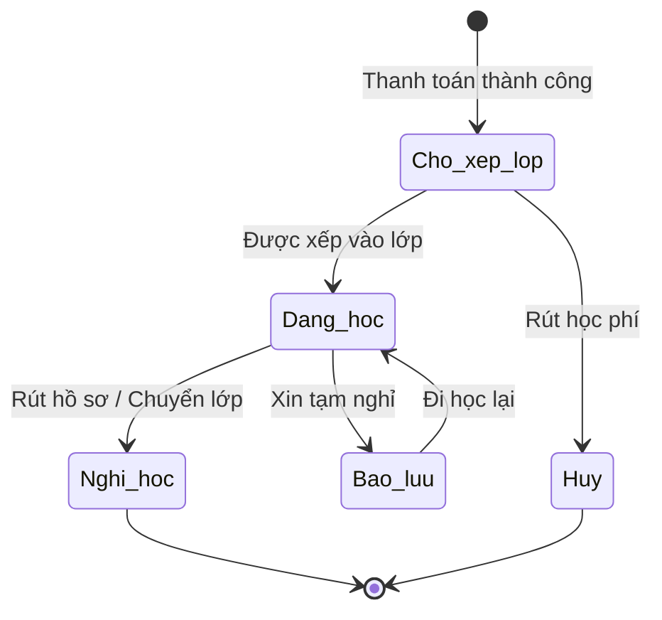

# BF-CLS-03: Quản lý Học viên (Student Management)

> **Capability:** CAP-OPS (Năng lực Quản lý Học viên & Vận hành Lớp)
> **Giai đoạn:** 2 - Vận hành
> **Nhóm chức năng:** Quản lý Học viên
> **Mã màn hình:** `students`

---

## 1. Mô tả tổng quan

Phân hệ quản lý toàn bộ vòng đời của Học viên trong hệ thống — từ khi hoàn thành thanh toán và vào trạng thái **Chờ xếp lớp**, cho đến khi được xếp vào Lớp học cụ thể. Đồng thời cung cấp:

- **Danh sách tổng quát** toàn trung tâm với bộ lọc trạng thái (Chờ xếp lớp, Đang học, Bảo lưu, Nghỉ học).
- **Roster** — danh sách Học viên đang theo học trong một Lớp cụ thể.
- **Student 360° View** — góc nhìn toàn diện về học viên: Lịch sử điểm danh, Điểm số, Nhận xét, Lịch sử buổi học, và Lịch sử chuyển lớp/bảo lưu.
- **Gắn nhãn (Tag)** chú ý nhanh cho học viên (ví dụ: Học yếu, Cá biệt, Cần kèm cặp).

### Trạng thái "Chờ xếp lớp" (Was BF-CLS-01)

Học viên hoàn thành thanh toán nhưng chưa được xếp vào lớp sẽ tự động vào trạng thái **Chờ xếp lớp** (`Cho_xep_lop`). Tại màn hình Quản lý Học viên, bộ lọc trạng thái cho phép tách riêng nhóm này để Giáo vụ xử lý nhanh:

1. Xem danh sách học viên chờ xếp lớp.
2. Gợi ý lớp phù hợp dựa trên trình độ và chương trình học.
3. Thực hiện ghi danh (Enroll) trực tiếp từ danh sách.
4. Xếp lớp hàng loạt cho nhiều học viên cùng lúc.

## 2. Đối tượng sử dụng (Vai trò)

- **Nhân viên Giáo vụ (Vận hành):** Theo dõi bao quát tình hình lớp, xử lý xếp lớp, bảo lưu/chuyển lớp.
- **Giáo viên:** Theo sát học viên, xem điểm danh, nhận xét và kết quả học tập để điều chỉnh phương pháp dạy.
- **Chuyên viên Chăm sóc (CSM):** Dùng dữ liệu này để tư vấn phụ huynh.
- **Quản lý Chi nhánh:** Giám sát tiến độ xếp lớp, đảm bảo không có học viên tồn đọng quá hạn.

## 3. Ranh giới Nghiệp vụ (Scope)

### Có bao gồm (In Scope)
- Hiển thị danh sách Học viên tổng quát trên toàn cơ sở (Danh sách vận hành).
- **Bộ lọc trạng thái:** Chờ xếp lớp, Đang học, Bảo lưu, Nghỉ học.
- Thao tác xếp lớp trực tiếp từ danh sách học viên chờ xếp lớp (xếp đơn, xếp hàng loạt).
- Hiển thị danh sách Học viên (Roster) của một Lớp học cụ thể.
- Màn hình Student 360° View tổng hợp toàn bộ lịch sử (Điểm danh, Điểm, Nhận xét).
- Đánh dấu sao, gắn nhãn (tag) chú ý nhanh cho học viên.

### Không bao gồm (Out of Scope)
- Đăng ký ghi danh mới hoặc thu tiền → Thuộc `CAP-COM`, `CAP-FIN`.
- Quản lý hồ sơ gốc (Tên, SĐT, Địa chỉ) → Xử lý tại `BF-MDM-01`.
- Điểm danh & Nhập điểm (hành động nhập liệu) → Xử lý tại `BF-CLS-05`.

## 4. Mô hình Dữ liệu Nghiệp vụ (Data Entities)

| Tên Thực thể | Trường định danh | Thuộc tính quan trọng | Ràng buộc quan hệ | Diễn giải |
|--------------|------------------|-----------------------|-------------------|----------|
| Hồ sơ Vận hành (Student Roster) | Mã hồ sơ Roster | Trạng thái (Đang học/Bảo lưu), Nhãn chú ý | Trỏ về Lớp & Học viên gốc | Dữ liệu gắn kết người-lớp. |

### 4.1. Vòng đời Trạng thái (Status Lifecycle)

*Sơ đồ dưới đây xác định trạng thái tổng quát của một Học viên trong hệ thống.*

**Quy tắc chuyển đổi:**

| Từ trạng thái | Sang trạng thái | Điều kiện bắt buộc | Vai trò được phép |
|---------------|-----------------|---------------------|-------------------|
| Bất kỳ | Chờ xếp lớp | Có Đơn hàng thành công nhưng chưa có Lớp | Hệ thống tự động |
| Chờ xếp lớp | Đang học | Lớp học được chọn phải còn chỗ trống | Giáo vụ |
| Chờ xếp lớp | Hủy | Xác nhận hoàn phí | Giáo vụ / Quản lý |
| Đang học | Bảo lưu | Có phiếu yêu cầu bảo lưu hợp lệ | Giáo vụ / Quản lý |
| Bất kỳ | Nghỉ học | Xác nhận hoàn phí hoặc đã xếp sang lớp khác | Giáo vụ / Quản lý |

### Quy tắc Xếp lớp (từ BF-CLS-01 cũ)

1. **[RULE-CLS-03-03] Sĩ số (Capacity):** Mặc định KHÔNG cho phép xếp lớp nếu số lượng học viên vượt quá Sĩ số tối đa (Max Capacity) của lớp, trừ trường hợp có quyền Quản lý ghi đè (Override).
2. **[RULE-CLS-03-04] Trình độ (Level Matching):** Hệ thống phải bật cảnh báo nếu Giáo vụ cố tình xếp học viên vào lớp có Trình độ (Level) khác với kết quả bài Kiểm tra đầu vào (Placement Test).

### 4.2. Ví dụ Dữ liệu mẫu

*Giúp AI và Lập trình viên tạo dữ liệu kiểm thử chính xác.*

| Tình huống | Dữ liệu đầu vào | Kết quả mong đợi |
|------------|-----------------|-------------------|
| Xem 360 độ | Chọn Học viên A trong Lớp IELTS-01 | Màn hình hiển thị: A vắng 2 buổi, điểm Mid-term 6.5. |
| Gắn thẻ (Tag) | Gắn thẻ "Cần kèm cặp" cho Học viên B | Thẻ hiện lên đỏ bên cạnh tên B trong danh sách lớp. |

## 5. Quy tắc Nghiệp vụ Tổng thể (Business Rules)

1. **[RULE-CLS-03-01] Hiển thị lịch sử:** Học viên đã chuyển lớp (Transfer) hoặc đang bảo lưu (Suspend) VẪN HIỂN THỊ trong danh sách của lớp cũ để tra cứu lịch sử, nhưng tên bị làm mờ và gắn nhãn "Đã nghỉ/Bảo lưu".
2. **[RULE-CLS-03-02] Phân quyền xem (Data Privacy):** Giáo viên chỉ được xem thông tin học thuật (Điểm, Nhận xét, Điểm danh), KHÔNG ĐƯỢC XEM thông tin tài chính (Học phí, Công nợ) của học viên.

## 6. Danh sách Yêu cầu Người dùng (User Stories)

| Mã Yêu cầu | Tên Yêu cầu (Loại màn hình) | Đường dẫn truy cập | Trạng thái |
|------------|-----------------------------|--------------------|------------|
| US-CLS03-01 | Quản lý danh sách Học viên cơ sở (Danh sách) | /app/students | Đã chuẩn hóa |
| US-CLS03-02 | Xem Roster lớp học (Bảng trong chi tiết lớp) | /app/classes/[id] | Đã chuẩn hóa |
| US-CLS03-03 | Gán tag chú ý học viên (Chức năng) | /app/students | Đã chuẩn hóa |
| US-CLS03-04 | Xem chi tiết Hồ sơ Student 360° (Tab chi tiết) | /app/students/[id] | Đã chuẩn hóa |
| US-CLS01-01 | Danh sách HV chờ xếp lớp (Bộ lọc trong Danh sách HV) | /app/students?status=cho_xep_lop | Hợp nhất vào BF-CLS-03 |
| US-CLS01-02 | Thêm HV từ Chi tiết Lớp (Bảng nổi) | /app/classes/[id] | Hợp nhất vào BF-CLS-03 |
| US-CLS01-03 | Xếp lớp hàng loạt (Chức năng) | /app/students?status=cho_xep_lop | Hợp nhất vào BF-CLS-03 |

---

## 7. Chỉ dẫn cho AI Agent & Lập trình viên (Business Architecture)

- Tuân thủ chặt chẽ cấu trúc thực thể ở mục 4. Phải đảm bảo tính toàn vẹn dữ liệu nghiệp vụ (dữ liệu bảng con phải trỏ đúng mã có thật của bảng cha).
- Mọi trạng thái liệt kê trong sơ đồ 4.1 phải được ánh xạ đầy đủ vào hệ thống.
- Giao diện và luồng xử lý phải tuân thủ bảng chuyển đổi trạng thái (chỉ hiển thị các hành động hợp lệ theo từng trạng thái và phân quyền).

### ⛔ Hàng rào An toàn (Guardrails)
- **KHÔNG** thêm trường dữ liệu hoặc thực thể ngoài danh sách quy định ở mục 4.
- **KHÔNG** thay đổi cấu trúc quan hệ thực thể mà chưa được phê duyệt từ Product Owner.
- **KHÔNG** tạo trạng thái nghiệp vụ mới ngoài sơ đồ ở mục 4.1. Mọi sự thay đổi vòng đời phải được cập nhật vào tài liệu này trước.

