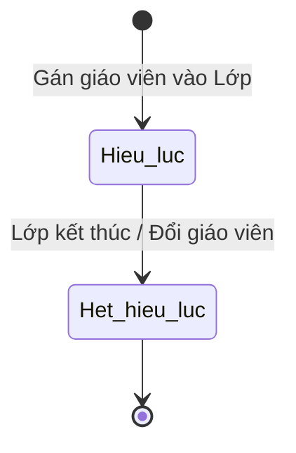

# BF-CLS-04: Quản lý Giáo viên Vận hành (Operational Teacher Management)

> **Capability:** CAP-OPS (Năng lực Quản lý Học viên & Vận hành Lớp)
> **Giai đoạn:** 2 - Vận hành
> **Nhóm chức năng:** Quản lý Học viên
> **Mã màn hình:** `teachers`

---

## 1. Mô tả tổng quan

Phân hệ quản lý danh sách Giáo viên đang tham gia giảng dạy tại cơ sở, cung cấp góc nhìn 360° về giáo viên trong bối cảnh Vận hành: Lớp đang phụ trách, Lịch dạy, Thống kê giờ dạy, Đánh giá chất lượng, và Lịch sử dạy thay. Phân công Giáo viên chủ nhiệm (Primary Teacher) và Trợ giảng (TA) cố định cho một Lớp học.

## 2. Đối tượng sử dụng (Vai trò)

- **Quản lý Chi nhánh / Điều phối viên:** Phân công và điều phối giáo viên cho các lớp.
- **Giáo viên:** Xem danh sách lớp mình được phân công chủ nhiệm.

## 3. Ranh giới Nghiệp vụ (Scope)

### Có bao gồm (In Scope)
- Hiển thị danh sách Giáo viên đang tham gia giảng dạy tại cơ sở (Góc nhìn điều phối).
- Cung cấp trang Chi tiết Giáo viên (Teacher 360° View) với đầy đủ thông tin vận hành.
- Gán mới hoặc Đổi Giáo viên chủ nhiệm (Primary Teacher) / Trợ giảng cho một Lớp cụ thể.
- Ghi nhận lịch sử phân công và thay đổi nhân sự của Lớp.

### Không bao gồm (Out of Scope)
- Quản lý Hợp đồng, Lương bổng, Hồ sơ nhân sự gốc → Thuộc HR (`CAP-HR`).
- Xử lý Dạy thay (Substitute) đột xuất cho 1 buổi học → Xử lý tại `BF-OPS-03`.
- Kiểm tra trùng lịch Giáo viên khi xếp thời khóa biểu → Xử lý tại `BF-OPS-02`.

## 4. Mô hình Dữ liệu Nghiệp vụ (Data Entities)

| Tên Thực thể | Trường định danh | Thuộc tính quan trọng | Ràng buộc quan hệ | Diễn giải |
|--------------|------------------|-----------------------|-------------------|----------|
| Hồ sơ Vận hành (Teacher Profile) | Mã hồ sơ GV | Nhãn chú ý, Tổng giờ dạy | Trỏ về gốc HR | Dữ liệu làm việc tại cơ sở. |
| Phân công Lớp (Class Assignment) | Mã phân công | Vai trò (Chính/Trợ giảng), Ngày bắt đầu, Ngày kết thúc | Trỏ về Mã GV & Mã Lớp | Lịch sử GV gắn với Lớp. |

### 4.1. Vòng đời Trạng thái (Status Lifecycle)

*Sơ đồ dưới đây xác định trạng thái phân công của một Giáo viên với một Lớp học.*

**Quy tắc chuyển đổi:**

| Từ trạng thái | Sang trạng thái | Điều kiện bắt buộc | Vai trò được phép |
|---------------|-----------------|---------------------|-------------------|
| Hiệu lực | Hết hiệu lực | Khi có Giáo viên mới thay thế, hoặc lớp Đóng | Quản lý Chi nhánh |

### 4.2. Ví dụ Dữ liệu mẫu

*Giúp AI và Lập trình viên tạo dữ liệu kiểm thử chính xác.*

| Tình huống | Dữ liệu đầu vào | Kết quả mong đợi |
|------------|-----------------|-------------------|
| Phân công mới | Chọn GV "Trần Văn A", Vai trò: Chủ nhiệm, Lớp: IELTS-01 | GV A xuất hiện trên thẻ Lớp học, được quyền xem lớp. |
| Đổi giáo viên | Thay GV A bằng GV B từ ngày 15/10 | Lịch sử phân công ghi nhận GV A kết thúc 14/10, GV B bắt đầu 15/10. |
| Xem 360 độ | Bấm vào GV "Trần Văn A" | Hiện thống kê: Đang dạy 3 lớp, 12h/tuần, Rating 4.8. |

## 5. Quy tắc Nghiệp vụ Tổng thể (Business Rules)

1. **[RULE-CLS-04-01] Áp dụng Tương lai:** Khi thay đổi Giáo viên chủ nhiệm của một Lớp giữa chừng, hệ thống sẽ TỰ ĐỘNG cập nhật Giáo viên mới cho tất cả các Buổi học (Sessions) CHƯA DIỄN RA trong tương lai. Các Buổi học trong quá khứ VẪN GIỮ NGUYÊN Giáo viên cũ để đảm bảo tính đúng đắn của bảng chấm công.
2. **[RULE-CLS-04-02] Ràng buộc Môn học:** Hệ thống cảnh báo nếu phân công Giáo viên vào lớp có bộ môn không nằm trong danh sách kỹ năng giảng dạy (Skills) của Giáo viên đó.

## 6. Danh sách Yêu cầu Người dùng (User Stories)

| Mã Yêu cầu | Tên Yêu cầu (Loại màn hình) | Đường dẫn truy cập | Trạng thái |
|------------|-----------------------------|--------------------|------------|
| US-CLS04-01 | Quản lý danh sách Giáo viên Vận hành (Danh sách) | /app/teachers | Đang soạn thảo |
| US-CLS04-02 | Gán/Đổi GVCN (Component trong Chi tiết Lớp) | Nằm trong Chi tiết Lớp | Đang soạn thảo |
| US-CLS04-04 | Xem chi tiết Hồ sơ Teacher 360° (Tab chi tiết) | /app/teachers/[id] | Đang soạn thảo |

---

## 7. Chỉ dẫn cho AI Agent & Lập trình viên (Business Architecture)

- Tuân thủ chặt chẽ cấu trúc thực thể ở mục 4. Phải đảm bảo tính toàn vẹn dữ liệu nghiệp vụ (dữ liệu bảng con phải trỏ đúng mã có thật của bảng cha).
- Mọi trạng thái liệt kê trong sơ đồ 4.1 phải được ánh xạ đầy đủ vào hệ thống.
- Giao diện và luồng xử lý phải tuân thủ bảng chuyển đổi trạng thái (chỉ hiển thị các hành động hợp lệ theo từng trạng thái và phân quyền).

### ⛔ Hàng rào An toàn (Guardrails)
- **KHÔNG** thêm trường dữ liệu hoặc thực thể ngoài danh sách quy định ở mục 4.
- **KHÔNG** thay đổi cấu trúc quan hệ thực thể mà chưa được phê duyệt từ Product Owner.
- **KHÔNG** tạo trạng thái nghiệp vụ mới ngoài sơ đồ ở mục 4.1. Mọi sự thay đổi vòng đời phải được cập nhật vào tài liệu này trước.

