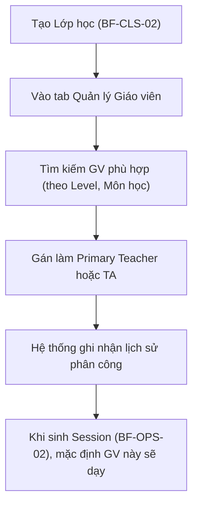

# BF-CLS-04: Quản lý Giáo viên Vận hành (Operational Teacher Management)

> **Giai đoạn:** 6 — Lớp học & Học viên
> **Capability:** CAP-OPS
> **Nhóm sidebar:** Vận hành
> **Menu ID:** `teachers`

---

## 1. Mô tả nghiệp vụ

Quản lý danh sách Giáo viên đang tham gia giảng dạy tại cơ sở, cung cấp góc nhìn 360° về giáo viên trong bối cảnh Vận hành: Lớp đang phụ trách, Lịch dạy, Thống kê giờ dạy, Đánh giá chất lượng, và Lịch sử dạy thay. Phân công Giáo viên chủ nhiệm (Primary Teacher) và Trợ giảng (TA) cho Lớp học.

## 2. Đối tượng sử dụng (Actors)

- Admin
- Branch Manager (Người phân công và điều phối)
- Teacher (Xem lớp mình chủ nhiệm)

## 3. Phạm vi (Scope)

### Trong phạm vi (In Scope)
- Hiển thị danh sách Giáo viên đang tham gia giảng dạy tại cơ sở (Góc nhìn điều phối).
- Cung cấp trang Chi tiết Giáo viên (Teacher 360° View) với đầy đủ thông tin vận hành.
- Thực hiện Gán mới hoặc Đổi Giáo viên chủ nhiệm cho một Lớp học cụ thể.
- Ghi nhận và truy xuất lịch sử thay đổi nhân sự của Lớp học đó.

### Ngoài phạm vi (Out of Scope)
- Xử lý Dạy thay (Substitute) cho 1 buổi (Xử lý tại `BF-OPS-03`).
- Kiểm tra trùng lịch Giáo viên (Xử lý tại `BF-OPS-02`).
- Quản lý Hợp đồng, Lương bổng (Xử lý tại `CAP-HR`, `BF-HR-01`).

## 4. Nghiệp vụ liên quan

- **Upstream:** `BF-HR-01` (Giáo viên phải có trong danh sách nhân sự). `BF-CLS-02` (Lớp phải được tạo).
- **Downstream:** `BF-OPS-02` (Dựa vào GV chủ nhiệm để xếp lịch mặc định).

## 5. User Stories

### Danh sách & Thao tác (List Views)
- [ ] US-CLS04-01: Quản lý danh sách Giáo viên tại Cơ sở (Operational Teacher List).
- [ ] US-CLS04-02: Gán/Đổi Giáo viên chủ nhiệm hoặc Trợ giảng cho một Lớp.
- [ ] US-CLS04-03: Xem lịch sử thay đổi giáo viên của Lớp.

### Chi tiết Giáo viên — Teacher 360° View (Kích hoạt khi click vào 1 GV)
- [ ] US-CLS04-04: Tab Tổng quan — Thông tin cá nhân & Kỹ năng giảng dạy.
- [ ] US-CLS04-05: Tab Lớp đang phụ trách (Active Classes).
- [ ] US-CLS04-06: Tab Lịch dạy tuần (Teaching Timetable).
- [ ] US-CLS04-07: Tab Lịch sử Dạy thay (Substitute Teaching History).
- [ ] US-CLS04-08: Tab Đánh giá Chất lượng (QA Rating & Observation).
- [ ] US-CLS04-09: Tab Thống kê Giờ dạy (Teaching Hours Summary).
- [ ] US-CLS04-10: Tab Phản hồi từ Học viên (Student Feedback).
- [ ] US-CLS04-11: Tab Ghi chú Vận hành (Operational Notes).
- [ ] US-CLS04-12: Tab Nhật ký thao tác (Audit Log).

## 6. Luồng vận hành tổng thể (End-to-End Flow)

## 7. Quy tắc nghiệp vụ (Business Rules)

1. Một lớp có thể có nhiều Giáo viên (Primary Teacher, TA) tùy vào cấu hình môn học.
2. Nếu đổi Giáo viên chủ nhiệm giữa chừng, các Session trong TƯƠNG LAI sẽ tự động cập nhật Giáo viên mới, các Session TRONG QUÁ KHỨ giữ nguyên Giáo viên cũ.

## 8. Dữ liệu chính (Key Data)

| Entity | Mô tả |
|--------|-------|
| Class-Teacher Mapping | Bảng mapping ghi nhận Lớp, Giáo viên, Vai trò, và Ngày bắt đầu/kết thúc. |

## 9. Ghi chú triển khai

- **UI/UX Note:** Do mô hình 1 lớp có 1 GVCN cố định theo suốt khóa, KHÔNG sử dụng Tab Giáo viên riêng biệt. Toàn bộ UI quản lý GVCN được nhúng (embed) dạng Widget/Avatar Card vào thẳng Tab Overview/Dashboard của lớp học.

- **Backend:** `ClassService` xử lý mapping.
- **Frontend:** Tab `Giáo viên` bên trong trang Chi tiết Lớp học.
- **Gaps:** Cần xác định luồng duyệt nếu Giáo viên từ chối nhận lớp.
