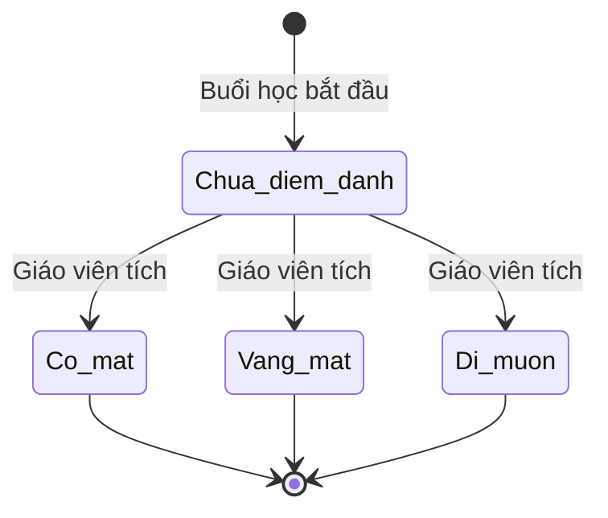

# BF-CLS-05: Điểm danh & Nhận xét (Session Attendance & Grading)

> **Capability:** CAP-OPS (Năng lực Quản lý Học viên & Vận hành Lớp)
> **Giai đoạn:** 2 - Vận hành
> **Nhóm chức năng:** Vận hành lớp
> **Mã màn hình:** `attendance`

---

## 1. Mô tả tổng quan

Phân hệ dành cho Giáo viên thực hiện đánh giá tình trạng chuyên cần (Điểm danh - Attendance), thái độ học tập và điểm số (nếu có) cho từng học viên trong một Buổi học (Session) cụ thể. Hệ thống sẽ tự động cập nhật lịch sử này vào hồ sơ của học sinh và gửi thông báo cho phụ huynh. Đồng thời cung cấp công cụ cho Giáo vụ kiểm duyệt điểm danh trên toàn trung tâm.

## 2. Đối tượng sử dụng (Vai trò)

- **Giáo viên (Teacher):** Người trực tiếp đứng lớp, thực hiện điểm danh và nhận xét.
- **Nhân viên Giáo vụ (Vận hành):** Kiểm tra, đôn đốc giáo viên chốt điểm danh đúng hạn, sửa điểm danh khi phụ huynh phản hồi.
- **Chuyên viên Chăm sóc (CSM):** Dựa vào kết quả điểm danh để gọi điện báo cáo phụ huynh nếu học sinh vắng.

## 3. Ranh giới Nghiệp vụ (Scope)

### Có bao gồm (In Scope)
- Hiển thị danh sách Học viên của một Buổi học (chỉ những học viên có hiệu lực tại ngày đó).
- Đánh dấu trạng thái Điểm danh (Có mặt, Vắng phép, Vắng không phép, Đi muộn).
- Nhập nhận xét (Comment) và chấm điểm nhanh (Grading) cho từng học sinh.
- Chốt sổ (Submit) buổi học để hoàn tất.
- Bảng tổng hợp kiểm duyệt điểm danh toàn trung tâm dành cho Quản lý.

### Không bao gồm (Out of Scope)
- Tính toán trừ tiền học phí hoặc tính lương giáo viên → Thuộc `CAP-FIN` và `CAP-HR` (Xử lý ngầm qua Webhook).
- Chăm sóc gọi điện cho học sinh vắng mặt → Xử lý tại `BF-CARE-01`.

## 4. Mô hình Dữ liệu Nghiệp vụ (Data Entities)

| Tên Thực thể | Trường định danh | Thuộc tính quan trọng | Ràng buộc quan hệ | Diễn giải |
|--------------|------------------|-----------------------|-------------------|----------|
| Bản ghi Điểm danh | Mã điểm danh | Trạng thái (P/A/L), Nhận xét, Điểm | Trỏ về Mã Học viên & Mã Buổi học (Session) | Lưu vết từng buổi của từng người. |

### 4.1. Vòng đời Trạng thái (Status Lifecycle)

*Sơ đồ dưới đây xác định các trạng thái hợp lệ của một Bản ghi điểm danh.*

*(Lưu ý: Sau khi Giáo viên bấm Chốt sổ (Submit) Buổi học, trạng thái điểm danh sẽ bị khóa cứng, chỉ Giáo vụ mới được sửa).*

### 4.2. Ví dụ Dữ liệu mẫu

*Giúp AI và Lập trình viên tạo dữ liệu kiểm thử chính xác.*

| Tình huống | Dữ liệu đầu vào | Kết quả mong đợi |
|------------|-----------------|-------------------|
| Chấm học sinh Vắng | Tích "Vắng không phép" cho Học sinh A | Điểm danh lưu là Vắng. Gửi event trigger tạo Ticket Chăm sóc. |
| Học sinh đi muộn | Tích "Đi muộn", nhập lý do "Tắc đường" | Lưu thành công. |
| Chốt sổ thiếu | Bấm "Submit" nhưng còn 2 học sinh chưa tích trạng thái | Báo lỗi chặn lại: "Vui lòng hoàn tất điểm danh cho tất cả học viên". |

## 5. Quy tắc Nghiệp vụ Tổng thể (Business Rules)

1. **[RULE-CLS-05-01] Ràng buộc thời gian (Session-based):** Điểm danh luôn luôn gắn liền với một Buổi học (Session) cụ thể. Học viên đang ở trạng thái Bảo lưu (Suspended) tại thời điểm Buổi học đó diễn ra sẽ KHÔNG xuất hiện trong danh sách điểm danh.
2. **[RULE-CLS-05-02] Ràng buộc khóa sổ:** Sau khi Buổi học kết thúc 24h, quyền "Sửa điểm danh" của Giáo viên sẽ bị khóa. Mọi thay đổi sau đó phải được thực hiện bởi Nhân viên Giáo vụ.

## 6. Danh sách Yêu cầu Người dùng (User Stories)

| Mã Yêu cầu | Tên Yêu cầu (Loại màn hình) | Đường dẫn truy cập | Trạng thái |
|------------|-----------------------------|--------------------|------------|
| US-CLS05-01 | Điểm danh, nhận xét theo từng buổi (Bảng nhập liệu) | Nằm trong Chi tiết Session | Đã chuẩn hóa |
| US-CLS05-04 | Kiểm duyệt điểm danh toàn trung tâm (Danh sách) | /app/attendance | Đã chuẩn hóa |

---

## 7. Chỉ dẫn cho AI Agent & Lập trình viên (Business Architecture)

- Tuân thủ chặt chẽ cấu trúc thực thể ở mục 4. Phải đảm bảo tính toàn vẹn dữ liệu nghiệp vụ (dữ liệu bảng con phải trỏ đúng mã có thật của bảng cha).
- Mọi trạng thái liệt kê trong sơ đồ 4.1 phải được ánh xạ đầy đủ vào hệ thống.
- Giao diện và luồng xử lý phải tuân thủ bảng chuyển đổi trạng thái (chỉ hiển thị các hành động hợp lệ theo từng trạng thái và phân quyền).

### ⛔ Hàng rào An toàn (Guardrails)
- **KHÔNG** thêm trường dữ liệu hoặc thực thể ngoài danh sách quy định ở mục 4.
- **KHÔNG** thay đổi cấu trúc quan hệ thực thể mà chưa được phê duyệt từ Product Owner.
- **KHÔNG** tạo trạng thái nghiệp vụ mới ngoài sơ đồ ở mục 4.1. Mọi sự thay đổi vòng đời phải được cập nhật vào tài liệu này trước.

