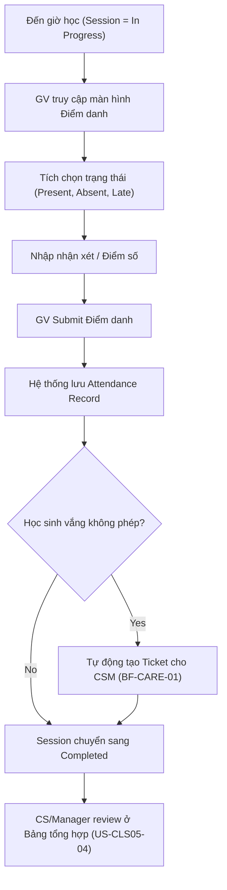

# BF-CLS-05: Điểm danh & Nhận xét (Session Attendance & Grading)

> **Giai đoạn:** 6 — Lớp học & Học viên
> **Capability:** CAP-OPS
> **Nhóm sidebar:** Vận hành
> **Menu ID:** `attendance`

---

## 1. Mô tả nghiệp vụ

Giáo viên thực hiện đánh giá tình trạng chuyên cần (Điểm danh - Attendance), thái độ học tập và điểm số (nếu có) cho từng học viên trong một Buổi học (Session) cụ thể. Hệ thống sẽ tự động cập nhật lịch sử này vào hồ sơ của học sinh và gửi thông báo cho phụ huynh. Đội ngũ Quản lý/CS kiểm duyệt điểm danh trên toàn trung tâm.

## 2. Đối tượng sử dụng (Actors)

- Teacher (Người trực tiếp điểm danh)
- Branch Manager / Admin (Kiểm tra và sửa điểm danh nếu cần)
- CSM (Theo dõi tỷ lệ vắng mặt, gọi điện báo phụ huynh)

## 3. Phạm vi (Scope)

### Trong phạm vi (In Scope)
- Hiển thị danh sách Roster của một Session cụ thể (chỉ những học viên đang học tại thời điểm Session diễn ra).
- Đánh dấu trạng thái Điểm danh: Có mặt (Present), Vắng phép (Excused Absence), Vắng không phép (Unexcused Absence), Đi muộn (Late).
- Nhập nhận xét nhanh (Comment) và chấm điểm bài tập/thái độ cho từng học sinh.
- Chốt sổ (Submit) buổi học để chuyển trạng thái Session sang Completed.
- Xem tổng hợp, kiểm duyệt điểm danh trên toàn bộ hệ thống lớp học của trung tâm.

### Ngoài phạm vi (Out of Scope)
- Cập nhật số buổi còn lại của học phí (Xử lý ngầm qua Webhook sang `CAP-FIN`).
- Gọi điện chăm sóc học viên vắng (Xử lý tại `BF-CARE-01`).

## 4. Nghiệp vụ liên quan

- **Upstream:** `BF-OPS-03` (Session phải chuyển sang trạng thái In Progress thì mới được điểm danh). `BF-CLS-03` (Lấy danh sách Roster).
- **Downstream:** `BF-CARE-01` (Trigger tạo ticket cho CSM nếu học sinh vắng không phép).

## 5. User Stories

### Thao tac theo buoi (Session-level)
- [ ] US-CLS05-01: Diem danh, cham diem va nhan xet theo tung buoi (Daily Session).
- [ ] US-CLS05-05: Xem ket qua BTVN theo buoi (Session Homework Results).
- [ ] US-CLS05-07: Upload & Quan ly Media buoi hoc (Session Gallery).

### Danh gia & Bao cao (Assessment & Reporting)
- [ ] US-CLS05-02: Danh gia dinh ky theo lop (Giua ky, Cuoi ky).
- [ ] US-CLS05-03: Xem bao cao tong hop diem danh & hoc tap cua ca lop.

### Goc nhin toan trung tam (Global View)
- [ ] US-CLS05-04: Kiem duyet va theo doi diem danh toan trung tam (Goc nhin CS/Quan ly).
- [ ] US-CLS05-06: Quan ly tong hop BTVN toan trung tam (Homework Dashboard).

## 6. Luồng vận hành tổng thể (End-to-End Flow)

## 7. Quy tắc nghiệp vụ (Business Rules)

1. **Session-based:** Điểm danh luôn luôn phải gắn liền với một Session ID cụ thể, không bao giờ điểm danh chung chung cho một Class.
2. Học viên đang ở trạng thái Bảo lưu (Suspended) tại thời điểm Session diễn ra sẽ không xuất hiện trong danh sách Điểm danh của Session đó.

## 8. Dữ liệu chính (Key Data)

| Entity | Mô tả |
|--------|-------|
| Attendance Record | Bản ghi điểm danh của 1 Học sinh trong 1 Session (chứa Status, Comment, Grading). |

## 9. Ghi chú triển khai

- **Backend:** `AttendanceService`.
- **Frontend:** Màn hình lưới (Grid) hiển thị danh sách học viên với các nút toggle trạng thái nhanh (P/A/L).
- **Gaps:** Chưa có chính sách giới hạn thời gian sửa điểm danh (VD: Sau 24h từ khi Session kết thúc thì không được sửa nữa trừ khi có quyền Admin).
