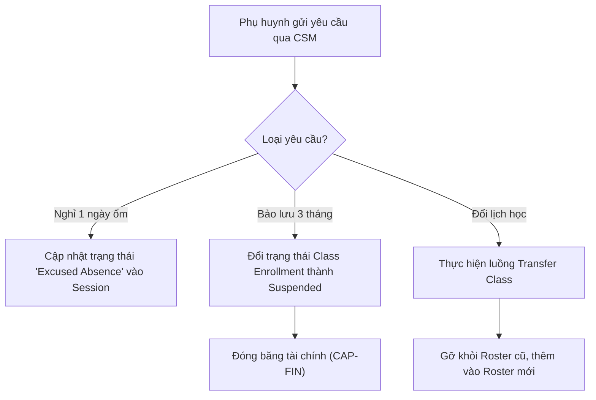

# BF-CLS-06: Báo nghỉ, Bảo lưu & Chuyển lớp (Absence & Transfer)

> **Giai đoạn:** 6 — Lớp học & Học viên
> **Capability:** CAP-OPS
> **Nhóm sidebar:** Vận hành
> **Menu ID:** `leave_reserve`

---

## 1. Mô tả nghiệp vụ

Xử lý các gián đoạn trong quá trình học tập của Học viên. Hỗ trợ 2 cấp độ: Báo nghỉ phép cho từng Buổi học (Session-level) và Bảo lưu/Chuyển lớp dài hạn cho Lớp học (Class-level).

## 2. Đối tượng sử dụng (Actors)

- Admin
- Branch Manager (Duyệt yêu cầu chuyển lớp/bảo lưu)
- CSM (Người tiếp nhận yêu cầu từ Phụ huynh)
- Teacher (Xem danh sách báo nghỉ)

## 3. Phạm vi (Scope)

### Trong phạm vi (In Scope)
- **Session-level (Báo nghỉ phép):** Học viên xin nghỉ 1 vài buổi cụ thể. Hệ thống tự động đánh dấu "Excused Absence" vào các Session tương ứng.
- **Class-level (Bảo lưu - Suspend):** Tạm dừng học tập dài hạn. Trạng thái Enrollment trong Class chuyển thành Suspended. Học phí còn dư (ví) được đóng băng.
- **Class-level (Chuyển lớp - Transfer):** Rút học viên khỏi Class hiện tại và Ghi danh (Enroll) vào Class mới cùng trình độ.

### Ngoài phạm vi (Out of Scope)
- Hoàn phí (Refund) khi học viên rút hẳn (Xử lý tại `CAP-FIN`).
- Điểm danh trực tiếp tại lớp (Xử lý tại `BF-CLS-05`).

## 4. Nghiệp vụ liên quan

- **Upstream:** `BF-CARE-01` (CSM tiếp nhận ticket yêu cầu từ phụ huynh).
- **Downstream:** `BF-FIN-01` (Kích hoạt luồng tính toán lại học phí còn dư khi Bảo lưu/Chuyển lớp).

## 5. User Stories

- [ ] US-CLS06-01: Phụ huynh/CSM báo nghỉ phép cho 1 Session (Xin nghỉ 1 ngày).
- [ ] US-CLS06-02: CSM làm thủ tục Bảo lưu dài hạn cho Học viên.
- [ ] US-CLS06-03: Branch Manager thực hiện Chuyển lớp (Transfer) cho Học viên.

## 6. Luồng vận hành tổng thể (End-to-End Flow)

## 7. Quy tắc nghiệp vụ (Business Rules)

1. **Báo nghỉ phép:** Phải báo trước X giờ (tùy cấu hình chi nhánh) mới được tính là Nghỉ có phép (Excused), nếu không hệ thống sẽ coi là Vắng không phép khi điểm danh.
2. **Bảo lưu:** Thời hạn bảo lưu tối đa là 6 tháng. Sau 6 tháng nếu không quay lại, hệ thống tự động hủy Enrollment.

## 8. Dữ liệu chính (Key Data)

| Entity | Mô tả |
|--------|-------|
| Leave Request | Đơn xin nghỉ phép ngắn hạn (gắn liền với 1 hoặc vài Session). |
| Transfer Record | Biên bản ghi nhận lịch sử chuyển lớp. |

## 9. Ghi chú triển khai

- **Backend:** `EnrollmentService` xử lý đổi trạng thái và sinh `TransferRecord`.
- **Frontend:** Tab `Yêu cầu` trong chi tiết Học viên.
- **Gaps:** Logic xử lý chuyển chi nhánh (Transfer Branch) đang bị hổng vì liên quan đến chuyển tiền giữa 2 pháp nhân độc lập.
