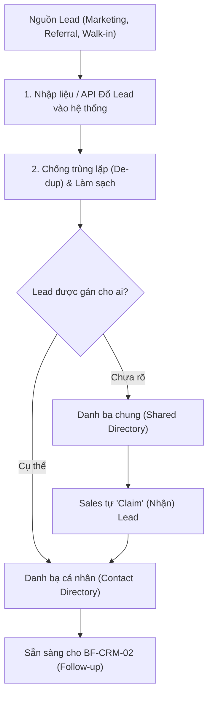

# BF-CRM-01: Quản lý Khách hàng tiềm năng (Lead Generation & Directory)

> **Capability:** CAP-ADM
> **Giai đoạn:** 1 — Thu hút & Tiếp cận (Pre-Enrollment)
> **Nhóm sidebar:** Khách hàng
> **Menu ID:** `contact_directory`, `contact_shared_directory`

---

## 1. Mô tả nghiệp vụ

Đây là business function quản trị đầu vào của vòng đời tuyển sinh. Nhiệm vụ chính là thu thập (Capture), chuẩn hóa (Enrich), và phân loại (Segment) các khách hàng tiềm năng (Leads/Contacts) từ nhiều nguồn khác nhau (Marketing campaigns, Referral, Walk-in, Form đăng ký). BF này cung cấp một danh bạ tập trung để Sales có thể khai thác và tiếp cận hiệu quả.

## 2. Đối tượng sử dụng (Actors)

- Sales (Telesales, Tư vấn viên)
- Marketing (Đẩy lead vào hệ thống)
- Branch Manager (Phân bổ lead cho Sales)
- System Admin (Cấu hình nguồn và quyền truy cập shared directory)

## 3. Phạm vi (Scope)

### Trong phạm vi (In Scope)

- Tạo mới hoặc import hồ sơ khách hàng tiềm năng (Leads/Contacts).
- Chuẩn hóa và làm sạch dữ liệu (Detect trùng lặp SĐT/Email).
- Phân loại Lead theo nguồn (Source), chiến dịch (Campaign/UTM), và mức độ ưu tiên (Hot/Warm/Cold).
- Quản lý cơ chế phân bổ Lead: Danh bạ cá nhân (chỉ Sales được gán mới thấy) và Danh bạ chung (Shared Directory - ai nhận trước thì được chăm sóc).

### Ngoài phạm vi (Out of Scope)

- Ghi nhận chi tiết các cuộc gọi, tin nhắn và lịch hẹn follow-up (thuộc `BF-CRM-02`).
- Quản lý hồ sơ học viên chính thức (Master Profile) sau khi đã đăng ký học (thuộc `BF-PRF-01`).

## 4. Nghiệp vụ liên quan

- **Upstream:** Các hệ thống Marketing ngoài nền tảng (Landing Page, Facebook Lead Ads, Zalo OA) đẩy data vào thông qua API.
- **Downstream:** `BF-CRM-02` (Follow-up & Tương tác) - Lấy danh sách Lead để thực hiện telesale và chăm sóc.
- **Downstream:** `BF-ENR-01`, `BF-ENR-02` - Đăng ký lịch test/học thử khi Lead có nhu cầu.

## 5. User Stories

**Danh sách US đề xuất (Proposed):**
- [ ] US-CRM-01: Tạo mới và Import danh sách khách hàng (Leads).
- [ ] US-CRM-02: Cơ chế chống trùng lặp dữ liệu (De-duplication) theo SĐT/Email.
- [ ] US-CRM-03: Phân bổ Lead tự động (Round-robin) hoặc thủ công cho Sales.
- [ ] US-CRM-04: Quản lý và khai thác Danh bạ chung (Shared Directory/Lead Pool).

## 6. Luồng vận hành tổng thể (End-to-End Flow)

## 7. Quy tắc nghiệp vụ (Business Rules)

1. Mọi Lead vào hệ thống bắt buộc phải có ít nhất một phương thức liên lạc hợp lệ (SĐT hoặc Email).
2. Khi import, nếu phát hiện SĐT trùng lặp, hệ thống cảnh báo và yêu cầu gộp (Merge) hoặc từ chối tạo mới để tránh xung đột Sale.
3. Lead nằm trong Shared Directory nếu quá thời gian quy định (ví dụ: 48h) không có ai "Claim" sẽ tự động chuyển trạng thái "Cảnh báo nguội".
4. Dữ liệu Lead thuộc sở hữu của Chi nhánh/Công ty, Sales bị giới hạn quyền export trừ khi được cấp phép đặc biệt.

## 8. Dữ liệu chính (Key Data)

| Entity | Mô tả |
|--------|-------|
| Lead / Contact | Hồ sơ khách hàng tiềm năng trước khi chuyển đổi. |
| Lead Source | Nguồn gốc xuất phát của Lead (ví dụ: Facebook, Walk-in). |
| Ownership Assignment | Bảng ánh xạ xác định Sales nào đang nắm giữ Lead nào. |

## 9. Ghi chú triển khai

- **Registry mapping:** `crm.lead_contact_lifecycle_management` (Giai đoạn Đầu vào)
- **Backend:** `partial` (Chức năng import và chống trùng lặp cần hoàn thiện logic).
- **Frontend:** Các màn hình `contact_directory`, `contact_shared_directory`.
- **Gaps:** Cần chốt với bộ phận Marketing về chuẩn kết nối API từ Landing Page/Facebook vào hệ thống Rinov4. Mức độ tự động phân bổ Lead (Round-robin) cần định nghĩa rõ logic.
