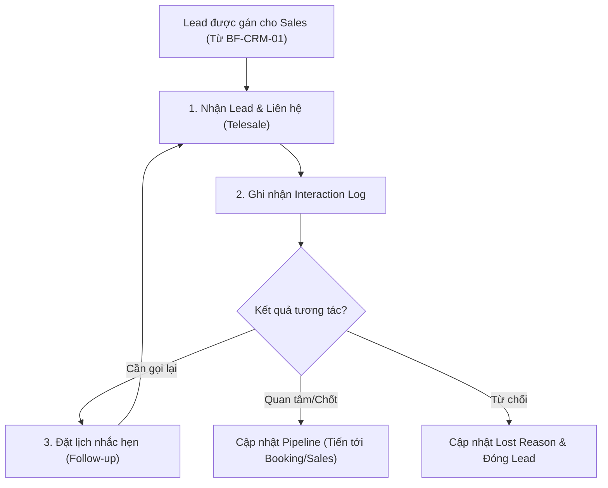

# BF-CRM-02: Quản lý Cơ hội và Tương tác (Sales Pipeline & Follow-up)

> **Capability:** CAP-ADM
> **Giai đoạn:** 1 — Thu hút & Tiếp cận (Pre-Enrollment)
> **Nhóm sidebar:** Khách hàng
> **Menu ID:** `contact_followups`, `contact_interactions`

---

## 1. Mô tả nghiệp vụ

Business function này quản lý quá trình theo dõi, chăm sóc và tương tác với khách hàng tiềm năng (Leads) nhằm mục đích chuyển đổi họ thành học viên (Conversion). Nó bao gồm việc quản lý các cuộc gọi (Telesales), lên lịch hẹn (Follow-ups), ghi nhận trạng thái phễu bán hàng (Sales Pipeline) và xử lý các cơ hội kinh doanh (Opportunities) trước khi chuyển qua quy trình Học thử hoặc Đăng ký chính thức.

## 2. Đối tượng sử dụng (Actors)

- Sales (Tư vấn viên, Telesales)
- Branch Manager (Giám sát hiệu suất Sales)
- CSM (Hỗ trợ tư vấn các gói gia hạn nếu áp dụng mô hình lai)

## 3. Phạm vi (Scope)

### Trong phạm vi (In Scope)

- Ghi nhận lịch sử tương tác đa kênh (Cuộc gọi, Zalo, SMS, Gặp mặt trực tiếp).
- Cài đặt nhắc hẹn (Reminders/Follow-ups) cho Sales.
- Quản lý trạng thái Lead trong phễu bán hàng (Pipeline Stages: New, Contacted, Interested, Booking, Won, Lost).
- Thống kê tỷ lệ chuyển đổi (Conversion Rate) và phân tích lý do rớt (Lost Reason).

### Ngoài phạm vi (Out of Scope)

- Quá trình đăng ký lịch Đánh giá năng lực hoặc Học thử (thuộc `BF-ENR-01`, `BF-ENR-02`).
- Phân bổ Lead đầu vào và gộp dữ liệu trùng lặp (thuộc `BF-CRM-01`).

## 4. Nghiệp vụ liên quan

- **Upstream:** `BF-CRM-01` (Lead Generation) - Cung cấp danh sách khách hàng tiềm năng đã được phân bổ cho Sales.
- **Downstream:** `BF-ENR-01`, `BF-ENR-02` - Đẩy Lead sang trạng thái Booking (Test/Trial) để trải nghiệm dịch vụ.
- **Downstream:** `BF-SAL-01` - Lead đồng ý mua khóa học sẽ được chuyển thẳng sang quy trình tạo Đơn hàng.

## 5. User Stories

**Danh sách US đề xuất (Proposed):**
- [ ] US-CRM-05: Ghi nhận Interaction Log (Nhật ký tương tác) cho Lead.
- [ ] US-CRM-06: Tạo và quản lý Lịch nhắc hẹn (Follow-up Tasks/Reminders).
- [ ] US-CRM-07: Quản lý và kéo thả trạng thái Lead trên Sales Pipeline (Kanban Board).
- [ ] US-CRM-08: Theo dõi lý do thất bại (Lost Reason) và tái tiếp cận (Re-targeting).

## 6. Luồng vận hành tổng thể (End-to-End Flow)

## 7. Quy tắc nghiệp vụ (Business Rules)

1. Mọi tác vụ Follow-up quá hạn (Overdue) sẽ bị gắn cờ đỏ và báo cáo lên Branch Manager sau 24h.
2. Không cho phép chuyển Lead sang trạng thái "Won" (Thành công) nếu chưa có lịch sử tương tác nào được ghi nhận.
3. Khi Lead chuyển đổi thành Học viên (Won), lịch sử tương tác tại CRM phải được đồng bộ và đính kèm vào Master Profile của học viên đó để đảm bảo tính liên tục của dữ liệu.

## 8. Dữ liệu chính (Key Data)

| Entity | Mô tả |
|--------|-------|
| Interaction Log | Bản ghi lịch sử tư vấn (Ngày, Giờ, Kênh, Nội dung, Kết quả). |
| Follow-up Task | Lịch nhắc nhở công việc cần làm với Lead (Gọi lại, Gửi email báo giá). |
| Pipeline Stage | Cột mốc định nghĩa mức độ quan tâm của Lead trong phễu bán hàng. |

## 9. Ghi chú triển khai

- **Registry mapping:** `crm.lead_contact_lifecycle_management` (Giai đoạn Chăm sóc & Chuyển đổi)
- **Backend:** `partial` (Cấu trúc lưu trữ log tương tác cần kiểm tra lại độ linh hoạt của DB).
- **Frontend:** Các màn hình `contact_followups`, `contact_interactions`. Đề xuất bổ sung giao diện Kanban Board cho Sales Pipeline.
- **Gaps:** Cần tích hợp với hệ thống tổng đài ảo (VoIP) hoặc Zalo ZNS để tự động lưu log gọi điện/nhắn tin, giảm thao tác thủ công cho Sales.
