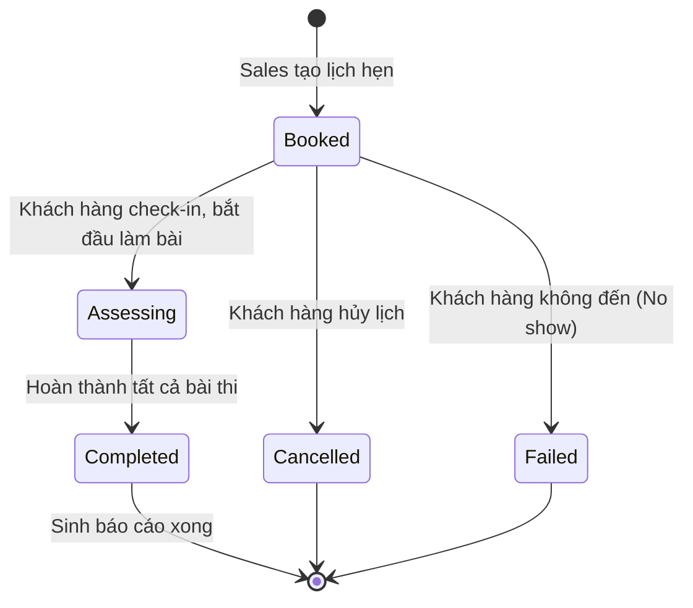

# BF-ENR-01: Booking Test (Đánh giá năng lực)

> **Capability:** CAP-ADM (Năng lực Tuyển sinh & Thương mại)
> **Giai đoạn:** 1 - Tuyển sinh
> **Nhóm chức năng:** Quản lý sự kiện
> **Mã màn hình:** `booking_test`

---

## 1. Mô tả tổng quan

Phân hệ đặt lịch kiểm tra năng lực đầu vào (Placement Test / Booking Test) cho khách hàng tiềm năng. Bao gồm việc tạo lịch hẹn, phân bổ giáo viên phỏng vấn (Speaking), đồng bộ đề thi xuống thiết bị thực hành (iPad), thu thập và tự động tổng hợp kết quả làm bài để sinh ra báo cáo năng lực (Report Link). Báo cáo này là cơ sở để Tư vấn viên (Sales) chốt lộ trình học.

## 2. Đối tượng sử dụng (Vai trò)

- **Nhân viên Tư vấn (Sales):** Đặt lịch hẹn test cho khách hàng, lấy kết quả để tư vấn.
- **Giáo viên (Teacher):** Tiến hành phỏng vấn (Speaking), chấm điểm trực tiếp trên hệ thống.
- **Quản lý Chi nhánh:** Giám sát tỷ lệ khách đến test và tỷ lệ chuyển đổi.

## 3. Ranh giới Nghiệp vụ (Scope)

### Có bao gồm (In Scope)
- Tạo và quản lý lịch hẹn kiểm tra năng lực (Booking Test) tại chi nhánh.
- Chọn loại bài test tương ứng với lứa tuổi/chương trình (Ví dụ: Math, English LWR).
- Phân công Giáo viên phụ trách phần phỏng vấn (Speaking).
- Đồng bộ dữ liệu ca thi xuống ứng dụng trên iPad.
- Thu thập điểm từ hệ thống LMS và điểm do Giáo viên nhập để tổng hợp kết quả.
- Tự động sinh Link Báo cáo Tổng thể.

### Không bao gồm (Out of Scope)
- Dựa vào kết quả test để tư vấn và bán khóa học → Xử lý tại `BF-SAL-03` và `BF-SAL-01`.
- Quản lý kho thiết bị iPad → Xử lý tại `BF-SYS-03` (Quản lý thiết bị).

## 4. Mô hình Dữ liệu Nghiệp vụ (Data Entities)

| Tên Thực thể | Trường định danh | Thuộc tính quan trọng | Ràng buộc quan hệ | Diễn giải |
|--------------|------------------|-----------------------|-------------------|----------|
| Lịch hẹn Test (Booking) | Mã lịch hẹn (VD: E005) | Thời gian, Chương trình test, Trạng thái | Trỏ về Mã Khách hàng & Mã Giáo viên | Phiếu quản lý ca thi. |
| Điểm thành phần | Mã kết quả | Điểm Toán, Điểm Nghe-Đọc-Viết (LWR), Điểm Nói | Trỏ về Mã Lịch hẹn | Dữ liệu cấu thành báo cáo. |

### 4.1. Vòng đời Trạng thái (Status Lifecycle)

*Sơ đồ dưới đây xác định trạng thái của một Lịch hẹn Test.*

**Quy tắc chuyển đổi:**

| Từ trạng thái | Sang trạng thái | Điều kiện bắt buộc | Vai trò được phép |
|---------------|-----------------|---------------------|-------------------|
| Booked | Assessing | Lễ tân hoặc Sales xác nhận Check-in | Nhân viên tại quầy |
| Assessing | Completed | Thu thập đủ 100% điểm các môn yêu cầu (VD: LMS đẩy điểm LWR, Giáo viên nhập điểm Speaking) | Hệ thống tự động |

### 4.2. Ví dụ Dữ liệu mẫu

*Giúp AI và Lập trình viên tạo dữ liệu kiểm thử chính xác.*

| Tình huống | Dữ liệu đầu vào | Kết quả mong đợi |
|------------|-----------------|-------------------|
| Đặt lịch test | Chọn Khách A, Ngày 15/10, Chương trình: IELTS, GV: Trần B | Sinh Booking E001, trạng thái Booked. |
| Chấm điểm | iPad gửi điểm LWR = 8.0, GV Trần B nhập Speaking = 7.5 | Booking E001 tự động chuyển sang Completed, sinh link báo cáo. |
| Vắng mặt | Đến cuối ngày 15/10, Booking E001 vẫn ở trạng thái Booked | Batch job cuối ngày tự động quét và chuyển sang Failed (No show). |

## 5. Quy tắc Nghiệp vụ Tổng thể (Business Rules)

1. **[RULE-ENR-01-01] Tính duy nhất (Concurrency):** Một khách hàng tiềm năng chỉ được phép tồn tại **duy nhất 1 booking test** ở trạng thái đang mở (`Booked` hoặc `Assessing`) tại một thời điểm để tránh việc Sales trùng lịch.
2. **[RULE-ENR-01-02] Phân quyền bảo mật:** Chỉ có Giáo viên được phân công trong Booking mới có quyền hiển thị giao diện và nhập điểm số phần Phỏng vấn (Speaking). Sales không được phép can thiệp vào điểm số.
3. **[RULE-ENR-01-03] Khôi phục bài thi:** Nếu thiết bị iPad mất kết nối mạng hoặc sập nguồn khi đang làm bài (`Assessing`), hệ thống LMS phải lưu trữ tạm (local storage) hoặc phiên làm việc để học sinh có thể tiếp tục bài thi mà không phải làm lại từ đầu.

## 6. Danh sách Yêu cầu Người dùng (User Stories)

| Mã Yêu cầu | Tên Yêu cầu (Loại màn hình) | Đường dẫn truy cập | Trạng thái |
|------------|-----------------------------|--------------------|------------|
| US-BT01 | Quản lý danh sách Booking Test (Danh sách) | /app/booking_test | Đã có US |
| US-BT02 | Tạo mới Booking Test (Bảng nổi) | Không có | Đã có US |
| US-BT03 | Xem và cập nhật chi tiết booking (Chi tiết) | Nằm trong Chi tiết Lead | Đã có US |
| US-BT04 | Đánh giá English Assessment Path (Nhập liệu) | Dành cho Giáo viên | Đã có US |
| US-BT05 | Thực thi và đồng bộ test iPad (API/Background) | Vô hình | Đã có US |

---

## 7. Chỉ dẫn cho AI Agent & Lập trình viên (Business Architecture)

- Tuân thủ chặt chẽ cấu trúc thực thể ở mục 4. Phải đảm bảo tính toàn vẹn dữ liệu nghiệp vụ (dữ liệu bảng con phải trỏ đúng mã có thật của bảng cha).
- Mọi trạng thái liệt kê trong sơ đồ 4.1 phải được ánh xạ đầy đủ vào hệ thống.
- Giao diện và luồng xử lý phải tuân thủ bảng chuyển đổi trạng thái (chỉ hiển thị các hành động hợp lệ theo từng trạng thái và phân quyền).

### ⛔ Hàng rào An toàn (Guardrails)
- **KHÔNG** thêm trường dữ liệu hoặc thực thể ngoài danh sách quy định ở mục 4.
- **KHÔNG** thay đổi cấu trúc quan hệ thực thể mà chưa được phê duyệt từ Product Owner.
- **KHÔNG** tạo trạng thái nghiệp vụ mới ngoài sơ đồ ở mục 4.1. Mọi sự thay đổi vòng đời phải được cập nhật vào tài liệu này trước.

