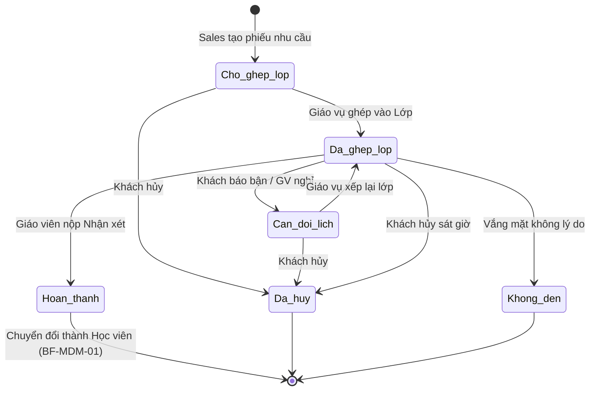

# BF-ENR-02: Học thử ghép buổi (Trial Session)

> **Capability:** CAP-ADM (Năng lực Tuyển sinh & Thương mại)
> **Giai đoạn:** 1 - Tuyển sinh
> **Nhóm chức năng:** Quản lý sự kiện
> **Mã màn hình:** `trial_class`

---

## 1. Mô tả tổng quan

Phân hệ quản lý toàn bộ vòng đời của một lịch học thử (Trial Booking) theo mô hình **Ghép buổi** (Trial Session). Khách hàng tiềm năng (Lead) sẽ được sắp xếp tham gia trải nghiệm trực tiếp vào một Buổi học (Session) của một Lớp chính thức đang vận hành để đánh giá sự phù hợp trước khi quyết định ghi danh dài hạn.

## 2. Đối tượng sử dụng (Vai trò)

- **Nhân viên Tư vấn (Sales):** Ghi nhận nhu cầu học thử của khách, chốt lịch.
- **Nhân viên Giáo vụ / Quản lý Chi nhánh:** Phê duyệt và xếp khách vào lớp phù hợp (Ghép lớp).
- **Giáo viên:** Chấm điểm, đánh giá và nhận xét học viên sau khi kết thúc buổi học thử.

## 3. Ranh giới Nghiệp vụ (Scope)

### Có bao gồm (In Scope)
- Ghi nhận nhu cầu học thử (Môn học, cơ sở, thời gian).
- Quản lý danh sách Booking Học thử theo các trạng thái vòng đời.
- Thực hiện ghép nối (Assignment) khách vào một Lớp & Buổi học cụ thể (có kiểm tra sĩ số, trình độ).
- Xử lý các nghiệp vụ ngoại lệ: Đổi lịch, Hủy lịch học thử.
- Giao diện cho Giáo viên điền nhận xét năng lực riêng cho học viên học thử.

### Không bao gồm (Out of Scope)
- Tổ chức lớp học thử riêng biệt chỉ gồm toàn học sinh mới (Dedicated Trial Class) → Xử lý như lớp bình thường ở `CAP-OPS`.
- Tư vấn chốt Sale, tạo Đơn hàng → Xử lý tại `BF-SAL-01`.
- Xếp lớp học chính thức dài hạn → Xử lý tại `BF-CLS-03` (trạng thái Chờ xếp lớp).

## 4. Mô hình Dữ liệu Nghiệp vụ (Data Entities)

| Tên Thực thể | Trường định danh | Thuộc tính quan trọng | Ràng buộc quan hệ | Diễn giải |
|--------------|------------------|-----------------------|-------------------|----------|
| Lịch Học thử (Trial Booking) | Mã Học thử | Lớp dự kiến, Trạng thái, Kết quả đánh giá | Trỏ về Mã Khách hàng & Mã Buổi học | Phiếu quản lý ca học thử. |

### 4.1. Vòng đời Trạng thái (Status Lifecycle)

*Sơ đồ dưới đây xác định vòng đời của một Lịch Học thử.*

**Quy tắc chuyển đổi:**

| Từ trạng thái | Sang trạng thái | Điều kiện bắt buộc | Vai trò được phép |
|---------------|-----------------|---------------------|-------------------|
| Chờ ghép lớp | Đã ghép lớp | Lớp ghép phải còn chỗ | Nhân viên Giáo vụ |
| Đã ghép lớp | Cần đổi lịch | Khách yêu cầu hoặc Giáo viên hủy buổi | Tư vấn / Giáo vụ |
| Cần đổi lịch | Đã ghép lớp | Lớp ghép phải còn chỗ | Nhân viên Giáo vụ |
| Đã ghép lớp | Hoàn thành | Giáo viên hoàn tất Nhận xét học thử | Giáo viên / Giáo vụ |

### 4.2. Ví dụ Dữ liệu mẫu

*Giúp AI và Lập trình viên tạo dữ liệu kiểm thử chính xác.*

| Tình huống | Dữ liệu đầu vào | Kết quả mong đợi |
|------------|-----------------|-------------------|
| Tạo nhu cầu | Chọn Khách A, môn IELTS, cơ sở Q1 | Booking "Chờ ghép lớp". |
| Ghép lớp lỗi | Ghép Khách A vào Lớp IELTS-01 (Đã đủ 15/15 sĩ số) | Báo lỗi: "Lớp đã đầy, không thể nhận thêm học viên học thử". |
| Đánh giá | GV nhập "Nói tốt, ngữ pháp yếu", đánh giá 7/10 | Trạng thái chuyển thành "Hoàn thành", gửi thông báo cho Sales. |

## 5. Quy tắc Nghiệp vụ Tổng thể (Business Rules)

1. **[RULE-ENR-02-01] Kiểm soát sĩ số (Capacity):** Lịch học thử được ghép vào Buổi học sẽ chiếm 1 "chỗ cứng" của buổi đó. Tổng số (Học viên chính thức + Học viên học thử) trong 1 Buổi học KHÔNG ĐƯỢC vượt quá Sĩ số tối đa (Max Capacity) của Lớp/Phòng học.
2. **[RULE-ENR-02-02] Ranh giới dữ liệu (Roster Privacy):** Học viên học thử CHỈ được hiển thị trong danh sách Điểm danh của duy nhất Buổi học (Session) mà họ được ghép vào. Họ KHÔNG xuất hiện trong Danh sách lớp chính thức (Class Roster) hay lịch sử các buổi học khác.
3. **[RULE-ENR-02-03] Phân quyền Ghép lớp:** Sales có quyền tạo Phiếu Nhu cầu, nhưng quyền "Ghép lớp" (Assign) bắt buộc phải do Giáo vụ (CSM) hoặc Quản lý thực hiện để đảm bảo kiểm soát chất lượng vận hành lớp.
4. **[RULE-ENR-02-04] Tích hợp Điểm danh & Nhận xét:** Khi Giáo viên hoàn tất điểm danh và nhận xét học viên tại màn hình Vận hành buổi học (BF-CLS), hệ thống Học thử (BF-ENR-02) sẽ tự động đồng bộ kết quả này về dưới dạng Read-only, và tự động chuyển trạng thái Booking sang 'Hoàn thành'.
5. **[RULE-ENR-02-05] Giới hạn số buổi (Max Sessions):** Khách hàng được phép đăng ký ghép tối đa 3 buổi học thử cho mỗi Booking (Multi-session limit).
6. **[RULE-ENR-02-06] Xác định Hoàn thành (Multi-session Completion):** Trạng thái Booking chỉ chuyển sang 'Hoàn thành' khi buổi học **cuối cùng** trong mảng đăng ký được Giáo viên hoàn tất nhận xét.
7. **[RULE-ENR-02-07] Điểm danh từng phần (Partial Show/No-show):** Booking chỉ chuyển sang trạng thái 'Không đến' (No-show) khi khách vắng mặt **tất cả** các buổi đã đăng ký. Nếu khách có mặt ít nhất 1 buổi, Booking tiếp tục vòng đời.
8. **[RULE-ENR-02-08] Người phụ trách (Owner Assignment):** Khi ghép lớp/buổi học thành công, 'Người phụ trách' (Owner) của Booking sẽ tự động được gán theo Giáo viên phụ trách của lớp/buổi học đó.

## 6. Danh sách Yêu cầu Người dùng (User Stories)

| Mã Yêu cầu | Tên Yêu cầu (Loại màn hình) | Đường dẫn truy cập | Trạng thái |
|------------|-----------------------------|--------------------|------------|
| US-ENR02-01 | Quản lý danh sách Booking Học thử (Danh sách) | /app/trial_class | Đã có US |
| US-ENR02-02 | Tạo mới Booking học thử (Bảng nổi) | Không có | Đã có US |
| US-ENR02-03 | Thao tác Ghép lớp và Buổi học (Bảng phụ) | Nằm trong Chi tiết Booking | Đã có US |
| US-ENR02-04 | Xử lý ngoại lệ Đổi/Hủy lịch (Hành động) | Nằm trong Chi tiết Booking | Đã có US |
| US-ENR02-05 | Xem và cập nhật Chi tiết Booking (Detail Modal) | Mở từ danh sách | Đã có US |

---

## 7. Chỉ dẫn cho AI Agent & Lập trình viên (Business Architecture)

- Tuân thủ chặt chẽ cấu trúc thực thể ở mục 4. Phải đảm bảo tính toàn vẹn dữ liệu nghiệp vụ (dữ liệu bảng con phải trỏ đúng mã có thật của bảng cha).
- Mọi trạng thái liệt kê trong sơ đồ 4.1 phải được ánh xạ đầy đủ vào hệ thống.
- Giao diện và luồng xử lý phải tuân thủ bảng chuyển đổi trạng thái (chỉ hiển thị các hành động hợp lệ theo từng trạng thái và phân quyền).

### ⛔ Hàng rào An toàn (Guardrails)
- **KHÔNG** thêm trường dữ liệu hoặc thực thể ngoài danh sách quy định ở mục 4.
- **KHÔNG** thay đổi cấu trúc quan hệ thực thể mà chưa được phê duyệt từ Product Owner.
- **KHÔNG** tạo trạng thái nghiệp vụ mới ngoài sơ đồ ở mục 4.1. Mọi sự thay đổi vòng đời phải được cập nhật vào tài liệu này trước.

