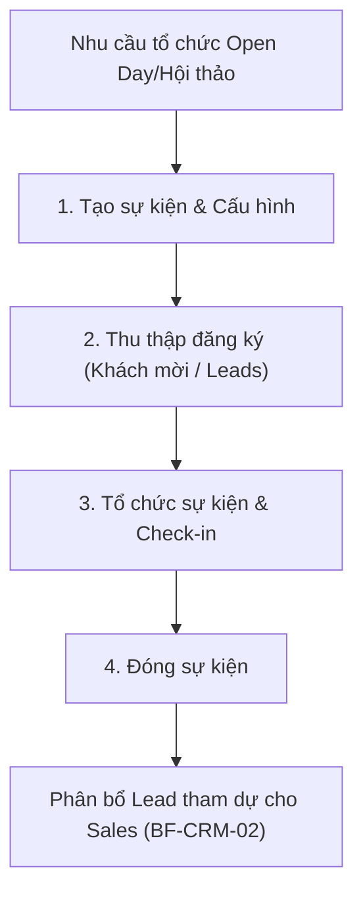

# BF-ENR-03: Quản lý sự kiện tuyển sinh (Event Management)

> **Capability:** CAP-ADM
> **Giai đoạn:** 1 — Thu hút & Tiếp cận (Pre-Enrollment)
> **Nhóm sidebar:** Quản lý sự kiện
> **Menu ID:** `event_management_new`

---

## 1. Mô tả nghiệp vụ

Đây là business function phục vụ việc thiết lập, tổ chức và quản lý các sự kiện offline/online nhằm mục đích tuyển sinh (ví dụ: Hội thảo, Open Day, Lễ hội, Thi thử tập trung). Nghiệp vụ này theo dõi toàn bộ vòng đời của một sự kiện: từ khâu lập kế hoạch (Setup), gom danh sách người đăng ký tham gia (Attendees), điểm danh sự kiện (Check-in), cho đến đo lường mức độ chuyển đổi sau sự kiện (Event Conversion).

## 2. Đối tượng sử dụng (Actors)

- Marketing Executive (Lên kịch bản, setup sự kiện)
- Sales / Telesales (Ghi nhận đăng ký, Check-in tại sự kiện)
- Branch Manager (Phê duyệt nguồn lực tổ chức tại cơ sở)

## 3. Phạm vi (Scope)

### Trong phạm vi (In Scope)

- Tạo mới và cấu hình thông tin sự kiện (Tên, thời gian, địa điểm, sức chứa tối đa).
- Quản lý danh sách đăng ký tham gia (Guest List / RSVP).
- Thực hiện điểm danh (Check-in) người tham dự thực tế tại sự kiện (QR Code hoặc tick thủ công).
- Báo cáo số liệu: Đăng ký vs. Tham dự thực tế vs. Chuyển đổi thành học viên.

### Ngoài phạm vi (Out of Scope)

- Quản lý chiến dịch quảng cáo Digital Marketing chạy cho sự kiện (nằm ngoài hệ thống lõi).
- Sắp xếp và điều phối lịch làm việc của nhân sự (thuộc `BF-HR-02`).
- Phân bổ phòng học cho sự kiện (được xử lý bởi luồng `BF-OPS-02` - Class Scheduling).

## 4. Nghiệp vụ liên quan

- **Upstream:** `BF-CRM-01` - Người đăng ký sự kiện (Guest) tự động trở thành Lead trong danh bạ nếu chưa có.
- **Downstream:** `BF-CRM-02` - Dữ liệu người tham gia (Attendees) được đẩy sang phễu bán hàng (Sales Pipeline) để Sales thực hiện follow-up sau sự kiện.
- **Downstream:** `BF-ENR-01`, `BF-ENR-02` - Cho phép book test/học thử ngay tại sự kiện.

## 5. User Stories

**Danh sách US đề xuất (Proposed):**
- [ ] US-ENR03-01: Cấu hình thông tin và thông số sự kiện (Sức chứa, Địa điểm).
- [ ] US-ENR03-02: Quản lý danh sách đăng ký (Guest List) và phát hành vé/QR.
- [ ] US-ENR03-03: Thực hiện Check-in người tham dự thực tế.
- [ ] US-ENR03-04: Báo cáo tỷ lệ chuyển đổi Lead từ sự kiện tuyển sinh.

## 6. Luồng vận hành tổng thể (End-to-End Flow)

## 7. Quy tắc nghiệp vụ (Business Rules)

1. Số lượng đăng ký không được vượt quá "Sức chứa tối đa" (Capacity) của sự kiện trừ khi được Override bởi Manager.
2. Một khách mời (Lead) có thể đăng ký nhiều sự kiện khác nhau, nhưng mỗi sự kiện chỉ được Check-in 1 lần.
3. Khi khách mời Check-in thành công, trạng thái Lead của họ tự động cập nhật interaction log là "Đã tham gia sự kiện X" (Đồng bộ với `BF-CRM-02`).

## 8. Dữ liệu chính (Key Data)

| Entity | Mô tả |
|--------|-------|
| Event | Phiếu ghi nhận sự kiện (Thời gian, địa điểm, trạng thái: Planning, Open, Closed). |
| Event Registration | Thông tin đăng ký của 1 Lead (Trạng thái: Registered, Cancelled, Attended). |

## 9. Ghi chú triển khai

- **Registry mapping:** Nằm trong cụm tính năng mở rộng của phễu CRM/Enrollment.
- **Backend:** Cần API cung cấp hệ thống Check-in nhanh.
- **Frontend:** Cần phát triển màn hình tạo QR hoặc quét QR Check-in trên thiết bị di động/Tablet cho nhân viên lễ tân sự kiện.
