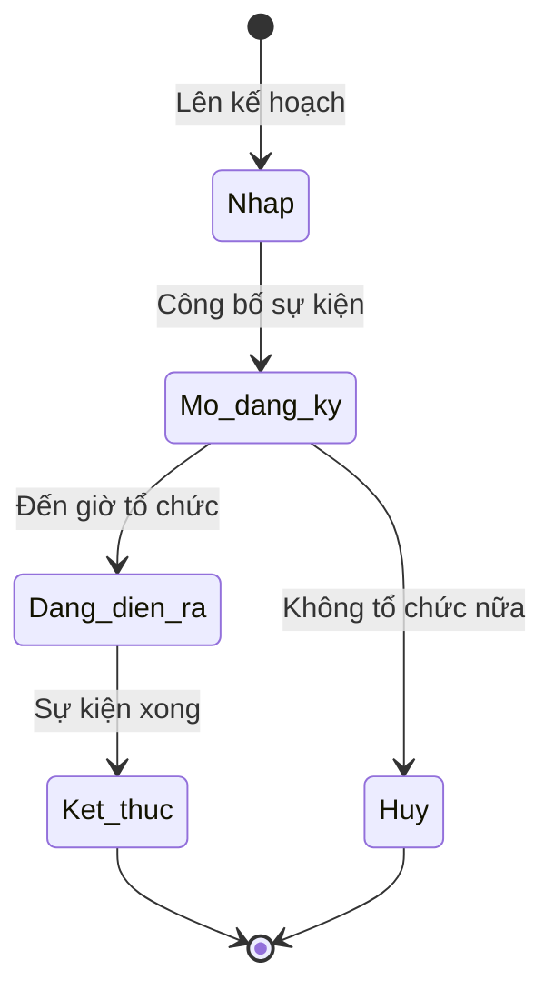

# BF-ENR-03: Quản lý sự kiện tuyển sinh (Event Management)

> **Capability:** CAP-ADM (Năng lực Tuyển sinh & Thương mại)
> **Giai đoạn:** 1 - Tuyển sinh
> **Nhóm chức năng:** Quản lý sự kiện
> **Mã màn hình:** `event_management_new`

---

## 1. Mô tả tổng quan

Phân hệ phục vụ việc thiết lập, tổ chức và quản lý các sự kiện offline/online nhằm mục đích tuyển sinh (ví dụ: Hội thảo, Open Day, Lễ hội, Thi thử tập trung). Quản lý toàn bộ vòng đời của một sự kiện: từ khâu lập kế hoạch (Setup), gom danh sách người đăng ký tham gia (Attendees), điểm danh sự kiện (Check-in), cho đến đo lường mức độ chuyển đổi sau sự kiện.

## 2. Đối tượng sử dụng (Vai trò)

- **Nhân viên Tiếp thị (Marketing):** Lên kịch bản, cấu hình sự kiện, đẩy danh sách đăng ký vào hệ thống.
- **Nhân viên Tư vấn (Sales):** Mời khách tham gia, trực tiếp Check-in khách tại sự kiện.
- **Quản lý Chi nhánh:** Phê duyệt việc tổ chức sự kiện tại cơ sở và bố trí không gian.

## 3. Ranh giới Nghiệp vụ (Scope)

### Có bao gồm (In Scope)
- Tạo mới và cấu hình thông tin sự kiện (Tên, thời gian, địa điểm, sức chứa tối đa).
- Quản lý danh sách khách mời đăng ký tham gia (Guest List / RSVP).
- Thực hiện điểm danh (Check-in) người tham dự thực tế tại sự kiện.
- Báo cáo cơ bản: Đăng ký vs. Tham dự thực tế.

### Không bao gồm (Out of Scope)
- Quản lý chiến dịch quảng cáo Digital Marketing chạy cho sự kiện → Ngoài hệ thống (Hoạt động của Marketing).
- Sắp xếp và điều phối nhân sự trực sự kiện → Thuộc `BF-HR-02`.
- Phân bổ phòng học cho sự kiện → Thuộc hệ thống đặt phòng hoặc `BF-OPS-02` (Class Scheduling).
- Đánh giá chuyển đổi (Conversion) sâu sau sự kiện → Dữ liệu đẩy qua `BF-CRM-02` để đánh giá.

## 4. Mô hình Dữ liệu Nghiệp vụ (Data Entities)

| Tên Thực thể | Trường định danh | Thuộc tính quan trọng | Ràng buộc quan hệ | Diễn giải |
|--------------|------------------|-----------------------|-------------------|----------|
| Sự kiện | Mã sự kiện | Tên, Thời gian, Sức chứa, Trạng thái | Độc lập | Gốc sự kiện. |
| Vé tham dự (Đăng ký) | Mã vé | Trạng thái (Chờ duyệt/Check-in) | Trỏ về Mã Sự kiện & Mã Khách hàng | Khách được mời dự sự kiện. |

### 4.1. Vòng đời Trạng thái (Status Lifecycle)

*Sơ đồ dưới đây xác định vòng đời của một Sự kiện tuyển sinh.*

**Quy tắc chuyển đổi:**

| Từ trạng thái | Sang trạng thái | Điều kiện bắt buộc | Vai trò được phép |
|---------------|-----------------|---------------------|-------------------|
| Mở đăng ký | Đang diễn ra | Có thể do người dùng bấm hoặc tự chuyển theo giờ | Quản lý / Marketing |
| Bất kỳ | Hủy | Bắt buộc ghi nhận lý do hủy | Quản lý Chi nhánh |

### 4.2. Ví dụ Dữ liệu mẫu

*Giúp AI và Lập trình viên tạo dữ liệu kiểm thử chính xác.*

| Tình huống | Dữ liệu đầu vào | Kết quả mong đợi |
|------------|-----------------|-------------------|
| Tạo sự kiện | Open Day 15/10, Sức chứa: 50 người | Lưu thành công ở trạng thái Nháp. |
| Vượt sức chứa | Khách thứ 51 đăng ký vào sự kiện trên | Đăng ký thành công nhưng đưa vào danh sách Chờ (Waitlist). |
| Khách đến dự | Quét mã QR hoặc tích Check-in cho Khách A | Trạng thái Vé của A chuyển thành "Đã tham dự". |

## 5. Quy tắc Nghiệp vụ Tổng thể (Business Rules)

1. **[RULE-ENR-03-01] Sức chứa (Capacity):** Số lượng khách Đăng ký chính thức không được vượt quá "Sức chứa tối đa" của sự kiện trừ khi được Ghi đè (Override) bởi Quản lý. Nếu vượt quá, khách hàng được đẩy vào danh sách Chờ (Waitlist).
2. **[RULE-ENR-03-02] Đồng bộ Tương tác CRM:** Khi khách mời (Lead) Check-in thành công tại Sự kiện, hệ thống tự động sinh ra một "Nhật ký Tương tác" (Interaction Log) trong hồ sơ CRM của khách đó với nội dung "Đã tham dự sự kiện [Tên sự kiện]" (Đồng bộ với `BF-CRM-02`).

## 6. Danh sách Yêu cầu Người dùng (User Stories)

| Mã Yêu cầu | Tên Yêu cầu (Loại màn hình) | Đường dẫn truy cập | Trạng thái |
|------------|-----------------------------|--------------------|------------|
| US-ENR03-01 | Quản lý danh sách Sự kiện (Danh sách) | /app/event_management_new | Đang soạn thảo |
| US-ENR03-02 | Tạo/Cập nhật Sự kiện (Biểu mẫu) | Không có | Đang soạn thảo |
| US-ENR03-03 | Quản lý Khách mời & Check-in (Chi tiết Sự kiện) | /app/event_management_new/[id] | Đang soạn thảo |
| US-ENR03-04 | Lịch sự kiện Cơ sở (Global Event Schedule) | /app/calendar_event_schedule | Hoàn thành |

---

## 7. Chỉ dẫn cho AI Agent & Lập trình viên (Business Architecture)

- Tuân thủ chặt chẽ cấu trúc thực thể ở mục 4. Phải đảm bảo tính toàn vẹn dữ liệu nghiệp vụ (dữ liệu bảng con phải trỏ đúng mã có thật của bảng cha).
- Mọi trạng thái liệt kê trong sơ đồ 4.1 phải được ánh xạ đầy đủ vào hệ thống.
- Giao diện và luồng xử lý phải tuân thủ bảng chuyển đổi trạng thái (chỉ hiển thị các hành động hợp lệ theo từng trạng thái và phân quyền).

### ⛔ Hàng rào An toàn (Guardrails)
- **KHÔNG** thêm trường dữ liệu hoặc thực thể ngoài danh sách quy định ở mục 4.
- **KHÔNG** thay đổi cấu trúc quan hệ thực thể mà chưa được phê duyệt từ Product Owner.
- **KHÔNG** tạo trạng thái nghiệp vụ mới ngoài sơ đồ ở mục 4.1. Mọi sự thay đổi vòng đời phải được cập nhật vào tài liệu này trước.

