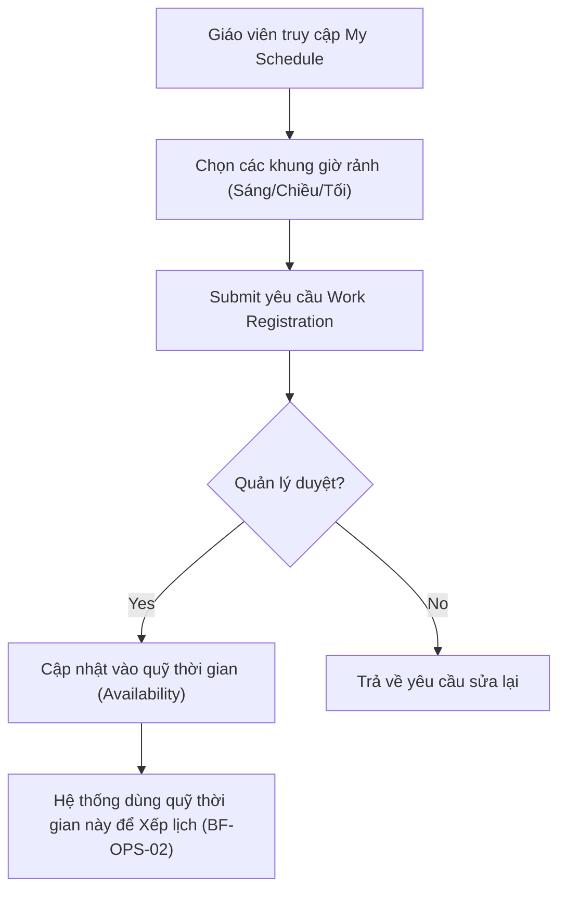

# BF-HR-02: Đăng ký lịch làm việc (Work Registration)

> **Giai đoạn:** 4 — Lịch & Đăng ký
> **Capability:** CAP-HR
> **Nhóm sidebar:** Lịch
> **Menu ID:** `work_registration`, `my_schedule`

---

## 1. Mô tả nghiệp vụ

Nhân viên (đặc biệt là Giáo viên) đăng ký ca làm việc khả dụng (Availability) của mình theo tuần/tháng. Admin và Quản lý chi nhánh (Branch Manager) sử dụng quỹ thời gian này để sắp xếp Thời khóa biểu (Golden Schedule) mà không bị trùng lặp hoặc vi phạm khung giờ làm việc.

## 2. Đối tượng sử dụng (Actors)

- Teacher (Giáo viên đăng ký lịch)
- Branch Manager (Quản lý chi nhánh duyệt lịch)
- Admin (Quản trị hệ thống)

## 3. Phạm vi (Scope)

### Trong phạm vi (In Scope)
- Giáo viên chọn khung giờ trống trong tuần (Sáng/Chiều/Tối) để đăng ký sẵn sàng nhận lớp.
- Quản lý duyệt/từ chối quỹ thời gian đã đăng ký.
- Hệ thống hiển thị tổng quan quỹ thời gian của toàn bộ nhân sự tại một chi nhánh.
- Cảnh báo nếu số giờ đăng ký thấp hơn KPI quy định.

### Ngoài phạm vi (Out of Scope)
- Xếp lịch học cụ thể cho lớp (Được xử lý tại `BF-OPS-02`).
- Tính lương theo giờ (Được xử lý tại `CAP-FIN`).

## 4. Nghiệp vụ liên quan

- **Upstream:** `BF-HR-01` - Quản lý nhân sự (Cần có tài khoản giáo viên trước khi đăng ký).
- **Downstream:** `BF-OPS-02` - Xếp lịch (Sử dụng dữ liệu Availability để tự động lọc giáo viên rảnh).

## 5. User Stories

| Tài liệu | Trạng thái |
|----------|------------|
| US-HR02-01: Đăng ký lịch rảnh (Giáo viên) | ⏳ Chờ làm |
| US-HR02-02: Duyệt quỹ thời gian (Quản lý) | ⏳ Chờ làm |
| US-HR02-03: Xem tổng quan Availability (Admin) | ⏳ Chờ làm |

> Xem chi tiết tại các file US tương ứng trong thư mục gốc.

## 6. Luồng vận hành tổng thể (End-to-End Flow)

## 7. Quy tắc nghiệp vụ (Business Rules)

1. Giáo viên chỉ được đăng ký thời gian trống trước ít nhất 1 tuần so với tuần làm việc thực tế (trừ khi có quyền Admin override).
2. Quỹ thời gian đã được duyệt sẽ bị "khóa" nếu đã có Session được xếp đè lên khung giờ đó.

## 8. Dữ liệu chính (Key Data)

| Entity | Mô tả |
|--------|-------|
| Availability Record | Bản ghi khung giờ khả dụng của 1 nhân sự trong 1 ngày cụ thể. |
| Timeblock | Khung giờ định nghĩa sẵn (VD: Ca Sáng: 08:00 - 12:00). |

## 9. Ghi chú triển khai

- **Backend:** `ScheduleService`, quản lý bảng `availability`.
- **Frontend:** Component Calendar Grid tại `my_schedule`.
- **Gaps:** Chưa rõ logic xử lý khi Giáo viên muốn Hủy lịch rảnh nhưng đã bị xếp lớp. (Đề xuất: Chuyển sang luồng xin Nghỉ phép thay vì Hủy rảnh).
