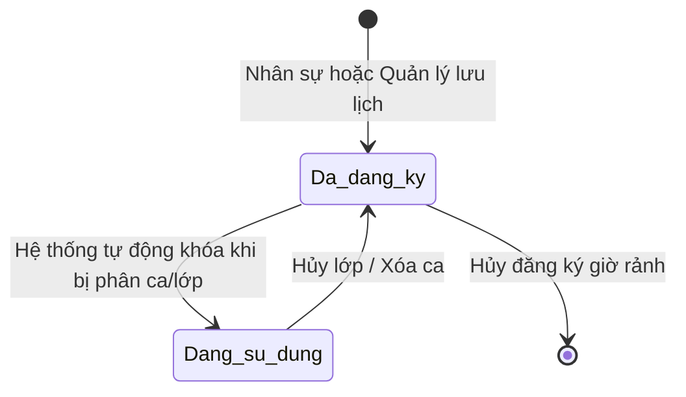

# BF-HR-02: Quản lý Lịch làm việc & Quỹ thời gian (Workforce Scheduling)

> **Capability:** CAP-HR (Quản trị Nguồn nhân lực)
> **Giai đoạn:** 1 - Thiết lập nền tảng
> **Nhóm chức năng:** Lịch biểu & Nguồn lực
---
title: "BF-HR-02: Quản lý Lịch làm việc & Quỹ thời gian"
type: "Business Function"
domain: "CAP-HR"
status: "Standardized"
tags: [hr, schedule, availability]
---

# BF-HR-02: Quản lý Lịch làm việc & Quỹ thời gian (Workforce Scheduling)

> **Capability:** CAP-HR (Quản trị Nguồn nhân lực)
> **Giai đoạn:** 1 - Thiết lập nền tảng
> **Nhóm chức năng:** Lịch biểu & Nguồn lực
> **Mã màn hình:** `work_registration`

---

## 1. Mô tả tổng quan

Phân hệ đóng vai trò trung tâm quản lý thời gian của nhân sự, bao gồm 2 nhánh chính:
1. **Quỹ thời gian (Work Registration):** Cho phép Nhân sự đăng ký các khung giờ rảnh của mình. Việc đăng ký này là đăng ký lịch làm việc chung, không gắn chết với một Chi nhánh cụ thể lúc đăng ký.
2. **Lịch của tôi (My Schedule - Aggregator):** Đóng vai trò là một Consumer Hub, tổng hợp và hiển thị mọi lịch làm việc thực tế đã được giao từ các hệ thống khác (như Lịch học, Học thử, Booking Test, Sự kiện).

## 2. Đối tượng sử dụng (Vai trò)

- **Nhân sự (Tất cả):** Người trực tiếp thao tác đăng ký khung giờ rảnh trên ứng dụng.
- **Quản lý Chi nhánh / Giáo vụ (Branch Manager / Operation):** Theo dõi tình trạng đăng ký của nhân sự để nắm bắt quỹ thời gian; Đăng ký hộ nhân sự (trong trường hợp nhân sự không tự thao tác được).

## 3. Ranh giới Nghiệp vụ (Scope)

### Có bao gồm (In Scope)
- Giao diện lịch cho phép Nhân sự tự chọn các khung giờ rảnh trong tuần từ 07:00 đến 23:00, mỗi ô cách nhau 30 phút.
- Tính năng "Đăng ký hộ": Quản lý/Giáo vụ có thể chọn tên một nhân sự và đăng ký lịch thay cho họ.
- Màn hình hiển thị tổng quan theo trung tâm, theo tuần và theo từng ngày trong tuần để theo dõi mức phủ quỹ thời gian của nhân sự.
- Cấu hình các ca và khung giờ ưu tiên để phát hiện các thời điểm thiếu phủ nhân sự.
- Cảnh báo tự động nếu số giờ đăng ký hoặc mức phủ khung giờ ưu tiên thấp hơn ngưỡng vận hành (chỉ mang tính cảnh báo, không chặn).

### Không bao gồm (Out of Scope)
- Quy trình duyệt/từ chối: Lịch rảnh không cần duyệt, được lưu trực tiếp làm quỹ thời gian.
- Phân bổ nhân sự vào công việc/lớp học cụ thể -> Thuộc về `BF-OPS-02` (Xếp lịch) hoặc các phân hệ phân ca.
- Quản lý chấm công và tính lương -> Thuộc Hệ thống Tính lương riêng.

### Kế hoạch Mở rộng (Future Roadmap)
- Tính năng tự tạo sự kiện cá nhân, thiết lập lịch họp nội bộ và mời nhân sự khác tham gia (Collaboration) tương tự như Google Calendar mang độ phức tạp cao, sẽ được tách riêng thành một Business Function mới (`BF-HR-03: Phối hợp & Sự kiện nội bộ`) thay vì nhồi nhét vào phân hệ Quản lý Quỹ thời gian này.

## 4. Mô hình Dữ liệu Nghiệp vụ (Data Entities)

| Tên Thực thể | Trường định danh | Thuộc tính quan trọng | Ràng buộc quan hệ | Diễn giải |
|--------------|------------------|-----------------------|-------------------|----------|
| Đăng ký Lịch rảnh | Mã đăng ký | Thời gian bắt đầu, Thời gian kết thúc, Người cập nhật | Trỏ về Mã Nhân viên | Thể hiện khung giờ rảnh chung. |
| Khung giờ mẫu | Mã khung giờ | Tên, giờ bắt đầu, giờ kết thúc, thời lượng | Độc lập | Thiết lập sẵn từ 07:00 đến 23:00, mỗi khung 30 phút để nhân sự bấm chọn nhanh. |
| Quy tắc khung giờ ưu tiên | Mã quy tắc | Tên quy tắc, ngày áp dụng, ca áp dụng, khung giờ ưu tiên | Áp dụng cho khung giờ mẫu | Là ngưỡng vận hành để tính cảnh báo thiếu phủ; không phải lịch làm việc của nhân viên. |

### 4.1. Vòng đời Trạng thái (Status Lifecycle)

*Do quy trình đã bỏ bước phê duyệt, vòng đời trạng thái rất đơn giản.*

**Quy tắc chuyển đổi:**

| Từ trạng thái | Sang trạng thái | Điều kiện bắt buộc | Vai trò được phép |
|---------------|-----------------|---------------------|-------------------|
| Đã đăng ký | Đang sử dụng | Hệ thống `BF-OPS-02` sinh lịch đè lên khung giờ này | Hệ thống tự động |

### 4.2. Ví dụ Dữ liệu mẫu

*Giúp AI và Lập trình viên tạo dữ liệu kiểm thử chính xác.*

| Tình huống | Dữ liệu đầu vào | Kết quả mong đợi |
|------------|-----------------|-------------------|
| Tự đăng ký | Nhân viên A chọn Ca Tối 2-4-6 trên màn Đăng ký lịch làm việc | Lưu 3 bản ghi lịch rảnh. Trạng thái "Đã đăng ký". |
| Đăng ký hộ | Quản lý B vào màn Đăng ký lịch làm việc, chọn Nhân viên C, đăng ký Ca Sáng thứ 7 | Lưu lịch rảnh cho C, ghi nhận B là người thao tác và gửi thông báo cho C. |
| Khóa lịch | Ca tối Thứ 2 của A đã được gán để dạy lớp IELTS-01 ở Chi nhánh X | Khung giờ Tối Thứ 2 của A bị khóa. A không thể tự bỏ đánh dấu rảnh nữa. |

## 5. Quy tắc Nghiệp vụ Tổng thể (Business Rules)

1. **[RULE-HR-02-01] Tính toàn cục:** Khung giờ khả dụng không gắn cố định với một trung tâm. Nó chỉ thể hiện nhân sự rảnh vào thời gian đó; việc điều phối nhân sự về trung tâm nào được quyết định ở bước xếp lịch vận hành.
2. **[RULE-HR-02-02] Ràng buộc khóa:** Quỹ thời gian tự động bị khóa khi đã được dùng để phân công công việc hoặc xếp lớp. Bất kỳ thay đổi nào lúc này phải xử lý qua quy trình vận hành phù hợp.
3. **[RULE-HR-02-03] Ủy quyền thao tác:** Người quản lý có quyền được phép đăng ký, sửa hoặc xóa lịch rảnh của nhân sự khác. Hành động này bắt buộc phải ghi nhận ai là người thao tác.
4. **[RULE-HR-02-04] Cảnh báo khung giờ ưu tiên:** Hệ thống đánh dấu các khung giờ ưu tiên và tính một khung giờ là thiếu phủ khi chưa có nhân sự nào đăng ký (hoặc thấp hơn ngưỡng vận hành hệ thống). Cảnh báo này giúp quản lý chủ động nhắc đăng ký bổ sung, không tạo bước duyệt.
5. **[RULE-HR-02-05] Hành vi theo tuần:** Tuần trong quá khứ chỉ được xem lại; tuần mới cho phép lưu đăng ký lần đầu; tuần đã đăng ký cho phép cập nhật khi chưa bị khóa; tuần đã bị dùng để xếp lịch chỉ hiển thị trạng thái đọc.
6. **[RULE-HR-02-06] Thiết lập khung giờ ưu tiên:** Quản lý được cấu hình ngày áp dụng, ca áp dụng và các khung giờ qua nút thiết lập riêng trên màn Đăng ký lịch. Khu vực hướng dẫn chỉ dùng để đọc cảnh báo và quy tắc thao tác, không chứa danh sách khung giờ cấu hình. Cấu hình này phục vụ cảnh báo vận hành, không thay đổi trạng thái đăng ký.
7. **[RULE-HR-02-07] Độ chi tiết khung giờ:** Tất cả màn đăng ký lịch phải dùng cùng danh sách khung giờ từ 07:00 đến 23:00 với bước 30 phút để dữ liệu cá nhân, nhân viên và trung tâm luôn khớp nhau.

## 6. Danh sách Yêu cầu Người dùng (User Stories)

| Mã Yêu cầu | Tên Yêu cầu (Loại màn hình) | Đường dẫn truy cập | Trạng thái |
|------------|-----------------------------|--------------------|------------|
| US-HR-02-01 | Cá nhân đăng ký lịch rảnh (Quỹ thời gian) | /app/work_registration (tab cá nhân) | Sẵn sàng |
| US-HR-02-02 | Quản lý Đăng ký hộ & Theo dõi (Danh sách & Lịch) | /app/work_registration | Sẵn sàng |
| US-HR-02-03 | Xem tổng quan Bản đồ quỹ thời gian (Báo cáo) | Phân trang trung tâm | Sẵn sàng |
| US-HR-02-04 | Xem Lịch của tôi (My Schedule / Aggregator) | /app/my_schedule | Sẵn sàng |

---

## 7. Chỉ dẫn cho AI Agent & Lập trình viên (Business Architecture)

- Tuân thủ chặt chẽ cấu trúc thực thể ở mục 4. Phải đảm bảo tính toàn vẹn dữ liệu nghiệp vụ (dữ liệu bảng con phải trỏ đúng mã có thật của bảng cha).
- Mọi trạng thái liệt kê trong sơ đồ 4.1 phải được ánh xạ đầy đủ vào hệ thống.
- Giao diện và luồng xử lý phải tuân thủ bảng chuyển đổi trạng thái (chỉ hiển thị các hành động hợp lệ theo từng trạng thái và phân quyền).

### ⛔ Hàng rào An toàn (Guardrails)
- **KHÔNG** thêm trường dữ liệu hoặc thực thể ngoài danh sách quy định ở mục 4.
- **KHÔNG** thay đổi cấu trúc quan hệ thực thể mà chưa được Product Owner xác nhận.
- **KHÔNG** tạo trạng thái nghiệp vụ mới ngoài sơ đồ ở mục 4.1. Mọi sự thay đổi vòng đời phải được cập nhật vào tài liệu này trước.
