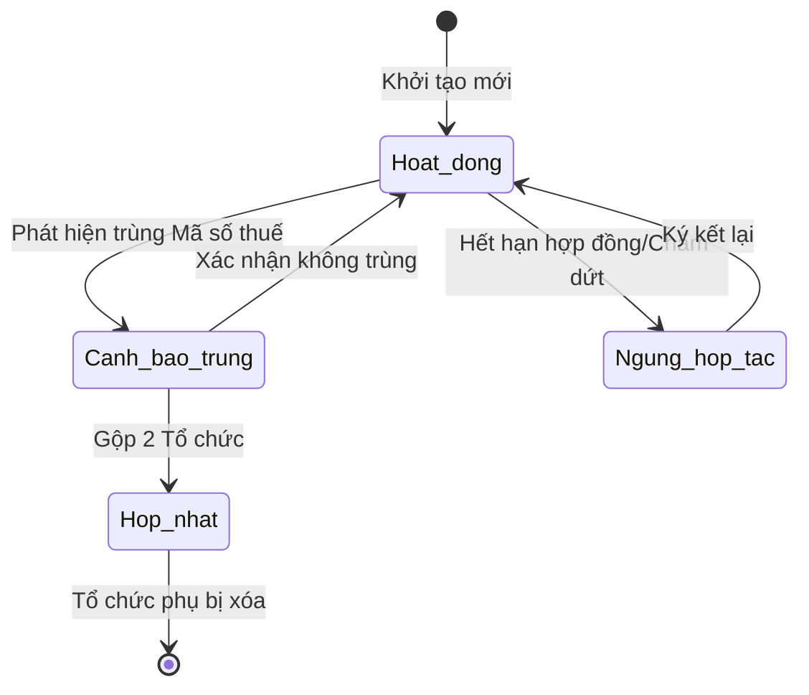

# BF-MDM-03: Quản trị Thực thể Đối tác (B2B Partner Entity Management)

> **Capability:** CAP-MDM (Quản trị Dữ liệu Gốc)
> **Giai đoạn:** 3 - Hồ sơ & Sản phẩm
> **Nhóm chức năng:** Dữ liệu Gốc
> **Mã màn hình:** `mdm_partners`

---

## 1. Mô tả tổng quan

Nghiệp vụ dành riêng cho mô hình B2B. Phân hệ quản lý `Business Account` (hay `Corporate Entity`) đại diện cho các tổ chức phi-nhân-loại có giao dịch, liên kết, hoặc cung cấp dịch vụ cho hệ thống giáo dục. 
Các đối tác này có thể là: Trường mầm non cấp nguồn học viên (Partner School), Công ty mua gói đào tạo tiếng Anh cho nhân sự (B2B Sales), hoặc Nhà cung cấp dịch vụ (Vendor).

## 2. Đối tượng sử dụng (Vai trò)

- **Nhân viên B2B Sales:** Quản lý danh sách các công ty khách hàng.
- **Quản lý Đối tác (Partnership Manager):** Quản lý thông tin các trường liên kết, đối tác tuyển sinh.
- **Kế toán (Finance):** Quản lý thông tin xuất hóa đơn đỏ (VAT) cho doanh nghiệp.

## 3. Ranh giới Nghiệp vụ (Scope)

### Có bao gồm (In Scope)
- Tạo mới và cập nhật Hồ sơ Tổ chức (Business Account): Tên công ty, Mã số thuế, Ngành nghề, Địa chỉ xuất hóa đơn.
- Quản lý Điểm chạm liên lạc (Contact Point): Gán các cá nhân (`Person` từ `BF-MDM-01`) vào Business Account làm Key Contact (Giám đốc, Kế toán trưởng, HR).
- Phân loại Đối tác (Account Type): `B2B_Client` (Khách hàng doanh nghiệp), `Partner_School` (Trường liên kết), `Vendor` (Nhà cung cấp).
- Cảnh báo trùng lặp Mã số thuế.

### Không bao gồm (Out of Scope)
- Quản lý quá trình chốt sale B2B, Lead, Deal, Pipeline → Thuộc `CAP-ADM`.
- Quản lý Hợp đồng B2B (Contract) → Thuộc `CAP-FIN`.
- Quản lý lớp học riêng biệt dạy tại doanh nghiệp → Thuộc `CAP-OPS`.

## 4. Mô hình Dữ liệu Nghiệp vụ (Data Entities)

| Tên Thực thể | Trường định danh | Thuộc tính quan trọng | Ràng buộc quan hệ | Diễn giải |
|--------------|------------------|-----------------------|-------------------|----------|
| Hồ sơ Tổ chức (Business Account) | Mã Tổ chức | Tên công ty, Mã số thuế, Loại đối tác, Trạng thái | Độc lập | Master Data về một pháp nhân. |
| Người liên hệ (Key Contact) | Mã liên kết | Chức vụ (Giám đốc/Kế toán), Là người nhận Hóa đơn (Yes/No) | Trỏ về Mã Tổ chức & Mã Person | Bảng mapping n-n. |

### 4.1. Vòng đời Trạng thái (Status Lifecycle)

*Sơ đồ dưới đây xác định vòng đời của một Tổ chức đối tác.*

**Quy tắc chuyển đổi:**

| Từ trạng thái | Sang trạng thái | Điều kiện bắt buộc | Vai trò được phép |
|---------------|-----------------|---------------------|-------------------|
| Hoạt động | Ngừng hợp tác | Bắt buộc chọn lý do ngừng | Quản lý Đối tác |
| Bất kỳ | Cảnh báo trùng | Quét thấy 2 Business Account có cùng Mã số thuế | Hệ thống tự động |

### 4.2. Ví dụ Dữ liệu mẫu

*Giúp AI và Lập trình viên tạo dữ liệu kiểm thử chính xác.*

| Tình huống | Dữ liệu đầu vào | Kết quả mong đợi |
|------------|-----------------|-------------------|
| Tạo Tổ chức | Tên: "Công ty TNHH ABC", MST: 0123456789, Loại: Khách hàng B2B | Sinh Business Account mới ở trạng thái Hoạt động. |
| Gán người liên hệ | Chọn Person "Anh Dũng" (từ MDM-01), chức vụ: "Trưởng phòng HR" | Tạo 1 bản ghi Key Contact nối Công ty ABC với Person "Anh Dũng". |
| Trùng Mã số thuế | Sales khác nhập MST 0123456789 cho tên "Công ty ABC Việt Nam" | Cảnh báo: "Mã số thuế này đã tồn tại dưới tên Công ty TNHH ABC". |

## 5. Quy tắc Nghiệp vụ Tổng thể (Business Rules)

1. **[RULE-MDM-03-01] Ranh giới Pháp nhân:** Tuyệt đối không lưu trữ thông tin cá nhân (Tên người đại diện, Số điện thoại cá nhân) trực tiếp vào bảng `Business Account`. Tất cả con người phải được tạo ở `BF-MDM-01` (`Person`) và gán vào Tổ chức thông qua bảng nối `Key Contact`.
2. **[RULE-MDM-03-02] Tính duy nhất (Unique Tax ID):** Mã số thuế (Tax ID) là trường định danh bắt buộc để phát hiện trùng lặp Tổ chức. Cảnh báo đỏ sẽ hiện ra nếu 2 Sales cùng cố gắng tạo 2 Business Account với cùng 1 Mã số thuế.

## 6. Danh sách Yêu cầu Người dùng (User Stories)

| Mã Yêu cầu | Tên Yêu cầu (Loại màn hình) | Đường dẫn truy cập | Trạng thái |
|------------|-----------------------------|--------------------|------------|
| US-MDM-03-01 | Quản lý danh sách Khách hàng Doanh nghiệp / Đối tác (Danh sách) | /app/mdm_partners | Đang soạn thảo |
| US-MDM-03-02 | Gán Key Contact (Person) vào Doanh nghiệp (Bảng gán) | /app/mdm_partners/[id] | Đang soạn thảo |

---

## 7. Chỉ dẫn cho AI Agent & Lập trình viên (Business Architecture)

- Tuân thủ chặt chẽ cấu trúc thực thể ở mục 4. Phải đảm bảo tính toàn vẹn dữ liệu nghiệp vụ (dữ liệu bảng con phải trỏ đúng mã có thật của bảng cha).
- Mọi trạng thái liệt kê trong sơ đồ 4.1 phải được ánh xạ đầy đủ vào hệ thống.
- Giao diện và luồng xử lý phải tuân thủ bảng chuyển đổi trạng thái (chỉ hiển thị các hành động hợp lệ theo từng trạng thái và phân quyền).

### ⛔ Hàng rào An toàn (Guardrails)
- **KHÔNG** thêm trường dữ liệu hoặc thực thể ngoài danh sách quy định ở mục 4.
- **KHÔNG** thay đổi cấu trúc quan hệ thực thể mà chưa được phê duyệt từ Product Owner.
- **KHÔNG** tạo trạng thái nghiệp vụ mới ngoài sơ đồ ở mục 4.1. Mọi sự thay đổi vòng đời phải được cập nhật vào tài liệu này trước.

