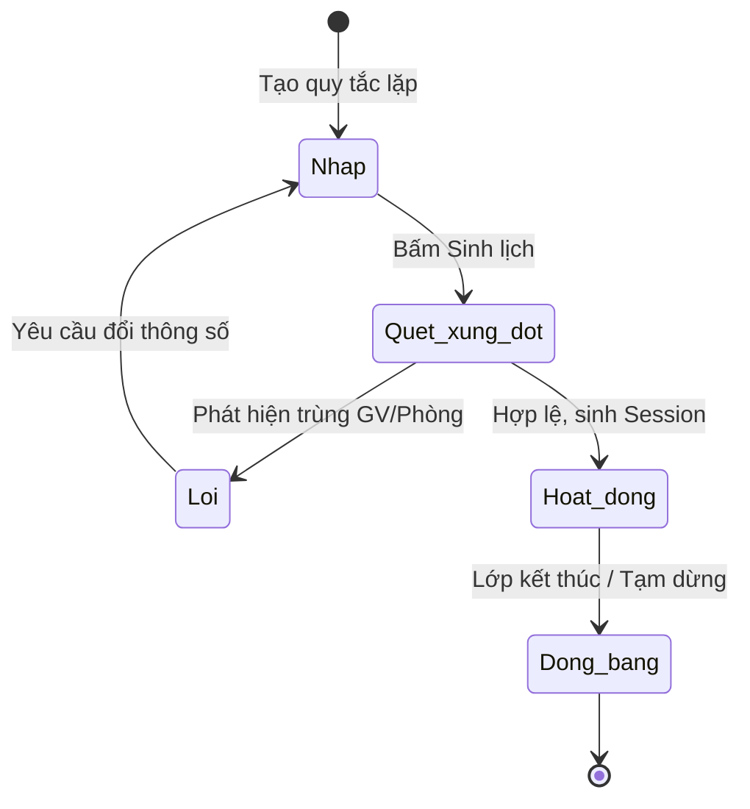

# BF-OPS-02: Quản lý Xếp lịch (Scheduling)

> **Capability:** CAP-OPS (Năng lực Quản lý Học viên & Vận hành Lớp)
> **Giai đoạn:** 2 - Vận hành
> **Nhóm chức năng:** Lịch
> **Mã màn hình:** `calendar_class_schedule`

---

## 1. Mô tả tổng quan

Thiết lập Thời khóa biểu (Golden Schedule) định kỳ cho một Lớp học. Thông qua bộ quy tắc này, hệ thống sẽ tự động phát sinh các Buổi học vật lý (Session) cho toàn bộ vòng đời của lớp đó (hoặc sinh cuốn chiếu). Tính năng bao gồm lõi thuật toán kiểm tra chống trùng lịch giáo viên, học viên và phòng học.

## 2. Đối tượng sử dụng (Vai trò)

- **Nhân viên Giáo vụ (Operation):** Người trực tiếp thiết lập quy tắc lặp và xếp lịch cho các lớp.
- **Quản lý Chi nhánh (Branch Manager):** Kiểm duyệt tổng thể lịch của chi nhánh để tối ưu hóa nguồn lực (Phòng/Giáo viên).
- **Giáo viên (Teacher):** Xem lịch đã được xếp của mình (View-only).

## 3. Ranh giới Nghiệp vụ (Scope)

### Có bao gồm (In Scope)
- Tạo Khung lịch (Schedule) lặp lại cho Lớp học (Ví dụ: Tối Thứ 3 & Thứ 5, 18:00 - 19:30).
- Hệ thống quét và cảnh báo các mâu thuẫn (Conflict):
  - Giáo viên đã có Session khác cùng giờ.
  - Giáo viên không đăng ký khung giờ rảnh (Availability - từ `BF-HR-02`).
  - Phòng học đã được book cho lớp khác.
- Tự động sinh ra danh sách các Buổi học (Sessions) vật lý dựa trên Quy tắc lặp và Tổng số buổi quy định trong Khung chương trình (Syllabus).
- Tự động bỏ qua và lùi lịch nếu rơi vào Ngày nghỉ lễ (từ `BF-SYS-02`).
- Giao diện Calendar tổng thể của cơ sở để soi chiếu phòng học/giáo viên.

### Không bao gồm (Out of Scope)
- Xử lý Đổi lịch đột xuất / Xin dạy thay cho 1 Buổi học duy nhất → Xử lý tại `BF-OPS-03`.
- Gắn Khung chương trình (Syllabus) vào Lớp → Xử lý tại `BF-CLS-02`.
- Đăng ký lịch khả dụng của Giáo viên → Xử lý tại `BF-HR-02`.

## 4. Mô hình Dữ liệu Nghiệp vụ (Data Entities)

| Tên Thực thể | Trường định danh | Thuộc tính quan trọng | Ràng buộc quan hệ | Diễn giải |
|--------------|------------------|-----------------------|-------------------|----------|
| Quy tắc Lịch (Schedule Rule) | Mã quy tắc | Khung giờ, Ngày trong tuần, Phòng học, Giáo viên | Trỏ về Mã Lớp học | Lưu trữ chuẩn RRULE (Recurrence Rule). |
| Buổi học (Session) | Mã buổi học | Ngày, Giờ bắt đầu/kết thúc, Phòng, GV | Trỏ về Mã quy tắc & Mã Lớp | Bản ghi vật lý sinh ra từ Rule. |

### 4.1. Vòng đời Trạng thái (Status Lifecycle)

*Sơ đồ dưới đây xác định vòng đời của một Quy tắc Lịch.*

**Quy tắc chuyển đổi:**

| Từ trạng thái | Sang trạng thái | Điều kiện bắt buộc | Vai trò được phép |
|---------------|-----------------|---------------------|-------------------|
| Nháp | Hoạt động | Thuật toán quét không báo lỗi | Nhân viên Giáo vụ |
| Bất kỳ | Đóng băng | Lớp học chuyển trạng thái Tốt nghiệp/Đóng | Hệ thống tự động |

### 4.2. Ví dụ Dữ liệu mẫu

*Giúp AI và Lập trình viên tạo dữ liệu kiểm thử chính xác.*

| Tình huống | Dữ liệu đầu vào | Kết quả mong đợi |
|------------|-----------------|-------------------|
| Tạo quy tắc | Lớp IELTS, Tối 3-5-7 (18h-20h), Phòng 101, GV Trần A. Khóa 10 buổi. | Hệ thống sinh ra đúng 10 Session vào các ngày tương ứng. |
| Phát hiện trùng | Nhập Tối 2-4-6, Phòng 101 cho Lớp TOEIC | Báo lỗi: "Phòng 101 đang được sử dụng bởi Lớp IELTS vào tối T2-4-6". Yêu cầu đổi. |
| Né ngày nghỉ lễ | Ngày sinh lịch rơi vào 02/09 (Ngày lễ được cấu hình ở SYS-02) | Bỏ qua ngày 02/09, tự động đẩy buổi học đó sang lịch học tiếp theo. |

## 5. Quy tắc Nghiệp vụ Tổng thể (Business Rules)

1. **[RULE-OPS-02-01] Ràng buộc Không xung đột (Strict No-Conflict):** Hệ thống TUYỆT ĐỐI không cho phép ghi nhận (Lưu) một Schedule Rule nếu phát hiện trùng lặp về Giáo viên hoặc Phòng học tại cùng một thời điểm. Giáo vụ bắt buộc phải điều chỉnh trước khi tạo.
2. **[RULE-OPS-02-02] Ràng buộc Khả dụng (Availability Match):** Giáo viên được xếp vào lịch lặp BẮT BUỘC phải có quỹ thời gian (Availability - xem `BF-HR-02`) ở trạng thái Trống và tương thích với khung giờ được xếp.
3. **[RULE-OPS-02-03] Sinh lịch cuốn chiếu (Rolling Generation):** Để tránh rác dữ liệu và sai lệch lịch do nghỉ lễ, các Session không nên được sinh ra một lần cho khóa học 3 năm, mà chỉ được tự động sinh ra trước tối đa X tháng (Ví dụ: 3 tháng) thông qua một Background Job hàng ngày.

## 6. Danh sách Yêu cầu Người dùng (User Stories)

| Mã Yêu cầu | Tên Yêu cầu (Loại màn hình) | Đường dẫn truy cập | Trạng thái |
|------------|-----------------------------|--------------------|------------|
| US-OPS02-01 | Quản lý Danh sách Buổi học tại Lớp (Local View) | Nằm trong Chi tiết Lớp học | Đang soạn thảo |
| US-OPS02-02 | Khởi tạo Quy tắc & Sinh lịch học tự động (Batch) | Nằm trong Chi tiết Lớp học | Đang soạn thảo |
| US-OPS02-03 | Quản lý Lịch tổng thể Cơ sở (Global Calendar) | /app/calendar_class_schedule | Hoàn thành |
| US-OPS02-04 | Thuật toán Quét xung đột (Conflict Check API) | Chạy ngầm | Đang soạn thảo |

---

## 7. Chỉ dẫn cho AI Agent & Lập trình viên (Business Architecture)

- Tuân thủ chặt chẽ cấu trúc thực thể ở mục 4. Phải đảm bảo tính toàn vẹn dữ liệu nghiệp vụ (dữ liệu bảng con phải trỏ đúng mã có thật của bảng cha).
- Mọi trạng thái liệt kê trong sơ đồ 4.1 phải được ánh xạ đầy đủ vào hệ thống.
- Giao diện và luồng xử lý phải tuân thủ bảng chuyển đổi trạng thái (chỉ hiển thị các hành động hợp lệ theo từng trạng thái và phân quyền).

### ⛔ Hàng rào An toàn (Guardrails)
- **KHÔNG** thêm trường dữ liệu hoặc thực thể ngoài danh sách quy định ở mục 4.
- **KHÔNG** thay đổi cấu trúc quan hệ thực thể mà chưa được phê duyệt từ Product Owner.
- **KHÔNG** tạo trạng thái nghiệp vụ mới ngoài sơ đồ ở mục 4.1. Mọi sự thay đổi vòng đời phải được cập nhật vào tài liệu này trước.

