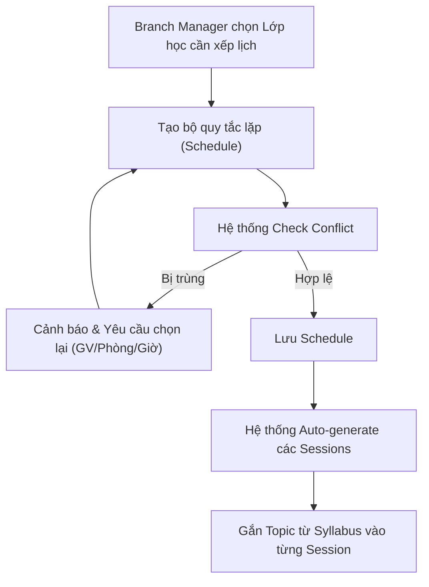

# BF-OPS-02: Quản lý Xếp lịch (Scheduling)

> **Giai đoạn:** 4 — Lịch & Đăng ký
> **Capability:** CAP-OPS
> **Nhóm sidebar:** Lịch
> **Menu ID:** `calendar_class_schedule`

---

## 1. Mô tả nghiệp vụ

Thiết lập Thời khóa biểu (Golden Schedule) định kỳ cho một Lớp học, đồng thời hệ thống tự động phát sinh các Buổi học vật lý (Session) cho toàn bộ vòng đời của lớp đó (hoặc sinh cuốn chiếu). Tính năng bao gồm kiểm tra chống trùng lịch giáo viên, học viên và phòng học.

## 2. Đối tượng sử dụng (Actors)

- Admin
- Branch Manager (Người trực tiếp xếp lịch)
- Teacher (Chỉ xem lịch của mình)

## 3. Phạm vi (Scope)

### Trong phạm vi (In Scope)
- Tạo Khung lịch (Schedule) lặp lại cho Lớp học (VD: Tối Thứ 3 & Thứ 5, 18:00 - 19:30).
- Hệ thống quét và cảnh báo các mâu thuẫn (Conflict):
  - Giáo viên đã có Session khác cùng giờ.
  - Giáo viên không đăng ký khung giờ rảnh (Availability).
  - Phòng học đã được book cho lớp khác.
- Tự động sinh ra danh sách các Buổi học (Sessions) dựa trên Schedule và số buổi quy định trong Syllabus.
- Giao diện Calendar kéo thả (Drag & Drop) để điều chỉnh nhanh khung lịch.

### Ngoài phạm vi (Out of Scope)
- Xử lý Đổi lịch đột xuất / Dạy thay cho 1 Buổi học (Session) duy nhất (Được xử lý tại `BF-OPS-03`).
- Gắn Khung chương trình (Syllabus) vào Lớp (Được xử lý tại `BF-CLS-02`).

## 4. Nghiệp vụ liên quan

- BF-SYS-02: Cấu hình hệ thống — Cung cấp danh sách Ngày nghỉ lễ để thuật toán Quét xung đột (US-OPS02-04) đọc và bỏ qua khi sinh lịch.

- **Upstream:** `BF-CLS-02` - Quản lý lớp học (Lớp phải được tạo và có Syllabus trước khi xếp lịch), `BF-HR-02` - Đăng ký quỹ thời gian.
- **Downstream:** `BF-OPS-03` - Vòng đời buổi học (Các Session sinh ra sẽ được vận hành qua đây).

## 5. User Stories

- [ ] US-OPS02-01: Quản lý Danh sách Buổi học tại Lớp (Local View).
- [ ] US-OPS02-02: Khởi tạo Quy tắc & Sinh lịch học tự động (Batch Generation).
- [ ] US-OPS02-03: Quản lý Danh sách Buổi học & Lịch tổng thể Cơ sở (Global View).
- [ ] US-OPS02-04: Thuật toán Quét xung đột (Trùng lịch, Ngày nghỉ lễ).

## 6. Luồng vận hành tổng thể (End-to-End Flow)

## 7. Quy tắc nghiệp vụ (Business Rules)

1. **Strict No-Conflict:** Hệ thống tuyệt đối không cho phép tạo Schedule nếu phát hiện trùng lặp về Giáo viên hoặc Phòng học tại cùng một thời điểm.
2. **Rolling Generation:** Để tránh rác dữ liệu, các Session có thể được sinh ra trước tối đa 3 tháng, hoặc sinh ra ngay lập tức cho toàn bộ khóa học nếu khóa học ngắn (dưới 6 tháng).

## 8. Dữ liệu chính (Key Data)

| Entity | Mô tả |
|--------|-------|
| Schedule Rule | Bộ quy tắc lặp của một lớp (RRULE - Recurrence Rule). |
| Session | Thực thể vật lý sinh ra từ Schedule (Bao gồm Ngày, Giờ bắt đầu/kết thúc, Phòng, GV). |

## 9. Ghi chú triển khai

- **Backend:** `ScheduleEngine` xử lý cronjob sinh Session và check conflict real-time.
- **Frontend:** Cần sử dụng thư viện Lịch (VD: FullCalendar) có hỗ trợ giao diện timeline để soi chiếu phòng học.
- **Gaps:** Chưa có logic xử lý nghỉ lễ (Hệ thống có tự bỏ qua ngày Lễ khi sinh Session không?).
