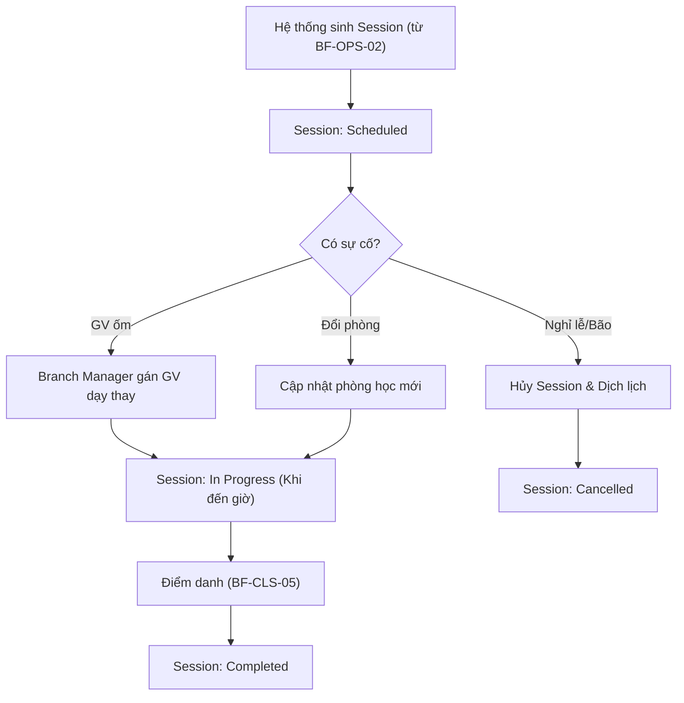

# BF-OPS-03: Vòng đời buổi học (Session Delivery Lifecycle)

> **Giai đoạn:** 4 — Lịch & Đăng ký
> **Capability:** CAP-OPS
> **Nhóm sidebar:** Lịch
> **Menu ID:** `calendar_event_schedule`, `session_management`

---

## 1. Mô tả nghiệp vụ

Quản lý trạng thái và các biến động thực tế của từng Buổi học (Session) đã được sinh ra. Bao gồm việc đổi lịch, dạy thay, đổi phòng, hủy buổi học do sự cố, hoặc tạo các buổi học bù (Makeup Class). Mọi thao tác ở đây chỉ ảnh hưởng đến duy nhất 1 Session, không ảnh hưởng đến Khung lịch (Schedule) gốc của Lớp.

## 2. Đối tượng sử dụng (Actors)

- Admin
- Branch Manager (Điều phối lịch hàng ngày)
- Teacher (Nhận lịch dạy thay)

## 3. Phạm vi (Scope)

### Trong phạm vi (In Scope)
- **Substitute (Dạy thay):** Thay đổi Giáo viên cho 1 Session cụ thể (có check trùng lịch).
- **Room Change (Đổi phòng):** Thay đổi Phòng học cho 1 Session cụ thể.
- **Cancel/Reschedule:** Hủy 1 Session và đẩy lịch học lùi lại (tự động dịch chuyển các Topic phía sau).
- **Makeup Class (Học bù):** Tạo 1 Session hoàn toàn mới độc lập với Schedule để học bù.
- Hiển thị các Session đặc biệt (Sự kiện, Workshop) trên lịch tổng.

### Ngoài phạm vi (Out of Scope)
- Thay đổi Khung lịch gốc dài hạn (Được xử lý tại `BF-OPS-02`).
- Điểm danh cho Session (Được xử lý tại `BF-CLS-05`).

## 4. Nghiệp vụ liên quan

- **Upstream:** `BF-OPS-02` - Xếp lịch (Nguồn sinh ra các Session ban đầu).
- **Downstream:** `BF-CLS-05` - Điểm danh (Chỉ những Session ở trạng thái "In Progress" hoặc "Completed" mới được phép điểm danh).

## 5. User Stories

- [ ] US-OPS03-01: Branch Manager điều phối Dạy thay (Substitute) cho 1 Session.
- [ ] US-OPS03-02: Branch Manager báo hủy 1 Session và xử lý đẩy lịch (Reschedule).
- [ ] US-OPS03-03: Xem trạng thái Session trên Lịch sự kiện tổng.

## 6. Luồng vận hành tổng thể (End-to-End Flow)

## 7. Quy tắc nghiệp vụ (Business Rules)

1. Khi Dạy thay hoặc Đổi phòng, hệ thống vẫn phải bắt buộc gọi engine kiểm tra trùng lịch (Conflict Check).
2. Khi Hủy (Cancel) một Session, toàn bộ các bài học (Topic) của Session đó và các Session tương lai của Lớp sẽ bị dịch lùi đi 1 slot, hoặc phải sinh ra 1 Session học bù tương ứng tùy cấu hình trung tâm.

## 8. Dữ liệu chính (Key Data)

| Entity | Mô tả |
|--------|-------|
| Session | Buổi học thực tế chứa thông tin thay đổi (Override Teacher, Override Room). |
| Session Status | Trạng thái: Scheduled, In Progress, Completed, Cancelled. |

## 9. Ghi chú triển khai

- **Backend:** `SessionService` xử lý cập nhật đơn lẻ.
- **Frontend:** Popup Edit Session khi click vào 1 event trên Calendar.
- **Gaps:** Cần chốt quy trình: Khi hủy 1 buổi, hệ thống sẽ tự động dồn bài (Shift forward) hay bắt buộc tạo buổi học bù (Makeup class)?
