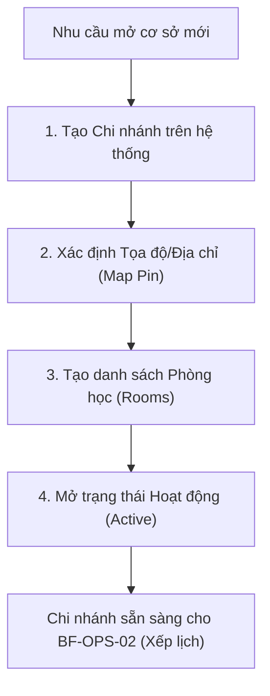

# BF-ORG-01: Thiết lập Chi nhánh (Branch Setup & Opening Process)

> **Capability:** CAP-HR
> **Giai đoạn:** 2 — Thiết lập tổ chức
> **Nhóm sidebar:** Thiết lập tổ chức
> **Menu ID:** `branch_list`

---

## 1. Mô tả nghiệp vụ

Đây là business function cốt lõi phục vụ việc quản lý cơ sở vật chất ở mức vĩ mô. Nó bao gồm quy trình tạo mới một chi nhánh (Branch), cấu hình địa điểm trên bản đồ (Coordinates), và thiết lập các danh mục phòng học (Rooms), sức chứa (Capacity) bên trong chi nhánh đó để phục vụ cho công tác xếp lịch (`BF-OPS-02`).

## 2. Đối tượng sử dụng (Actors)

- System Admin (Tạo và cấu hình chi nhánh gốc)
- HR Admin / Operation Admin (Cấu hình phòng học, giờ hoạt động)

## 3. Phạm vi (Scope)

### Trong phạm vi (In Scope)

- Quản lý danh sách Chi nhánh (Tạo mới, Sửa, Xóa/Vô hiệu hóa).
- Thiết lập địa chỉ và vị trí bản đồ (Map Coordinates) cho Chi nhánh.
- Thiết lập danh mục Phòng học (Rooms) thuộc Chi nhánh (Tên phòng, Sức chứa tối đa, Loại phòng).
- Định nghĩa khung giờ hoạt động tiêu chuẩn (Business Hours) của Chi nhánh.

### Ngoài phạm vi (Out of Scope)

- Quản lý thiết bị cụ thể trong phòng học (thuộc `CAP-FCM`).
- Phân bổ nhân sự vào chi nhánh (thuộc `BF-ORG-02`).
- Thuê/Trả mặt bằng, quản lý chi phí vận hành (thuộc `CAP-FIN`).

## 4. Nghiệp vụ liên quan

- **Downstream:** `BF-OPS-02` (Class Scheduling) - Phải có cấu hình Phòng học và Chi nhánh mới có thể xếp lịch giảng dạy.
- **Downstream:** `BF-ORG-02` (Organization Structure) - Chi nhánh được gán vào các Vùng (Regions) trên cây sơ đồ tổ chức.

## 5. User Stories

**Danh sách US đề xuất (Proposed):**
- [ ] US-ORG-01: Tạo mới và cấu hình thông tin cơ bản của Chi nhánh (Bao gồm định vị Bản đồ).
- [ ] US-ORG-02: Quản lý danh sách Phòng học (Rooms) và sức chứa (Capacity) tại một Chi nhánh.
- [ ] US-ORG-03: Đóng cửa/Vô hiệu hóa một Chi nhánh và cảnh báo xung đột dữ liệu lịch học.

## 6. Luồng vận hành tổng thể (End-to-End Flow)

## 7. Quy tắc nghiệp vụ (Business Rules)

1. Một Chi nhánh khi đã có lớp học hoặc lịch học (Sessions) phát sinh thì không được phép Xóa (Delete), chỉ được phép Đóng cửa (Inactive/Closed).
2. Khi vô hiệu hóa (Inactive) một phòng học, hệ thống phải quét và cảnh báo nếu có lịch học trong tương lai đang gán vào phòng đó.
3. Sức chứa của Phòng học (Room Capacity) là điều kiện chặn cứng (Hard constraint) trong lúc xếp lịch lớp.

## 8. Dữ liệu chính (Key Data)

| Entity | Mô tả |
|--------|-------|
| Branch | Thực thể đại diện cho một cơ sở vật chất vật lý (Mã, Tên, Địa chỉ, Tọa độ). |
| Room | Đơn vị không gian bên trong Branch dùng để tổ chức lớp học (Tên phòng, Sức chứa). |
| Operating Hours | Khung giờ chi nhánh mở cửa, dùng để validate lịch xếp lớp. |

## 9. Ghi chú triển khai

- **Registry mapping:** `hr.branch_and_facility_setup` (Tuy nhiên thuộc về CAP-HR theo cấu trúc quản trị tập trung của Rinov4).
- **Backend:** `completed` (API quản lý Branch và Room đã có sẵn).
- **Frontend:** Đã thực hiện cải tiến màn hình tạo Branch (Tích hợp bản đồ kéo thả thay cho Google Places Search).
- **Gaps:** Cần đảm bảo UI Map Pin trên Frontend đồng bộ đúng chuẩn tọa độ Latitude/Longitude xuống DB.
