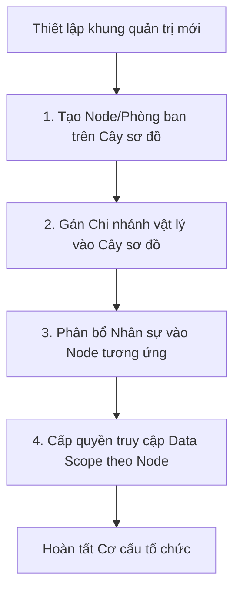

# BF-ORG-02: Quản lý Cơ cấu Tổ chức (Organization Structure Governance)

> **Capability:** CAP-HR
> **Giai đoạn:** 2 — Thiết lập tổ chức
> **Nhóm sidebar:** Thiết lập tổ chức
> **Menu ID:** `org_structure`

---

## 1. Mô tả nghiệp vụ

Business function này xây dựng và quản trị sơ đồ tổ chức (Org Chart) của toàn bộ doanh nghiệp. Nó định nghĩa các cấp bậc phân cấp (Khối → Vùng → Chi nhánh → Phòng ban → Tổ nhóm) và thực hiện việc gán nhân sự (Staff Mapping) vào đúng vị trí của họ trong sơ đồ tổ chức để phục vụ cho các logic phân quyền, báo cáo và phê duyệt.

## 2. Đối tượng sử dụng (Actors)

- System Admin (Cấu hình cây sơ đồ gốc)
- HR Admin (Quản trị danh sách nhân sự và phòng ban)

## 3. Phạm vi (Scope)

### Trong phạm vi (In Scope)

- Xây dựng cây phân cấp (Hierarchical Tree) cho các phòng ban, vùng, và chi nhánh.
- Định nghĩa các cấp bậc (Level/Tier) trong tổ chức.
- Gán nhân viên vào một hoặc nhiều Đơn vị/Phòng ban (Staff-to-Org Mapping) cùng chức danh cụ thể.
- Tra cứu danh bạ nội bộ theo sơ đồ tổ chức.

### Ngoài phạm vi (Out of Scope)

- Thiết lập chi nhánh vật lý và phòng học (thuộc `BF-ORG-01`).
- Quản lý hồ sơ nhân sự cá nhân, hợp đồng lao động (thuộc `BF-HR-01`).
- Đăng ký ca làm việc và quỹ thời gian (thuộc `BF-HR-02`).

## 4. Nghiệp vụ liên quan

- **Upstream:** `BF-ORG-01` - Dữ liệu Chi nhánh vật lý phải được móc nối vào Cây tổ chức.
- **Upstream:** `BF-HR-01` - Phải có hồ sơ nhân viên (Staff Profile) trước thì mới có thể gán vào sơ đồ tổ chức.
- **Downstream:** `BF-SYS-01` (Access Control) - Sơ đồ tổ chức đóng vai trò định nghĩa Data Scope (Ví dụ: Trưởng vùng A sẽ thấy dữ liệu của các Chi nhánh thuộc vùng A).

## 5. User Stories

**Danh sách US đề xuất (Proposed):**
- [ ] US-ORG-04: Xây dựng và quản lý Cây sơ đồ tổ chức (Org Tree Builder).
- [ ] US-ORG-05: Định nghĩa các Chức danh (Roles/Titles) thuộc một phòng ban.
- [ ] US-ORG-06: Điều chuyển nhân sự (Transfer Staff) giữa các phòng ban hoặc chi nhánh.

## 6. Luồng vận hành tổng thể (End-to-End Flow)

## 7. Quy tắc nghiệp vụ (Business Rules)

1. Cây sơ đồ tổ chức không được phép có vòng lặp (Circular Dependency - một node không thể là cha của chính cha nó).
2. Một nhân sự có thể thuộc nhiều phòng ban/chi nhánh khác nhau (VD: Giáo viên dạy liên chi nhánh), nhưng phải có một vị trí được đánh dấu là "Primary" (Chính).
3. Khi xóa một phòng ban (Node), bắt buộc phải luân chuyển (transfer) toàn bộ nhân sự đang thuộc Node đó sang một Node khác, hoặc đánh dấu họ là Unassigned.

## 8. Dữ liệu chính (Key Data)

| Entity | Mô tả |
|--------|-------|
| Org Node | Một điểm nút trên sơ đồ tổ chức (Phòng ban, Vùng, Tổ). |
| Org Hierarchy | Mối quan hệ Cha-Con giữa các Node. |
| Staff Org Assignment | Bảng ánh xạ 1 Nhân sự thuộc Node nào, chức danh gì, từ ngày đến ngày nào. |

## 9. Ghi chú triển khai

- **Registry mapping:** `hr.organization_structure`
- **Backend:** `missing` (Hệ thống tổ chức hiện tại khá phẳng, chủ yếu mapping theo Branch. Cần bổ sung kiến trúc Hierarchical Tree dạng Nested Sets hoặc Adjacency List).
- **Frontend:** Cần phát triển UI dạng Tree-view hoặc Org-Chart để dễ dàng kéo thả và quản lý.
- **Gaps:** Hệ thống cần làm rõ cơ chế kế thừa phân quyền (Data Scope inheritance) từ cha xuống con.
