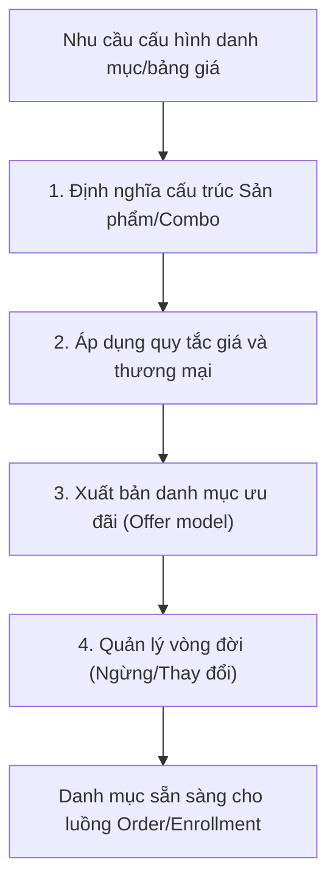

# BF-PRD-01: Quản lý Sản phẩm

> **Capability:** CAP-COM
> **Giai đoạn:** 3 — Thương mại & Bán hàng
> **Nhóm sidebar:** Sản phẩm
> **Menu ID:** `products`, `product_groups`, `combos`, `product_settings`

---

## 1. Mô tả nghiệp vụ

Đây là business function quản lý danh mục sản phẩm và chiến lược ưu đãi. Nó quản lý toàn bộ vòng đời của các sản phẩm có thể bán được, bao gồm việc thiết lập cấu trúc sản phẩm, nhóm sản phẩm, các gói combo ưu đãi và các quy tắc thương mại liên quan. Mục tiêu là tạo ra một catalog đồng nhất, sẵn sàng phục vụ cho quy trình Order, Thanh toán và Tuyển sinh.

## 2. Đối tượng sử dụng (Actors)

- Product Admin
- Sales Admin
- System Admin

## 3. Phạm vi (Scope)

### Trong phạm vi (In Scope)

- Định nghĩa sản phẩm, nhóm sản phẩm, combo và các thiết lập mô tả danh mục bán hàng.
- Áp dụng các quy tắc nhóm, trạng thái, mục đích định giá và quy tắc bán hàng vận hành vào danh mục.
- Xuất bản danh mục và mô hình ưu đãi (offer model) để sẵn sàng sử dụng cho các luồng tạo đơn hàng, tuyển sinh và báo cáo.
- Quản lý vòng đời danh mục: thay đổi hoặc ngừng kinh doanh các sản phẩm/combo mà vẫn đảm bảo tính liên tục của hệ thống.

### Ngoài phạm vi (Out of Scope)

- Khâu tạo đơn hàng và thanh toán trực tiếp (thuộc `BF-SAL-01`).
- Quản lý khung chương trình học thuật gốc (thuộc `BF-ACD-01`).

## 4. Nghiệp vụ liên quan

- **Downstream:** `BF-SAL-01` (Order and Payment Management) - Sử dụng danh mục sản phẩm/combo để cấu hình và tạo đơn hàng.
- **Downstream:** `BF-ACD-01` (Learning Blueprint Management) - Khởi tạo lộ trình học tương ứng với các sản phẩm giáo dục.

## 5. User Stories

**Danh sách US đề xuất (Proposed):**
- [ ] US-PRD-01: Quản lý danh mục Sản phẩm đơn lẻ.
- [ ] US-PRD-02: Quản lý Nhóm sản phẩm (Product Groups).
- [ ] US-PRD-03: Cấu hình và quản lý Combo ưu đãi.
- [ ] US-PRD-04: Thiết lập thuộc tính thương mại (Product Settings).

## 6. Luồng vận hành tổng thể (End-to-End Flow)

## 7. Quy tắc nghiệp vụ (Business Rules)

1. Cấu trúc bán hàng (Product/Combo) phải được xác định rõ ràng thuộc tính giá và trạng thái trước khi được lưu hành nội bộ.
2. Sản phẩm hoặc gói combo nếu bị đánh dấu "Ngừng kinh doanh" (Retired) sẽ không được phép chọn trong các đơn hàng mới, nhưng vẫn lưu trữ lịch sử ở các đơn hàng cũ.
3. Việc thay đổi cấu trúc của Combo không được làm ảnh hưởng hồi tố tới các hợp đồng/giao dịch đã xuất hóa đơn thành công.

## 8. Dữ liệu chính (Key Data)

| Entity | Mô tả |
|--------|-------|
| Product | Đối tượng cơ sở có thể kinh doanh độc lập (ví dụ: Khóa học cấp 1, Sách giáo trình). |
| Product Group | Nhóm các sản phẩm tương đồng để áp dụng chính sách giảm giá hoặc quy tắc kinh doanh chung. |
| Combo | Một gói kết hợp nhiều Sản phẩm/Nhóm sản phẩm với cấu trúc giá ưu đãi riêng biệt. |
| Product Settings | Cấu hình hệ thống liên quan tới thuế, cấu trúc định giá và quy tắc tính phí. |

## 9. Ghi chú triển khai

- **Registry mapping:** `product.catalog_and_offer_governance`
- **Backend:** `partial`
- **Frontend:** `hybrid` (Các màn hình chính: `ProductListView`, `ProductGroupsView`, `ProductCombosView`, `ProductSettingsView`)
- **Gaps:** Chưa có file User Story chi tiết nào. Các US liệt kê hiện đang ở mức đề xuất. Hệ thống cần làm rõ cơ chế duyệt giá (Price Approval) nếu có.
