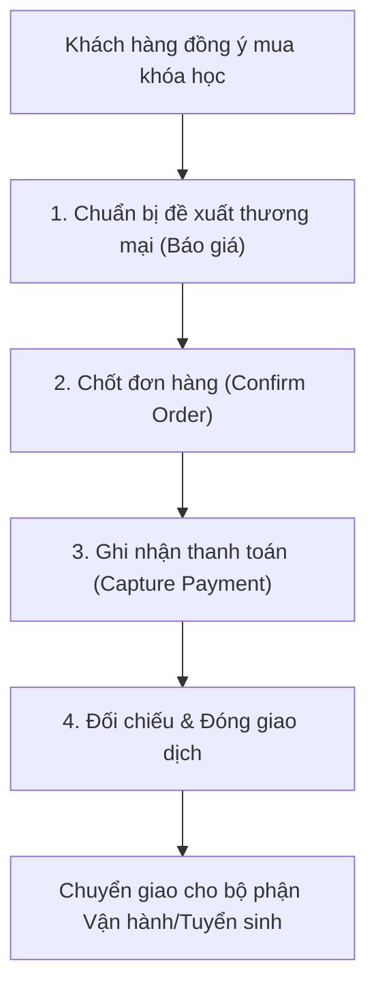

# BF-SAL-01: Quản lý Đơn hàng và Thanh toán

> **Capability:** CAP-COM
> **Giai đoạn:** 5 — Tuyển sinh & Bán hàng
> **Nhóm sidebar:** Bán hàng
> **Menu ID:** `orders`, `receipts`

---

## 1. Mô tả nghiệp vụ

Đây là business function quản lý giao dịch kinh doanh từ khâu đề xuất sản phẩm/gói học, tạo đơn hàng, lập phiếu thu, đối chiếu thanh toán cho đến khi giao dịch được chốt hoặc hủy bỏ. Nghiệp vụ này đảm bảo dòng tiền và doanh thu được ghi nhận chính xác theo các chính sách thương mại và ưu đãi đã thiết lập.

## 2. Đối tượng sử dụng (Actors)

- Sales
- Cashier (Thu ngân)
- Finance (Kế toán)
- CSM (Chăm sóc khách hàng)

## 3. Phạm vi (Scope)

### Trong phạm vi (In Scope)

- Chọn sản phẩm, combo hoặc cấu trúc gói học để tạo báo giá/đề xuất thương mại cho học viên.
- Khởi tạo và xác nhận đơn hàng (Sales Order) bao gồm logic định giá, chiết khấu và điều khoản thương mại.
- Tạo phiếu thu (Receipts) và ghi nhận sự kiện thanh toán, phương thức thanh toán, và trạng thái thu tiền.
- Đối chiếu trạng thái đơn hàng và thanh toán để đóng giao dịch, chuyển giao sang quy trình tuyển sinh hoặc xếp lớp.

### Ngoài phạm vi (Out of Scope)

- Quản lý danh mục sản phẩm và chính sách giá gốc (thuộc `BF-PRD-01`).
- Đánh giá năng lực hoặc học thử trước khi mua (thuộc `BF-ENR-01`, `BF-ENR-02`).

## 4. Nghiệp vụ liên quan

- **Upstream:** `BF-PRD-01` (Product Catalog and Offer Governance) - Cung cấp bảng giá và chính sách sản phẩm.
- **Upstream:** `BF-ENR-01`, `BF-ENR-02` - Cung cấp kết quả đánh giá/học thử để làm cơ sở tư vấn chốt sales.
- **Downstream:** `BF-ENR-03` (Enrollment Conversion Management) - Nhận kết quả thanh toán để kích hoạt trạng thái học viên (enrolled).

## 5. User Stories

**Danh sách US đề xuất (Proposed):**
- [ ] US-SAL-01: Tạo và quản lý báo giá/đơn hàng (Sales Order).
- [ ] US-SAL-02: Áp dụng mã giảm giá, voucher và chính sách chiết khấu.
- [ ] US-SAL-03: Lập phiếu thu và xác nhận thanh toán (Receipts/Payments).
- [ ] US-SAL-04: Xử lý hoàn tiền, hủy đơn và công nợ (nếu có).

## 6. Luồng vận hành tổng thể (End-to-End Flow)

## 7. Quy tắc nghiệp vụ (Business Rules)

1. Đơn hàng chỉ được chuyển trạng thái "Đã thanh toán" (Paid) khi tổng số tiền thu được từ các phiếu thu khớp với tổng giá trị đơn hàng sau chiết khấu.
2. Các khoản chiết khấu phải tuân thủ nghiêm ngặt quy tắc cấu hình từ `BF-PRD-01`.
3. Không thể thay đổi cấu trúc sản phẩm của một đơn hàng nếu đã phát sinh phiếu thu hợp lệ, trừ khi tiến hành quy trình hủy/chuyển đổi.

## 8. Dữ liệu chính (Key Data)

| Entity | Mô tả |
|--------|-------|
| Order | Đơn hàng gốc ghi nhận thỏa thuận mua bán, tổng tiền và trạng thái. |
| Order Item | Chi tiết các sản phẩm/gói học được chọn trong đơn hàng. |
| Receipt | Phiếu thu ghi nhận dòng tiền thực tế, phương thức thanh toán. |

## 9. Ghi chú triển khai

- **Registry mapping:** `sales.order_and_payment_management`
- **Backend:** `partial`
- **Frontend:** `hybrid` (Các màn hình chính: `OrderListView`, `ReceiptListView`)
- **Gaps:** Chưa có User Story chi tiết. Quy trình xử lý công nợ (Pending Collection) cần được làm rõ với bộ phận kế toán.
