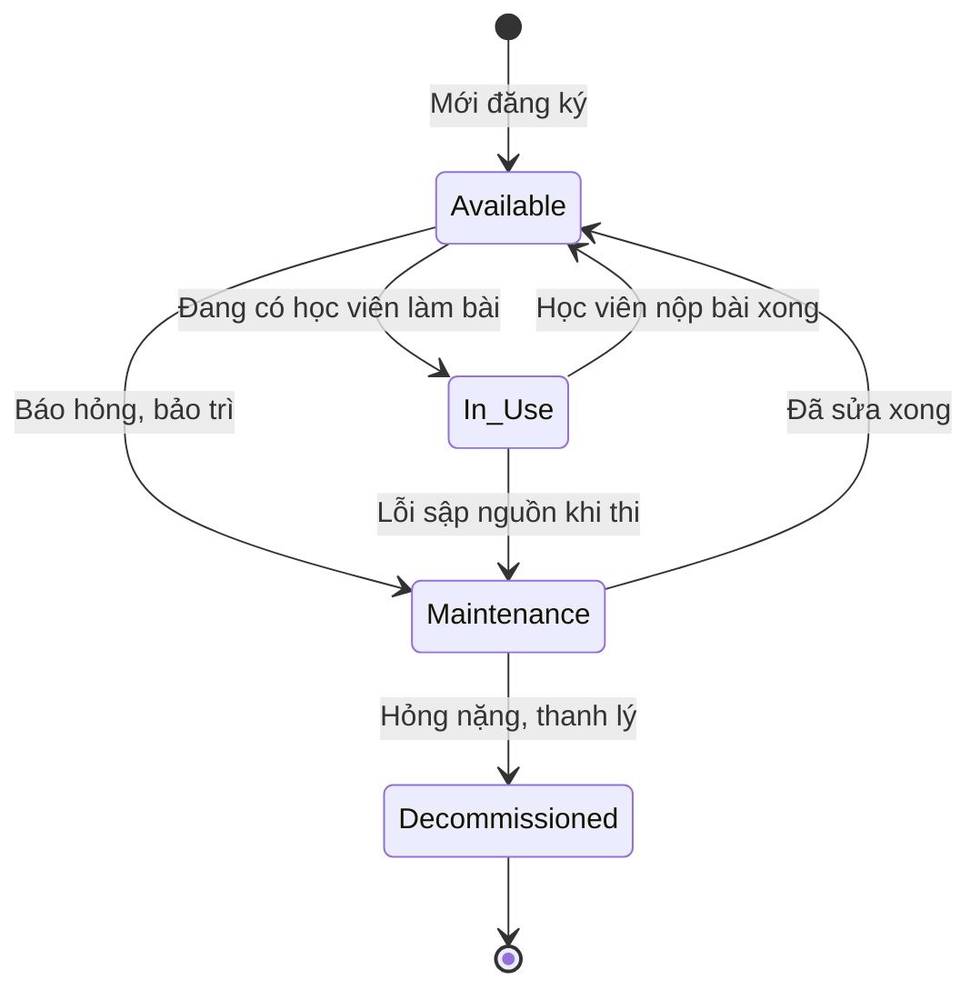

# BF-SYS-03: Quản lý Thiết bị (Device Provisioning Lifecycle)

> **Capability:** CAP-SYS (Năng lực Quản trị Hệ thống)
> **Giai đoạn:** 1 - Thiết lập nền tảng
> **Nhóm chức năng:** Quản lý tài khoản
> **Mã màn hình:** `devices`

---

## 1. Mô tả tổng quan

Quản lý vòng đời thiết bị (iPad/tablet/máy tính) được cấp phát cho các Chi nhánh để phục vụ trực tiếp cho việc làm bài thi điện tử (Booking Test). Quản trị toàn bộ lifecycle của thiết bị: từ **Đăng ký (Provisioning)** → **Gán cơ sở (Assignment)** → **Đồng bộ LMS (Operation)** → **Thu hồi (Decommission)**. Thiết bị ở đây đóng vai trò là **tài nguyên chia sẻ (Shared Resource)** tại chi nhánh, không gán cố định cho từng cá nhân.

## 2. Đối tượng sử dụng (Vai trò)

- **Quản trị Hệ thống (System Admin):** Đăng ký thiết bị mới, cấu hình kết nối LMS, thu hồi thiết bị hỏng.
- **Giám đốc Chi nhánh (Branch Manager):** Theo dõi trạng thái, báo hỏng thiết bị tại cơ sở mình.

## 3. Ranh giới Nghiệp vụ (Scope)

### Có bao gồm (In Scope)
- **Provisioning:** Đăng ký thiết bị vào hệ thống (Tên thiết bị, Số Serial/IMEI, Loại thiết bị).
- **Lifecycle Management:** Cập nhật trạng thái vòng đời (Sẵn sàng, Đang sử dụng, Bảo trì, Đã thu hồi).
- **Transfer:** Chuyển/Luân chuyển thiết bị từ Chi nhánh này sang Chi nhánh khác.
- **LMS Integration:** Đồng bộ và kiểm tra kết nối (Health Check) giữa thiết bị và hệ thống thi LMS.

### Không bao gồm (Out of Scope)
- Bảo trì cơ sở vật chất (bàn ghế, điều hòa) → Nằm ở `CAP-FCM` (`BF-QA-02`).
- Quản lý cấu trúc bài test, phân bổ giáo viên → Nằm ở `CAP-ADM` (`BF-ENR-01`).
- Tính toán khấu hao tài sản → Nằm ở `CAP-FIN`.

## 4. Mô hình Dữ liệu Nghiệp vụ (Data Entities)

| Tên Thực thể | Trường định danh | Thuộc tính quan trọng | Ràng buộc quan hệ | Diễn giải |
|--------------|------------------|-----------------------|-------------------|----------|
| Thiết bị (Device) | Mã Thiết bị | Tên, Số Serial, Trạng thái, Trạng thái LMS | Trỏ về Mã Chi nhánh (Branch) | Máy tính/iPad dùng để test. |
| Lịch sử Điều chuyển (Transfer Log) | Mã Log | Chi nhánh cũ, Chi nhánh mới, Ngày chuyển | Trỏ về Mã Thiết bị | Lưu vết di chuyển. |

### 4.1. Vòng đời Trạng thái (Status Lifecycle)

*Sơ đồ dưới đây xác định vòng đời của một Thiết bị thi.*

**Quy tắc chuyển đổi:**

| Từ trạng thái | Sang trạng thái | Điều kiện bắt buộc | Vai trò được phép |
|---------------|-----------------|---------------------|-------------------|
| Available | In Use | Hệ thống gọi API bắt đầu làm bài Test ở `BF-ENR-01` | Hệ thống tự động |
| Bất kỳ | Decommissioned | Phải gỡ liên kết với Chi nhánh (Trở thành Unassigned) | System Admin |

### 4.2. Ví dụ Dữ liệu mẫu

*Giúp AI và Lập trình viên tạo dữ liệu kiểm thử chính xác.*

| Tình huống | Dữ liệu đầu vào | Kết quả mong đợi |
|------------|-----------------|-------------------|
| Đăng ký mới | iPad Gen 9, S/N: X123, gán cho CS Cầu Giấy. | Lưu thiết bị, Status: Available. CS Cầu Giấy nhìn thấy. |
| Luân chuyển | Admin chuyển iPad X123 từ CS Cầu Giấy sang CS Đống Đa. | Ghi nhận 1 dòng Transfer Log. Status reset về Available. |

## 5. Quy tắc Nghiệp vụ Tổng thể (Business Rules)

1. **[RULE-DEV-01] Tính duy nhất (Unique Serial):** Số định danh phần cứng (Serial Number hoặc MAC Address) là trường Unique. Hệ thống chặn tạo mới nếu S/N đã tồn tại.
2. **[RULE-DEV-02] Điều kiện Xếp lịch thi (Test Eligibility):** Chỉ những thiết bị có Status là `Available` VÀ LMS Status là `Connected` (Mạng ổn định) thì mới được hiển thị trong danh sách chọn thiết bị khi Lễ tân xếp máy cho khách hàng làm bài Test (`BF-ENR-01`).
3. **[RULE-DEV-03] Bảo mật Data Scope:** Branch Manager chỉ được phép xem và quản lý những thiết bị có trường `branchId` thuộc chi nhánh mà mình đang làm việc.

## 6. Danh sách Yêu cầu Người dùng (User Stories)

| Mã Yêu cầu | Tên Yêu cầu (Loại màn hình) | Đường dẫn truy cập | Trạng thái |
|------------|-----------------------------|--------------------|------------|
| US-SYS-03-01 | Quản lý danh sách Thiết bị (Danh sách) | /app/devices | Đã có US |
| US-SYS-03-02 | Đăng ký & Luân chuyển Thiết bị (Bảng nổi) | Nằm trong Màn danh sách | Đã có US |
| US-SYS-03-03 | Đồng bộ LMS Health Check (Background Job) | Chạy ngầm | Đã có US |

---

## 7. Chỉ dẫn cho AI Agent & Lập trình viên (Business Architecture)

- Tuân thủ chặt chẽ cấu trúc thực thể ở mục 4. Phải đảm bảo tính toàn vẹn dữ liệu nghiệp vụ (dữ liệu bảng con phải trỏ đúng mã có thật của bảng cha).
- Mọi trạng thái liệt kê trong sơ đồ 4.1 phải được ánh xạ đầy đủ vào hệ thống.
- Giao diện và luồng xử lý phải tuân thủ bảng chuyển đổi trạng thái (chỉ hiển thị các hành động hợp lệ theo từng trạng thái và phân quyền).

### ⛔ Hàng rào An toàn (Guardrails)
- **KHÔNG** thêm trường dữ liệu hoặc thực thể ngoài danh sách quy định ở mục 4.
- **KHÔNG** thay đổi cấu trúc quan hệ thực thể mà chưa được phê duyệt từ Product Owner.
- **KHÔNG** tạo trạng thái nghiệp vụ mới ngoài sơ đồ ở mục 4.1. Mọi sự thay đổi vòng đời phải được cập nhật vào tài liệu này trước.

