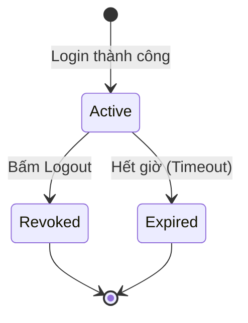

# BF-SYS-05: Dịch vụ Xác thực (Authentication Services)

> **Capability:** CAP-SYS (Năng lực Quản trị Hệ thống)
> **Giai đoạn:** 1 - Thiết lập nền tảng
> **Nhóm chức năng:** Đăng nhập & Xác thực
> **Mã màn hình:** `login`, `sessions`

---

## 1. Mô tả tổng quan

Cung cấp dịch vụ Xác thực (Authentication) cho toàn bộ hệ thống phần mềm. Đóng vai trò là Identity Provider (IdP) nội bộ, trả lời câu hỏi bảo mật cốt lõi: "Chứng minh bạn là ai?". Module này tách biệt hoàn toàn với `BF-SYS-01` (Tạo tài khoản) và `BF-SYS-04` (Phân quyền) để tập trung hoàn toàn vào luồng Đăng nhập (Login), Đăng xuất (Logout) và quản lý Phiên làm việc (Session).

## 2. Đối tượng sử dụng (Vai trò)

- **Mọi Người dùng (All Users):** Đăng nhập, đăng xuất, tự đổi mật khẩu cá nhân.
- **Quản trị Hệ thống (System Admin):** Cấu hình chính sách bảo mật (Session Timeout) và Force Logout khi cần.

## 3. Ranh giới Nghiệp vụ (Scope)

### Có bao gồm (In Scope)
- **Login Flow:** Validate Email/Username kết hợp với Password. Cấp phát JWT Token hoặc Cookie phiên làm việc (`auth_session`).
- **Session Management:** Theo dõi thời gian sống (Lifecycle) của các phiên làm việc, tự động Đăng xuất (Auto-Logout) khi hết hạn.
- **Security Control:** Cảnh báo và tự động Khóa tài khoản tạm thời nếu nhập sai mật khẩu N lần (Chống Brute-force).
- **Self-Service:** Tính năng cho phép người dùng đang đăng nhập tự đổi mật khẩu (Change Password).

### Không bao gồm (Out of Scope)
- Tạo mới User, Xóa User, Khóa vĩnh viễn tài khoản → Thuộc `BF-SYS-01`.
- Định nghĩa Quyền hạn, Phân quyền → Thuộc `BF-SYS-04` (Nhưng AuthN sẽ gộp chung kết quả của AuthZ vào trong Token khi đăng nhập thành công).
- Quên mật khẩu qua Email OTP (Chưa hỗ trợ MVP, Admin sẽ Reset tay ở `BF-SYS-01`).
- SSO (Single Sign-On) qua Google/Microsoft (Chưa hỗ trợ MVP).

## 4. Mô hình Dữ liệu Nghiệp vụ (Data Entities)

| Tên Thực thể | Trường định danh | Thuộc tính quan trọng | Ràng buộc quan hệ | Diễn giải |
|--------------|------------------|-----------------------|-------------------|----------|
| Phiên làm việc (Session) | Mã Session | Token/Cookie, Thời hạn (Expires), User-Agent, IP | Trỏ về Mã Tài khoản | Giữ trạng thái đăng nhập. |
| Lịch sử Đăng nhập (Login Log) | Mã Log | Địa chỉ IP, Trạng thái (Thành công/Thất bại), Thời gian | Trỏ về Mã Tài khoản | Phục vụ Audit bảo mật. |

### 4.1. Vòng đời Trạng thái (Status Lifecycle)

*Sơ đồ dưới đây xác định vòng đời của một Phiên làm việc (Session).*

**Quy tắc chuyển đổi:**

| Từ trạng thái | Sang trạng thái | Điều kiện bắt buộc | Vai trò được phép |
|---------------|-----------------|---------------------|-------------------|
| Active | Revoked | Người dùng chủ động chọn "Đăng xuất" | Người dùng / Admin |
| Active | Expired | Thời gian không tương tác vượt mức `SESSION_TIMEOUT_MINS` ở `BF-SYS-02` | Hệ thống tự động |

### 4.2. Ví dụ Dữ liệu mẫu

*Giúp AI và Lập trình viên thiết kế Middleware bảo mật.*

| Tình huống | Dữ liệu đầu vào | Kết quả mong đợi |
|------------|-----------------|-------------------|
| Đăng nhập sai | `nguyenvana` nhập pass sai 5 lần liên tục. | Hệ thống chặn đăng nhập, ghi đè trạng thái Account thành `Locked`. Báo Admin. |
| Đăng nhập đúng | `nguyenvana` nhập đúng Email + Password | Hệ thống gọi `BF-SYS-04` để lấy Ma trận quyền, đóng gói vào Token. Sinh Session, chuyển vào trang Dashboard. |
| Truy cập trái phép | Khách chưa login, gõ URL `/app/students` | Next.js Middleware chặn lại, redirect thẳng về màn hình `/login`. |

## 5. Quy tắc Nghiệp vụ Tổng thể (Business Rules)

1. **[RULE-AUTHN-01] Nguyên tắc Cửa ngõ (Authentication First):** Hệ thống Middleware (của Next.js) được cấu hình bao bọc toàn bộ các route bắt đầu bằng `/app/*`. Mọi request chưa có Token hợp lệ đều bị chặn và điều hướng (Redirect) về `/login` ngay lập tức.
2. **[RULE-AUTHN-02] Giới hạn Đoán mò (Brute-force Limit):** Nếu hệ thống ghi nhận `Login_Fail_Count` > 5 lần từ một IP hoặc cùng một Username trong vòng 15 phút, tự động gọi qua `BF-SYS-01` để cập nhật trạng thái Tài khoản thành `Locked` và chặn đăng nhập trong vòng X phút tiếp theo.
3. **[RULE-AUTHN-03] Token Hydration:** Phân hệ AuthN chỉ sinh Token. Tuy nhiên, nội dung trong Token (Claim) BẮT BUỘC phải chứa danh sách quyền lợi (Entitlements) được Request từ module `BF-SYS-04` tại đúng thời điểm login.

## 6. Danh sách Yêu cầu Người dùng (User Stories)

| Mã Yêu cầu | Tên Yêu cầu (Loại màn hình) | Đường dẫn truy cập | Trạng thái |
|------------|-----------------------------|--------------------|------------|
| US-SYS-05-01 | Màn hình Đăng nhập (Form) | `/login` | Đã có US |
| US-SYS-05-02 | Đổi mật khẩu cá nhân (Bảng nổi) | Menu Avatar Dropdown | Đã có US |
| US-SYS-05-03 | Đăng xuất (Nút bấm) | Menu Avatar Dropdown | Đã có US |

---

## 7. Chỉ dẫn cho AI Agent & Lập trình viên (Business Architecture)

- Tuân thủ chặt chẽ cấu trúc thực thể ở mục 4. Phải đảm bảo tính toàn vẹn dữ liệu nghiệp vụ (dữ liệu bảng con phải trỏ đúng mã có thật của bảng cha).
- Mọi trạng thái liệt kê trong sơ đồ 4.1 phải được ánh xạ đầy đủ vào hệ thống.
- Giao diện và luồng xử lý phải tuân thủ bảng chuyển đổi trạng thái (chỉ hiển thị các hành động hợp lệ theo từng trạng thái và phân quyền).

### ⛔ Hàng rào An toàn (Guardrails)
- **KHÔNG** thêm trường dữ liệu hoặc thực thể ngoài danh sách quy định ở mục 4.
- **KHÔNG** thay đổi cấu trúc quan hệ thực thể mà chưa được phê duyệt từ Product Owner.
- **KHÔNG** tạo trạng thái nghiệp vụ mới ngoài sơ đồ ở mục 4.1. Mọi sự thay đổi vòng đời phải được cập nhật vào tài liệu này trước.

