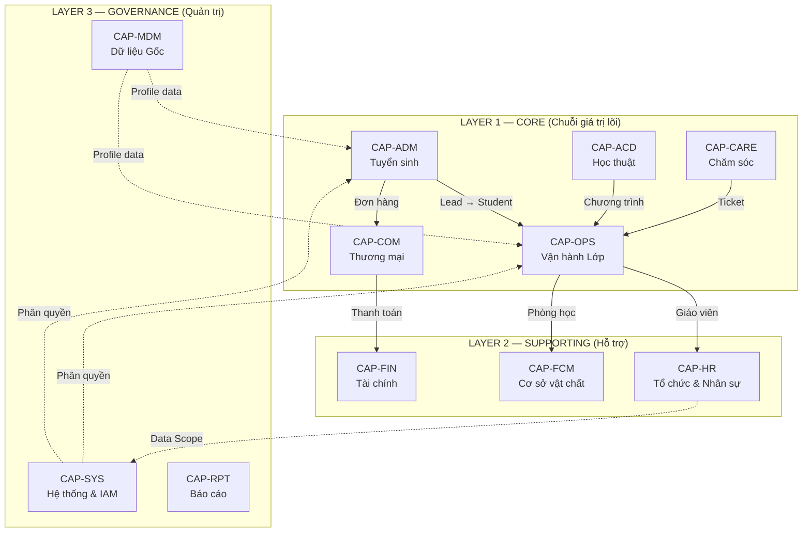

# Capability Map — Rinov5 Station ERP

> Bản đồ năng lực tổng thể hệ thống Rinov5 — All-in-One ERP cho mô hình Station.
> Rinov5 hợp nhất CRM + ERP + CARE vào 1 nền tảng, phục vụ riêng cho đào tạo tại cơ sở.
> Xem tổng quan hệ sinh thái: [ECOSYSTEM_OVERVIEW.md](../ECOSYSTEM_OVERVIEW.md)
> Cập nhật lần cuối: 2026-05-17

## 1. Kiến trúc 3 Lớp (Three-Layer Architecture)



## 2. Danh sách CAP theo Layer

### Layer 1 — Core Educational Capabilities (Giá trị lõi)

| CAP | Tên | Vai trò |
|-----|-----|---------|
| [CAP-ADM](./admissions/CAP-ADM-admissions-management.md) | Quản lý Tuyển sinh | Biến Lead thành Học viên |
| [CAP-COM](./commerce/CAP-COM-commerce.md) | Thương mại & Bán hàng | Sản phẩm → Đơn hàng |
| [CAP-OPS](./class-operations/CAP-OPS-class-operations.md) | Vận hành Lớp & Học viên | Lớp + Buổi + Điểm danh + GV |
| [CAP-ACD](./academic/CAP-ACD-academic-management.md) | Học thuật & Đào tạo | Chương trình + Giáo trình + QC |
| [CAP-CARE](./student-care/CAP-CARE-student-care.md) | Chăm sóc Học viên | Chăm sóc + Giữ chân |

### Layer 2 — Supporting Capabilities (Hỗ trợ)

| CAP | Tên | Vai trò |
|-----|-----|---------|
| [CAP-HR](./human-resources/CAP-HR-human-resources.md) | Tổ chức & Nhân sự | Ai làm gì, ở đâu trong tổ chức |
| [CAP-FIN](./financial/CAP-FIN-financial-management.md) | Quản trị Tài chính | Thu phí, Phiếu thu, Doanh thu |
| [CAP-FCM](./facility/CAP-FCM-facility-management.md) | Cơ sở vật chất | Bảo trì, Checklist CSVC |

### Layer 3 — Governance & Management (Quản trị)

| CAP | Tên | Vai trò |
|-----|-----|---------|
| [CAP-SYS](./system-governance/CAP-SYS-system-governance.md) | Hệ thống & IAM | Tài khoản, Phân quyền, Cấu hình |
| [CAP-MDM](./master-data/CAP-MDM-master-data.md) | Dữ liệu Gốc | Golden Record, Hồ sơ cá nhân/Gia đình |
| [CAP-RPT](./reporting-analytics/CAP-RPT-reporting-analytics.md) | Báo cáo & Phân tích | Dashboard, KPI, Export |

## 3. Mô hình 3 Tầng Thực thể Nền tảng

Theo chuẩn ngành ERP (SAP/Oracle/Workday), hệ thống tách biệt 3 tầng thực thể:

| Tầng | Thực thể | CAP | Câu hỏi |
|------|----------|-----|---------|
| **Identity** | Person (Golden Record) | CAP-MDM | Ai là ai? |
| **Role/Contract** | Worker (Employee Record) | CAP-HR | Làm gì, ở đâu? |
| **Access** | User Account + Role | CAP-SYS | Được phép làm gì? |

Quy tắc:
- Person tồn tại độc lập (học viên, phụ huynh không cần Worker hay User)
- Worker yêu cầu Person, nhưng KHÔNG yêu cầu User
- User Account yêu cầu Person, nhưng KHÔNG yêu cầu Worker
- Kích hoạt Worker ≠ Kích hoạt User — hai lifecycle độc lập

## 4. Chuỗi giá trị EdTech — Vòng đời Học viên

```
[CAP-ADM] Lead → Test → Học thử
       ↓
[CAP-COM] Mua khóa học → Đơn hàng
       ↓
[CAP-FIN] Thanh toán → Phiếu thu
       ↓
[CAP-OPS] Xếp lớp → Học → Điểm danh → Nhận xét
       ↓
[CAP-ACD] Nội dung giảng dạy (Syllabus → Lesson)
       ↓
[CAP-CARE] Chăm sóc → Tái phí → Quay lại [CAP-COM]
       ↓
[CAP-OPS] Tốt nghiệp / Hoàn thành
```

Xuyên suốt: `CAP-MDM` (Profile), `CAP-HR` (Nhân sự), `CAP-SYS` (Phân quyền), `CAP-RPT` (Báo cáo).
