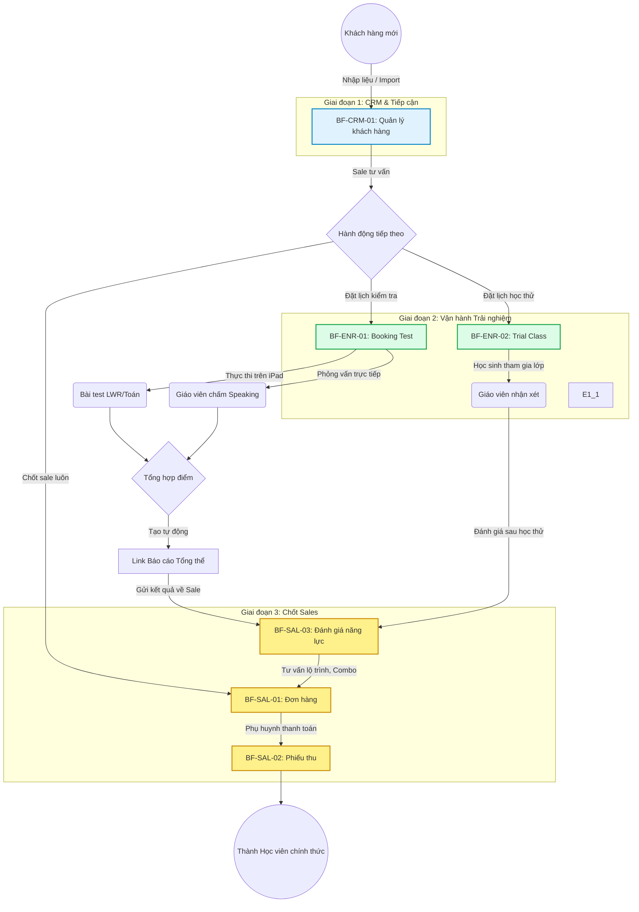

# FLOW-ENR-00: Vòng đời Tuyển sinh (Enrollment Lifecycle)

> **Loại Sơ đồ:** Master Flow (Luồng tổng quan xuyên suốt)
> **Mục đích:** Mô tả hành trình end-to-end của một Khách hàng tiềm năng (Lead) đi qua các phân hệ CRM, Vận hành và Bán hàng để trở thành Học viên chính thức.

---

## Sơ đồ luồng nghiệp vụ (Business Flow)

## Danh sách Business Functions liên quan
Sơ đồ trên kết nối trực tiếp các nghiệp vụ sau:
1. **[BF-CRM-01](../business-functions/BF-CRM-01-quan-ly-khach-hang.md):** Khởi tạo và lưu trữ hồ sơ Lead.
2. **[BF-ENR-01](../business-functions/BF-ENR-01-booking-test.md):** Điều phối ca test, thiết bị iPad và nhân sự coi thi.
3. **[BF-ENR-02](../business-functions/BF-ENR-02-hoc-thu.md):** Cho học sinh vào lớp học thật để trải nghiệm.
4. **[BF-SAL-03](../business-functions/BF-SAL-03-danh-gia-nang-luc.md):** Sale phân tích điểm số/nhận xét để chốt lộ trình.
5. **[BF-SAL-01](../business-functions/BF-SAL-01-don-hang.md) & [BF-SAL-02](../business-functions/BF-SAL-02-phieu-thu.md):** Tạo giao dịch tài chính.
