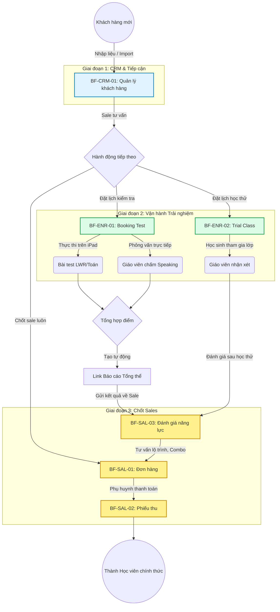

# FLOW-ENR-00: Vòng đời Tuyển sinh (Enrollment Lifecycle)

## 1. Bối cảnh Nghiệp vụ (Context)

Luồng tổng quan xuyên suốt (Master Flow) mô tả hành trình đầy đủ của một Khách hàng tiềm năng đi qua các giai đoạn Tiếp cận, Vận hành Trải nghiệm và Chốt bán hàng để trở thành Học viên chính thức. Luồng được kích hoạt khi tổ chức tiếp nhận một khách hàng mới.

> **Nghiệp vụ:** Liên phân hệ (`BF-CRM-01`, `BF-ENR-01`, `BF-ENR-02`, `BF-SAL-01`, `BF-SAL-02`, `BF-SAL-03`)
> **Capability:** CAP-ADM (Năng lực Tuyển sinh)

## 2. Đối tượng và Hệ thống tham gia

*   **Nhân viên Tư vấn (Sales):** Tiếp nhận khách hàng, tư vấn lộ trình, chốt đơn hàng.
*   **Giáo viên:** Phỏng vấn đánh giá năng lực (Speaking), nhận xét sau buổi học thử.
*   **Nhân viên Vận hành:** Điều phối lịch kiểm tra, lịch học thử, phân bổ giáo viên và phòng học.
*   **Hệ thống tự động:** Đồng bộ bài test xuống thiết bị, tổng hợp điểm, sinh báo cáo năng lực.

## 3. Sơ đồ luồng nghiệp vụ

## 4. Diễn giải các bước

1.  **Tiếp nhận khách hàng:** Tư vấn viên nhập thông tin khách hàng mới vào hệ thống (`BF-CRM-01`), sau đó quyết định hành động tiếp theo.
2.  **Kiểm tra đầu vào:** Tạo Booking Test (`BF-ENR-01`). Học sinh làm bài trên thiết bị (Toán/LWR) và/hoặc được Giáo viên phỏng vấn (Speaking). Hệ thống tổng hợp điểm.
3.  **Học thử:** Tạo Booking học thử (`BF-ENR-02`). Học sinh ghép vào lớp thật, Giáo viên nhận xét.
4.  **Tổng hợp và báo cáo:** Hệ thống thu thập điểm thành phần, tự động sinh Link Báo cáo Tổng thể.
5.  **Chốt bán hàng:** Tư vấn viên phân tích kết quả (`BF-SAL-03`), tư vấn lộ trình → tạo đơn hàng (`BF-SAL-01`) → thanh toán (`BF-SAL-02`) → Học viên chính thức.

## 5. Xử lý Rẽ nhánh / Ngoại lệ

*   **Chốt sale trực tiếp:** Khách hàng đã có kết quả hoặc quyết định nhanh → bỏ qua giai đoạn Vận hành, chốt đơn hàng luôn.
*   **Khách hàng không đến (No-show):** Hệ thống tự cập nhật trạng thái. Tư vấn viên liên hệ lại để đặt lịch mới.
*   **Kết quả chưa đủ:** Booking ở trạng thái trung gian cho đến khi thu thập đủ các thành phần điểm.

## 6. Danh sách Business Functions liên quan

1. **[BF-CRM-01](./BF-CRM-01-quan-ly-khach-hang.md):** Khởi tạo và lưu trữ hồ sơ khách hàng.
2. **[BF-ENR-01](./BF-ENR-01-booking-test.md):** Điều phối ca test, thiết bị và nhân sự coi thi.
3. **[BF-ENR-02](./BF-ENR-02-hoc-thu.md):** Cho học sinh vào lớp thật để trải nghiệm.
4. **[BF-SAL-03](./BF-SAL-03-danh-gia-nang-luc.md):** Phân tích điểm số/nhận xét để chốt lộ trình.
5. **[BF-SAL-01](./BF-SAL-01-don-hang.md) & [BF-SAL-02](./BF-SAL-02-phieu-thu.md):** Tạo giao dịch tài chính.

---

## 7. Chỉ dẫn cho AI Agent & Lập trình viên (Business Architecture)

- Luồng này kết nối nhiều phân hệ. Đảm bảo dữ liệu truyền chính xác giữa CRM → Enrollment → Sales.
- Tại mỗi bước chuyển tiếp, kiểm tra trạng thái nghiệp vụ hợp lệ theo sơ đồ vòng đời của từng BF.

### ⛔ Hàng rào An toàn (Guardrails)
- **KHÔNG** bỏ qua các bước Xác nhận / Phê duyệt đã được quy định trong sơ đồ.
- **KHÔNG** thay đổi thứ tự hoặc tự ý bỏ bước mà chưa được phê duyệt từ Product Owner.
- **KHÔNG** tự ý tạo ra các trạng thái trung gian ngoài luồng nghiệp vụ chuẩn.
