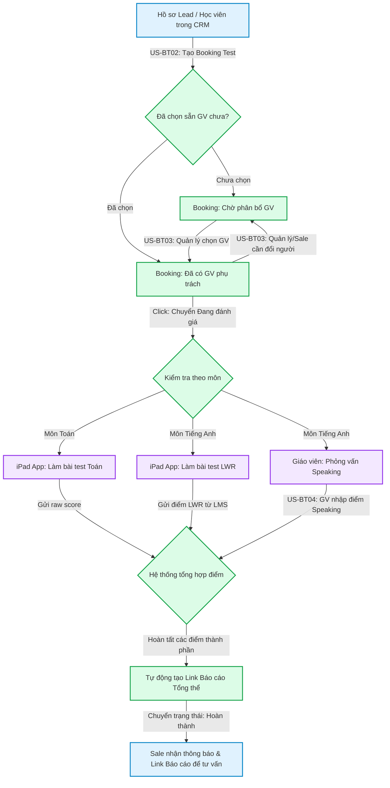

# FLOW-ENR-01: Vòng đời Booking Test (Booking Test Lifecycle)

> **Loại Sơ đồ:** Flow Nghiệp vụ chi tiết (Detailed Flow)
> **Nghiệp vụ (BF):** `BF-ENR-01`
> **Mục đích:** Mô tả chi tiết hành trình của một lịch kiểm tra đầu vào (Booking Test) từ lúc khởi tạo, phân bổ giáo viên, làm bài test trên iPad, phỏng vấn, đến khi trả kết quả tổng thể.

---

## Sơ đồ luồng nghiệp vụ chi tiết

## Giải thích luồng
1. **Giai đoạn Đặt lịch:** Sale lấy thông tin Lead từ CRM để tạo Booking Test. Nếu có sẵn giáo viên trống giờ, Sale chọn luôn. Nếu chưa có, Booking sẽ ở trạng thái chờ Phân bổ.
2. **Giai đoạn Chuẩn bị:** Quản lý/Giáo vụ phân bổ giáo viên cho ca test.
3. **Giai đoạn Đánh giá (Execution):** 
   - Với môn Toán: Học sinh làm trắc nghiệm/tự luận trên iPad.
   - Với môn Tiếng Anh: Học sinh làm bài LWR (Listening, Writing, Reading) trên iPad + Giáo viên phỏng vấn trực tiếp (Speaking).
4. **Giai đoạn Trả kết quả:** Hệ thống thu thập đủ các điểm thành phần, tự động mix lại theo trọng số và xuất ra một Report Link duy nhất. Sale sẽ dùng Report này để tư vấn khách hàng.
