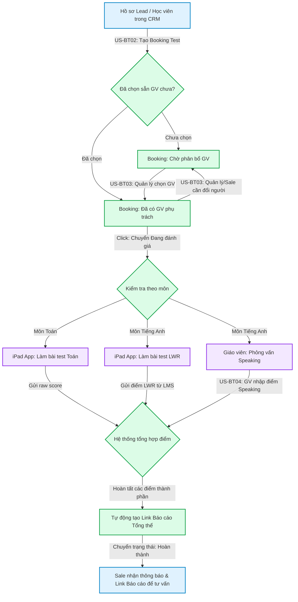

# FLOW-ENR-01: Vòng đời Booking Test (Booking Test Lifecycle)

## 1. Bối cảnh Nghiệp vụ (Context)

Luồng chi tiết mô tả hành trình đầy đủ của một **Lịch kiểm tra đầu vào (Booking Test)** — từ lúc nhân viên tư vấn đặt lịch, phân bổ giáo viên, học viên làm bài trên thiết bị, giáo viên phỏng vấn trực tiếp, đến khi hệ thống tổng hợp kết quả và trả báo cáo năng lực.

> **Nghiệp vụ gốc (BF):** `BF-ENR-01`
> **Kích hoạt bởi:** Nhân viên tư vấn tạo lịch hẹn kiểm tra cho khách hàng tiềm năng.
> **Kết thúc khi:** Hệ thống sinh xong báo cáo năng lực tổng thể (Report Link) để nhân viên tư vấn sử dụng.

## 2. Đối tượng và Hệ thống tham gia

*   **Nhân viên Tư vấn (Sale):** Tạo lịch hẹn test, chọn giáo viên, nhận kết quả để tư vấn chốt lộ trình học.
*   **Giáo viên (Teacher):** Được phân công phụ trách phỏng vấn (Speaking), chấm điểm trực tiếp trên hệ thống.
*   **Quản lý / Giáo vụ:** Phân bổ giáo viên cho ca test khi chưa có sẵn.
*   **Học viên:** Thực hiện bài test trên thiết bị tại cơ sở.
*   **Hệ thống tự động:** Đồng bộ đề thi xuống thiết bị, thu thập điểm, tổng hợp kết quả và sinh báo cáo.

## 3. Sơ đồ Luồng nghiệp vụ

## 4. Diễn giải các bước

1.  **Giai đoạn Đặt lịch:** Nhân viên tư vấn lấy thông tin khách hàng tiềm năng từ hệ thống quản lý khách hàng để tạo lịch hẹn kiểm tra. Nếu có sẵn giáo viên trống giờ, nhân viên chọn luôn. Nếu chưa có, lịch hẹn sẽ ở trạng thái chờ phân bổ.
2.  **Giai đoạn Chuẩn bị:** Quản lý hoặc Giáo vụ phân bổ giáo viên cho ca test. Có thể đổi giáo viên linh hoạt nếu có phát sinh.
3.  **Giai đoạn Đánh giá (Thực thi):**
    - Với **môn Toán:** Học sinh làm bài trắc nghiệm/tự luận trên thiết bị tại cơ sở.
    - Với **môn Tiếng Anh:** Hai phần diễn ra song song hoặc tuần tự:
      - *Phần tự động:* Học sinh làm bài Nghe - Viết - Đọc (LWR) trên thiết bị.
      - *Phần thủ công:* Giáo viên phỏng vấn trực tiếp, chấm điểm Nói (Speaking) trên hệ thống.
4.  **Giai đoạn Trả kết quả:** Hệ thống thu thập đủ các điểm thành phần, tự động tổng hợp theo trọng số và xuất ra một Báo cáo Năng lực duy nhất. Nhân viên tư vấn sẽ dùng báo cáo này để tư vấn khách hàng.

## 5. Xử lý Rẽ nhánh / Ngoại lệ

*   **Khách hàng không đến (No-show):** Nếu đến cuối ngày mà lịch hẹn vẫn ở trạng thái "Đã đặt lịch", hệ thống tự động quét và chuyển sang trạng thái "Không đạt".
*   **Khách hàng hủy lịch:** Nhân viên tư vấn hoặc Quản lý chuyển trạng thái thành "Đã hủy" tại bất kỳ thời điểm nào trước khi hoàn thành.
*   **Thiết bị mất kết nối khi đang làm bài:** Hệ thống lưu trữ tạm kết quả trên thiết bị. Khi có kết nối lại, tự động gửi kết quả về hệ thống chính.
*   **Giáo viên nghỉ đột xuất:** Quản lý đổi giáo viên phụ trách thông qua màn hình chi tiết lịch hẹn (US-BT03) mà không cần hủy lịch.
*   **Chỉ có một phần kết quả (Tiếng Anh):** Hai kênh đánh giá (LWR và Speaking) hoạt động độc lập. Một phần có kết quả trước vẫn được ghi nhận, phần còn lại hiển thị "chưa có" cho đến khi hoàn thành.

---

## 6. Chỉ dẫn cho AI Agent & Lập trình viên (Business Architecture)

- Các bước chuyển tiếp trong sơ đồ trên gắn chặt với việc cập nhật trạng thái nghiệp vụ. Trạng thái hợp lệ: `Booked → Assessing → Completed / Failed / Cancelled` (xem BF-ENR-01 §4.1).
- Tại các nút rẽ nhánh (Toán / Tiếng Anh), cần kiểm tra trường `subject` hoặc `programType` của booking để quyết định luồng.
- Phần B (Speaking) của US-BT04 và Phần A (LWR từ iPad) của US-BT05 là 2 nguồn dữ liệu độc lập ghi vào cùng 1 booking. Phải đảm bảo không ghi đè lẫn nhau.

### ⛔ Hàng rào An toàn (Guardrails)
- **KHÔNG** bỏ qua các bước Phân bổ Giáo viên — booking phải có giáo viên trước khi chuyển sang "Đang đánh giá".
- **KHÔNG** thay đổi thứ tự hoặc tự ý bỏ bước trong luồng mà chưa được phê duyệt từ Product Owner.
- **KHÔNG** tự ý tạo ra các trạng thái trung gian ngoài luồng nghiệp vụ chuẩn đã quy định tại BF-ENR-01.
