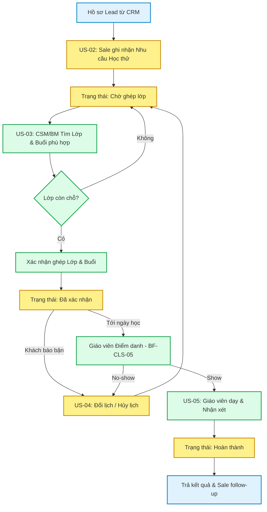

# FLOW-ENR-02: Vòng đời Học thử Ghép buổi (Trial Session Lifecycle)

> **Loại Sơ đồ:** Flow Nghiệp vụ chi tiết (Detailed Flow)
> **Nghiệp vụ (BF):** `BF-ENR-02`
> **Mục đích:** Mô tả chi tiết hành trình của một vé Học thử (Trial Booking) từ lúc Sale ghi nhận nhu cầu, Giáo vụ xếp lớp, đến khi Giáo viên dạy và trả kết quả.

---

## Sơ đồ luồng nghiệp vụ chi tiết

## Giải thích luồng
1. **Giai đoạn Booking:** Sale tạo nhu cầu (Chờ ghép).
2. **Giai đoạn Sắp xếp:** CSM (Giáo vụ) tìm Lớp đang chạy và chọn Buổi học tương lai. Nếu Lớp hết chỗ sẽ phải chờ. Nếu ghép thành công, Booking chuyển sang Đã xác nhận.
3. **Ngoại lệ:** Nếu Khách báo bận hoặc Giáo viên hủy buổi, Sale/CSM tiến hành Đổi/Hủy lịch.
4. **Vận hành thực tế:** Đến ngày học, Giáo viên/Lễ tân dùng tính năng của Quản lý Lớp (`BF-CLS-05`) để điểm danh. Học sinh bắt buộc là `Show` (Có mặt) thì mới kích hoạt bước Nhận xét.
5. **Kết thúc:** Sau khi GV submit form đánh giá năng lực thực tế, Booking hoàn thành, trả Feedback Report về cho CRM để Sale dùng làm "vũ khí" tư vấn chốt khách.
