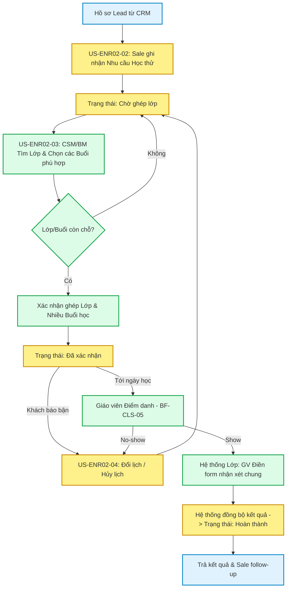

# FLOW-ENR-02: Vòng đời Học thử Ghép buổi (Trial Session Lifecycle)

> **Loại Sơ đồ:** Flow Nghiệp vụ chi tiết (Detailed Flow)
> **Nghiệp vụ (BF):** `BF-ENR-02`
> **Mục đích:** Mô tả chi tiết hành trình của một vé Học thử (Trial Booking) từ lúc Sale ghi nhận nhu cầu, Giáo vụ xếp lớp, đến khi Giáo viên dạy và trả kết quả.

---

## Sơ đồ luồng nghiệp vụ chi tiết

## Giải thích luồng
1. **Giai đoạn Booking:** Sale tạo nhu cầu (Chờ ghép).
2. **Giai đoạn Sắp xếp:** CSM (Giáo vụ) tìm Lớp đang chạy và chọn một hoặc nhiều Buổi học (Multi-session) tương lai. Nếu Lớp/Buổi hết chỗ sẽ phải chờ. Nếu ghép thành công, Booking chuyển sang Đã xác nhận. Người phụ trách Booking sẽ được gán tự động thành Giáo viên của lớp/buổi học đó. Khách hàng được phép chọn tối đa 3 buổi học.
3. **Ngoại lệ:** Nếu Khách báo bận hoặc Giáo viên hủy buổi, Sale/CSM tiến hành Đổi/Hủy lịch. Việc đổi/hủy lịch có thể áp dụng cho từng buổi cụ thể hoặc toàn bộ Booking.
4. **Vận hành thực tế:** Đến ngày học, Giáo viên/Lễ tân dùng tính năng của Quản lý Lớp (`BF-CLS-05`) để điểm danh. Học sinh bắt buộc là `Show` (Có mặt) thì mới kích hoạt bước Nhận xét. Trường hợp Multi-session, Booking chỉ bị tính là `No-show` (Không đến) khi khách vắng mặt tất cả các buổi.
5. **Kết thúc:** Sau khi GV submit form đánh giá chung tại Hệ thống Vận hành Lớp (áp dụng sau buổi học cuối cùng đối với Multi-session), Booking Học thử tự động đồng bộ kết quả (Read-only) và chuyển trạng thái hoàn thành. Hệ thống trả Feedback Report về cho CRM để Sale dùng làm "vũ khí" tư vấn chốt khách.
