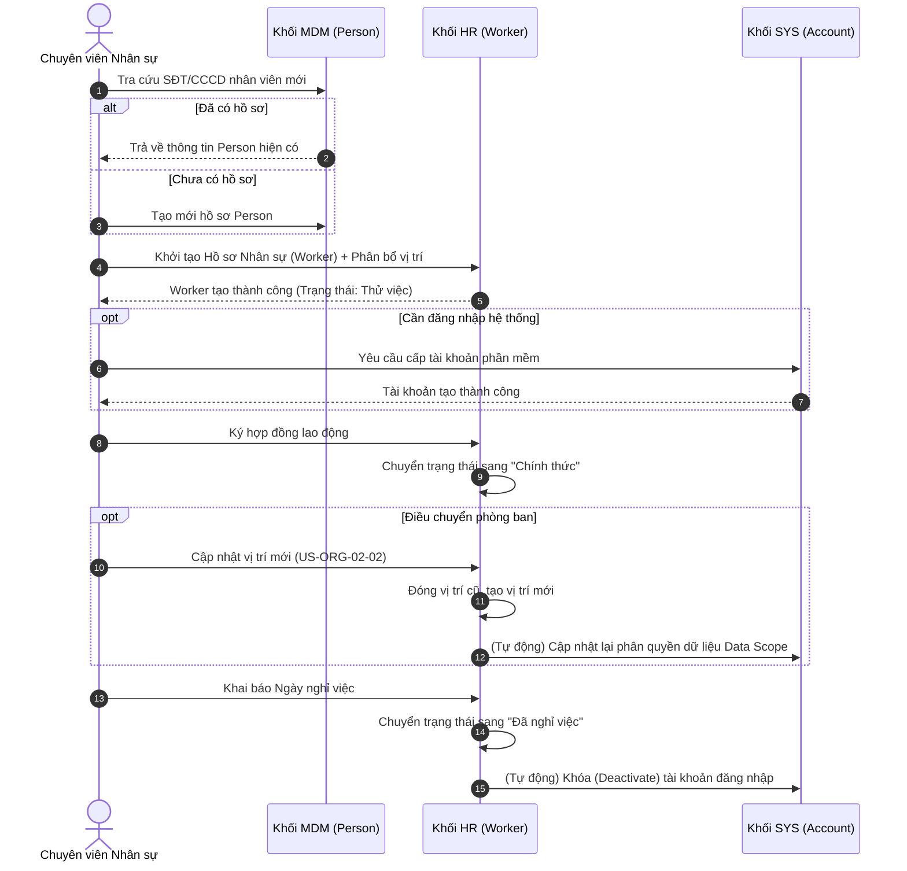

# FLOW-HR-01: Vòng đời Nhân sự (Hire-to-Retire Lifecycle)

## 1. Bối cảnh Nghiệp vụ (Context)
Luồng quy trình này mô tả toàn bộ vòng đời của một nhân sự trong hệ thống từ lúc bắt đầu gia nhập công ty (Hire), phân bổ vào các phòng ban/chi nhánh (Assignment), cho đến khi kết thúc hợp đồng hoặc nghỉ việc (Retire). Quy trình này liên kết chặt chẽ dữ liệu giữa 3 khối: `CAP-MDM` (Hồ sơ người dùng gốc), `CAP-HR` (Hồ sơ làm việc) và `CAP-SYS` (Cấp phát tài khoản).

## 2. Đối tượng và Hệ thống tham gia
*   **Chuyên viên Nhân sự (HR)**: Thực hiện nhập liệu hồ sơ, cập nhật trạng thái làm việc và điều chuyển.
*   **Quản trị Hệ thống (Admin)**: Xác nhận cấp phát tài khoản (nếu HR yêu cầu cấp tài khoản đăng nhập).
*   **Hệ thống CAP-MDM**: Quản lý Hồ sơ gốc (Person).
*   **Hệ thống CAP-SYS**: Quản lý Tài khoản (User).

## 3. Sơ đồ Trình tự

## 4. Diễn giải các bước
1.  **Bước 1-3**: HR tra cứu trên MDM để đảm bảo không tạo rác dữ liệu. Nếu nhân viên này từng là phụ huynh học sinh, hệ thống sẽ tái sử dụng hồ sơ Person đó.
2.  **Bước 4**: Tạo hồ sơ Worker và bắt buộc phải gán một Vị trí công tác (Phòng ban/Chi nhánh + Chức danh).
3.  **Bước 6**: Hệ thống tách bạch giữa việc có hồ sơ nhân sự và có tài khoản. Bác bảo vệ có hồ sơ nhưng không cần tạo tài khoản.
4.  **Bước 7-8**: Sau 2 tháng thử việc, HR chuyển trạng thái sang Chính thức.
5.  **Bước 10-11**: Khi nhân sự luân chuyển, HR cập nhật, và hệ thống tự động báo cho CAP-SYS để điều chỉnh quyền (ví dụ: chuyển từ CS Cầu Giấy sang CS Đống Đa thì chỉ thấy dữ liệu Đống Đa).
6.  **Bước 12-14**: Khi nghỉ việc, nhân sự không bị xóa khỏi hệ thống. Tài khoản đăng nhập lập tức bị khóa.

## 5. Xử lý Rẽ nhánh / Ngoại lệ
*   **Tình huống Nhân sự nghỉ việc quay lại làm**: HR tra cứu mã CCCD, hệ thống phát hiện Worker cũ đã "Nghỉ việc". HR chọn "Khôi phục hồ sơ", tạo ra Phân bổ vị trí mới.

---

## 6. Chỉ dẫn cho AI Agent & Lập trình viên (Business Architecture)

- Các bước chuyển tiếp trong sơ đồ trên thường đi kèm việc cập nhật trạng thái nghiệp vụ. Cần thiết kế logic chuyển đổi trạng thái ở tầng Service/Domain. Đặc biệt chú ý kết nối (sync) giữa trạng thái nghỉ việc bên HR và trạng thái Active/Inactive bên SYS.
- Tại các bước hệ thống tự động kiểm tra, phải đảm bảo tuân thủ nghiêm ngặt các quy tắc Business Rules tương ứng từ tài liệu BF/US.

### ⛔ Hàng rào An toàn (Guardrails)
- **KHÔNG** bỏ qua các bước Xác nhận / Phê duyệt (Approval/Confirmation) đã được quy định trong sơ đồ trình tự.
- **KHÔNG** tự ý tạo ra các trạng thái trung gian ngoài luồng nghiệp vụ chuẩn (ví dụ tự đẻ ra trạng thái "Đang xem xét nghỉ việc").
- **KHÔNG** được tự động tạo Account khi vừa mới tạo Worker nếu không có flag cấp quyền từ HR.
