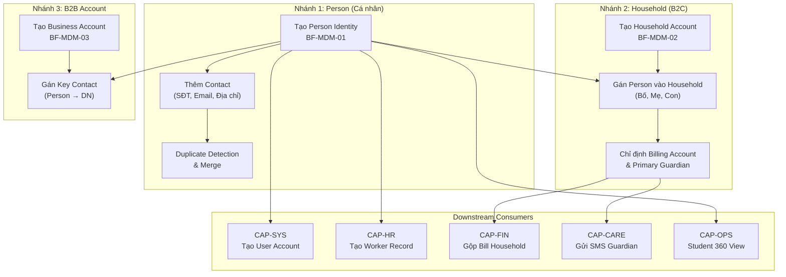

# FLOW-MDM-00: Vòng đời Dữ liệu Gốc (Party Data Lifecycle)

> Tài liệu mô tả luồng xuyên suốt (End-to-End Flow) của hệ thống Quản trị Dữ liệu Gốc (MDM), từ khi tạo Person → gom Household → liên kết B2B → phục vụ các phân hệ downstream.

## 1. Tổng quan

Luồng MDM tuân thủ **Party Data Model** (chuẩn EDA), chia thành 3 nhánh thực thể:

## 2. Chi tiết từng Nhánh

### Nhánh 1: Person Identity Lifecycle
**Actor:** Sale, CSM, HR Admin  
**BF:** `BF-MDM-01`

| Bước | Hành động | US tham chiếu | Ghi chú |
|------|-----------|--------------|---------|
| 1.1 | Sale tiếp nhận khách hàng mới, tìm kiếm xem Person đã tồn tại chưa | `US-MDM-01-01` | Tìm theo Tên, SĐT, Email, CCCD |
| 1.2a | Nếu **chưa có** → Tạo Person mới (Tên, DOB, Giới tính, CCCD) | `US-MDM-01-02` | Duplicate Detection chạy realtime |
| 1.2b | Nếu **đã có** → Dùng Person có sẵn, cập nhật nếu cần | `US-MDM-01-02` | Golden Record |
| 1.3 | Thêm thông tin liên lạc (SĐT, Email, Địa chỉ), đánh dấu Primary Contact | `US-MDM-01-03` | Contact tách bảng riêng (1-N) |
| 1.4 | (Nếu phát hiện trùng sau) Admin hợp nhất 2 Person thành 1 Golden Record | `US-MDM-01-04` | Chỉ System Admin |

**Output:** Person Entity hoàn chỉnh với Identity + Contact(s).

---

### Nhánh 2: Household & Relationship (B2C)
**Actor:** Sale, CSM, Kế toán  
**BF:** `BF-MDM-02`

| Bước | Hành động | US tham chiếu | Ghi chú |
|------|-----------|--------------|---------|
| 2.1 | Sale tạo Household Account khi tiếp nhận gia đình có 2+ học viên | `US-MDM-02-01` | VD: "GĐ Nguyễn Văn A" |
| 2.2 | Gán các Person (Bố, Mẹ, Con 1, Con 2) vào Household | `US-MDM-02-02` | Person phải tồn tại trước |
| 2.3 | Thiết lập cây quan hệ (Parent-Child, Sibling) | `US-MDM-02-03` | Sibling tự suy ra |
| 2.4 | Chỉ định Billing Account (ai trả tiền) | `US-MDM-02-03` | → CAP-FIN dùng để gộp Bill |
| 2.5 | Chỉ định Primary Guardian (ai nhận thông báo) | `US-MDM-02-03` | → CAP-CARE dùng để gửi SMS |

**Output:** Household Account → Billing Account + Guardian + Relationship Graph.

**Kịch bản thực tế:**
> Bố Nguyễn Văn A đưa 2 con (Minh, Khoa) đến đăng ký. Sale tạo 3 Person → gom vào 1 Household → đánh dấu Bố là Billing Account (nhận hóa đơn gộp 2 con), Mẹ là Primary Guardian (nhận SMS điểm danh).

---

### Nhánh 3: B2B Partner Entity
**Actor:** B2B Sales, Partnership Manager  
**BF:** `BF-MDM-03`

| Bước | Hành động | US tham chiếu | Ghi chú |
|------|-----------|--------------|---------|
| 3.1 | B2B Sales tạo Business Account (Tên DN, MST, Ngành nghề) | `US-MDM-03-01` | Loại: B2B_Client / Partner_School / Vendor |
| 3.2 | Gán Key Contact — chọn Person có sẵn, gán vai trò (Decision Maker, Finance, HR) | `US-MDM-03-02` | Person tồn tại trước |

**Output:** Business Account → Key Contacts.

---

## 3. MDM là Provider cho các CAP khác

| CAP downstream | Lấy gì từ MDM | Qua BF nào |
|---------------|---------------|-----------|
| **CAP-SYS** | `person_id` để tạo User Account | `BF-MDM-01` → `BF-SYS-01` |
| **CAP-HR** | `person_id` để tạo Worker Record (nhân sự) | `BF-MDM-01` → `BF-HR-01` |
| **CAP-FIN** | Billing Account để gộp Bill học phí | `BF-MDM-02` → `BF-FIN-01` |
| **CAP-CARE** | Primary Guardian SĐT để gửi SMS/Zalo | `BF-MDM-02` → `BF-CARE-01` |
| **CAP-OPS** | Person + Contact để hiển thị Student 360° | `BF-MDM-01` → `BF-CLS-03` |
| **CAP-OPS** | Household để hiển thị Tab Phụ huynh | `BF-MDM-02` → `US-CLS03-16` |
| **CAP-CRM** | Business Account để tạo Deal/Pipeline B2B | `BF-MDM-03` → `CAP-CRM` |

## 4. Policy Compliance
- `[POLICY-MDM-01]` Golden Record — 1 Person = 1 ID trên toàn hệ thống.
- `[POLICY-MDM-02]` Identity vs Contact Split — Bảng Contact tách rời Person.
- `[POLICY-MDM-03]` 3-Tier Entity — MDM chỉ sở hữu tầng Person (Identity).
- `[POLICY-MDM-04]` Party Data Model — Tách Person và Account/Group.
