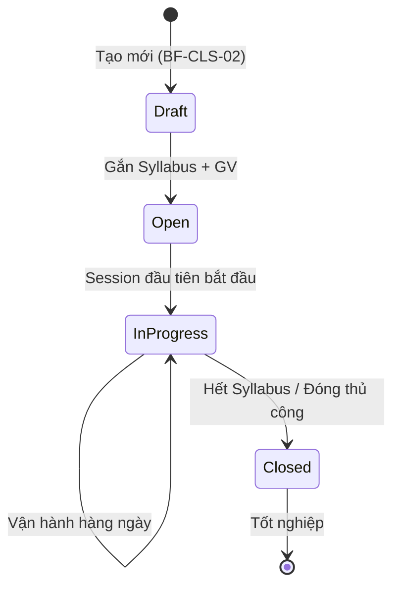

# FLOW-OPS-00: Vòng đời Lớp học (Class Lifecycle)

> **Capability:** CAP-OPS
> **Loại:** Master Flow — Luồng xuyên suốt nhiều BF
> **Cập nhật:** 2026-05-16

---

## 1. Mục đích

Mô tả luồng End-to-End từ khi một Lớp học (Class) được khởi tạo cho đến khi đóng lớp (Closed/Graduated). Flow này xâu chuỗi toàn bộ các Business Functions thuộc năng lực **CAP-OPS**, đồng thời chỉ ra các điểm giao tiếp với các Capability khác (CAP-ACD, CAP-HR, CAP-FIN, CAP-CARE).

## 2. Các giai đoạn chính

| Giai đoạn | Mô tả | BF phụ trách |
|-----------|-------|-------------|
| **1. Chuẩn bị** | GV đăng ký quỹ thời gian, Syllabus được chuẩn bị | `BF-HR-02`, `BF-ACD-02` (CAP-ACD) |
| **2. Mở lớp** | Tạo vỏ lớp (Class), gắn Syllabus, phân công GV chủ nhiệm | `BF-CLS-02`, `BF-CLS-04` |
| **3. Xếp lịch** | Tạo Golden Schedule, check conflict, sinh Sessions | `BF-OPS-02` |
| **4. Tuyển sinh vào lớp** | Xếp học viên từ Waitlist vào Roster của Class | `BF-CLS-01` |
| **5. Vận hành hàng ngày** | Quản lý biến động Session (dạy thay, đổi phòng, hủy, học bù) | `BF-OPS-03` |
| **6. Điểm danh & Đánh giá** | GV điểm danh từng Session, nhập điểm, nhận xét | `BF-CLS-05` |
| **7. Quản lý gián đoạn** | Báo nghỉ phép, bảo lưu, chuyển lớp | `BF-CLS-06` |
| **8. Theo dõi & Chăm sóc** | CSM theo dõi hồ sơ học viên, chăm sóc khi vắng nhiều | `BF-CLS-03`, `BF-CARE-01` (CAP-CARE) |
| **9. Đóng lớp** | Kết thúc khóa, chốt điểm tổng kết, tốt nghiệp | `BF-CLS-02` |

## 3. Sơ đồ luồng tổng thể (Master Flow)

```mermaid
graph TD
    subgraph "Giai đoạn 1: Chuẩn bị"
        A1["GV đăng ký quỹ thời gian<br>(BF-HR-02)"]
        A2["Syllabus được ban hành<br>(CAP-ACD / BF-ACD-02)"]
    end

    subgraph "Giai đoạn 2: Mở lớp"
        B1["Tạo vỏ Lớp học (Class)<br>(BF-CLS-02)"]
        B2["Gắn Syllabus vào Class<br>(BF-CLS-02)"]
        B3["Phân công GV chủ nhiệm<br>(BF-CLS-04)"]
    end

    subgraph "Giai đoạn 3: Xếp lịch"
        C1["Tạo Golden Schedule<br>(BF-OPS-02)"]
        C2["Check Conflict<br>(GV, Phòng, HV)"]
        C3["Auto-generate Sessions<br>+ Gắn Topic từ Syllabus"]
    end

    subgraph "Giai đoạn 4: Tuyển sinh vào lớp"
        D1["HV hoàn thành đóng phí<br>(CAP-FIN)"]
        D2["Xếp HV vào Class<br>(BF-CLS-01)"]
        D3["HV xuất hiện trong Roster"]
    end

    subgraph "Giai đoạn 5-6: Vận hành & Điểm danh"
        E1["Session: Scheduled"]
        E2{"Có sự cố?"}
        E3["Dạy thay / Đổi phòng<br>(BF-OPS-03)"]
        E4["Hủy & Dồn lịch<br>(BF-OPS-03)"]
        E5["Session: In Progress"]
        E6["GV Điểm danh & Nhận xét<br>(BF-CLS-05)"]
        E7["Session: Completed"]
    end

    subgraph "Giai đoạn 7: Quản lý gián đoạn"
        F1["Báo nghỉ phép<br>(BF-CLS-06)"]
        F2["Bảo lưu dài hạn<br>(BF-CLS-06)"]
        F3["Chuyển lớp<br>(BF-CLS-06)"]
    end

    subgraph "Giai đoạn 8-9: Theo dõi & Đóng lớp"
        G1["CSM theo dõi hồ sơ HV<br>(BF-CLS-03)"]
        G2["Chăm sóc HV vắng nhiều<br>(CAP-CARE)"]
        G3["Hết Syllabus → Đóng lớp<br>(BF-CLS-02)"]
        G4["Tốt nghiệp / Chuyển khóa"]
    end

    A1 --> C1
    A2 --> B2
    B1 --> B2
    B2 --> B3
    B3 --> C1
    C1 --> C2
    C2 -->|Hợp lệ| C3
    C2 -->|Trùng| C1

    D1 --> D2
    D2 --> D3
    D3 --> E1

    C3 --> E1
    E1 --> E2
    E2 -->|Yes| E3
    E2 -->|Hủy buổi| E4
    E2 -->|No| E5
    E3 --> E5
    E5 --> E6
    E6 --> E7

    E7 -->|Lặp lại cho Session tiếp| E1
    E6 -->|HV vắng không phép| G2
    E7 --> G1

    F1 -.->|Nghỉ từng buổi| E1
    F2 -.->|Tạm dừng dài hạn| G1
    F3 -.->|Chuyển sang lớp khác| D2

    G1 --> G2
    G3 --> G4
    E7 -->|Buổi cuối cùng| G3
</mermaid>
```

## 4. Các điểm giao tiếp liên miền (Cross-Capability Touchpoints)

| Điểm giao | Từ | Đến | Dữ liệu trao đổi |
|-----------|------|------|-------------------|
| Availability Input | `CAP-HR` (BF-HR-02) | `CAP-OPS` (BF-OPS-02) | Quỹ thời gian GV |
| Syllabus Input | `CAP-ACD` (BF-ACD-02) | `CAP-OPS` (BF-CLS-02) | Khung chương trình + số buổi + Topics |
| Payment Trigger | `CAP-FIN` (BF-SAL-02) | `CAP-OPS` (BF-CLS-01) | HV đã thanh toán → Waitlist |
| Attendance Output | `CAP-OPS` (BF-CLS-05) | `CAP-CARE` (BF-CARE-01) | Dữ liệu vắng không phép → Ticket CSM |
| Session Count Output | `CAP-OPS` (BF-CLS-05) | `CAP-FIN` | Số buổi đã học → Tính lương GV, khấu trừ học phí |
| Suspend/Transfer | `CAP-OPS` (BF-CLS-06) | `CAP-FIN` | Đóng băng / Tính lại tài chính |

## 5. Trạng thái vòng đời của Class



## 6. Trạng thái vòng đời của Session

> ⚠️ **Đã chuyển sang:** [FLOW-OPS-01: Vòng đời Buổi học](FLOW-OPS-01-vong-doi-buoi-hoc.md) — Section 4.
> FLOW-OPS-01 chứa State Diagram chi tiết hơn với các trạng thái: Scheduled → InProgress → Completed → Audited, và các nhánh Cancelled / Rescheduled / MakeupCreated.

## 7. Gaps chưa giải quyết

1. ~~**Nghỉ lễ:**~~ ✅ Đã giải quyết — Thuật toán `US-OPS02-04` đọc danh sách Holidays từ `BF-SYS-02` để tự động bỏ qua.
2. ~~**Hủy buổi — Dồn bài hay Học bù?**~~ ✅ Đã giải quyết — `US-OPS03-03` (Dịch lịch) + `US-OPS03-04` (Học bù độc lập).
3. **Đổi Syllabus giữa chừng:** Cho phép hay bắt buộc tạo Class mới? (Liên quan `BF-CLS-02`)
4. **Chuyển chi nhánh:** Logic tài chính chuyển tiền giữa 2 pháp nhân chưa được xử lý. (Liên quan `BF-CLS-06`)
