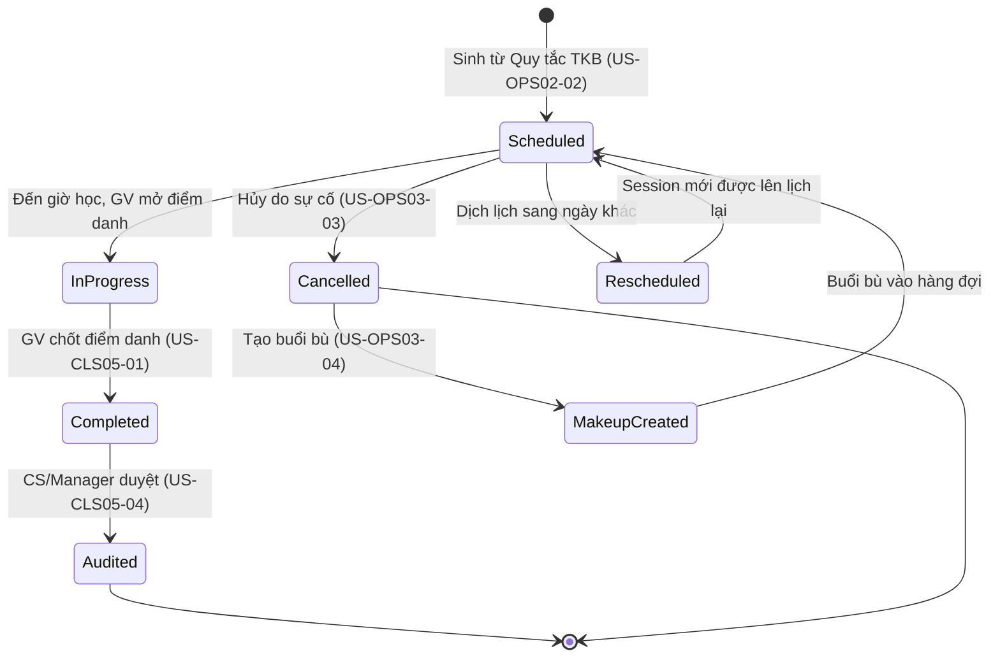

# FLOW-OPS-01: Vòng đời Buổi học (Session Lifecycle)

> **Capability:** CAP-OPS
> **Loại:** Master Flow — Luồng xuyên suốt nhiều BF
> **Cập nhật:** 2026-05-16

---

## 1. Mục đích

Mô tả luồng End-to-End từ khi một Buổi học (Session) được sinh ra cho đến khi nó kết thúc hoặc bị hủy. Flow này tập trung vào **đơn vị thực thi nhỏ nhất** của hệ thống Vận hành: mỗi "ô thời gian" cụ thể mà Giáo viên đứng lớp, Học viên ngồi học, và hệ thống ghi nhận dữ liệu.

**Phân biệt với FLOW-OPS-00:**
- FLOW-OPS-00 mô tả vòng đời của **Lớp học (Container)** — từ khi tạo vỏ đến khi đóng lớp.
- FLOW-OPS-01 mô tả vòng đời của **Buổi học (Execution Unit)** — từ khi được sinh ra đến khi hoàn thành.

## 2. Các giai đoạn chính

| Giai đoạn | Mô tả | BF / US phụ trách |
|-----------|-------|-------------------|
| **1. Sinh buổi học** | Hệ thống tự động tạo Session vật lý dựa trên quy tắc TKB | `BF-OPS-02` / `US-OPS02-02` |
| **2. Quét xung đột** | Check trùng Phòng, GV, Ngày nghỉ lễ trước khi xác nhận | `BF-OPS-02` / `US-OPS02-04` (đọc `BF-SYS-02`) |
| **3. Sẵn sàng (Scheduled)** | Session nằm trên Lịch, chờ đến giờ | `BF-OPS-02` / `US-OPS02-01` (Local), `US-OPS02-03` (Global) |
| **4. Xử lý sự cố (nếu có)** | Dạy thay, Đổi phòng, Hủy buổi, Dịch lịch | `BF-OPS-03` / `US-OPS03-01..04` |
| **5. Đang diễn ra (In Progress)** | GV bắt đầu buổi học, mở màn hình điểm danh | `BF-CLS-05` / `US-CLS05-01` |
| **6. Hoàn thành (Completed)** | GV chốt điểm danh, nhập nhận xét, đánh giá | `BF-CLS-05` / `US-CLS05-01` |
| **7. Hậu kiểm (Audit)** | CS/Manager kiểm duyệt dữ liệu điểm danh | `BF-CLS-05` / `US-CLS05-04` |

## 3. Sơ đồ luồng tổng thể

```mermaid
graph TD
    subgraph "Giai đoạn 1-2: Sinh & Kiểm tra"
        A1["GV cấu hình quy tắc TKB<br>(US-OPS02-02)"]
        A2["Thuật toán Quét xung đột<br>(US-OPS02-04)"]
        A3["Session được sinh ra<br>Trạng thái: Scheduled"]
    end

    subgraph "Giai đoạn 3: Chờ đến giờ"
        B1["Hiển thị trên Lịch tại Lớp<br>(US-OPS02-01)"]
        B2["Hiển thị trên Lịch Cơ sở<br>(US-OPS02-03)"]
    end

    subgraph "Giai đoạn 4: Xử lý sự cố"
        C1{"Có sự cố?"}
        C2["Dạy thay<br>(US-OPS03-01)"]
        C3["Đổi phòng<br>(US-OPS03-02)"]
        C4["Hủy buổi & Dịch lịch<br>(US-OPS03-03)"]
        C5["Tạo buổi bù<br>(US-OPS03-04)"]
    end

    subgraph "Giai đoạn 5-6: Thực thi & Hoàn thành"
        D1["Session: In Progress<br>GV mở điểm danh"]
        D2["Điểm danh + Nhận xét<br>(US-CLS05-01)"]
        D3["Session: Completed"]
    end

    subgraph "Giai đoạn 7: Hậu kiểm"
        E1["CS/Manager kiểm duyệt<br>(US-CLS05-04)"]
        E2["Dữ liệu chốt → Báo cáo"]
    end

    A1 --> A2
    A2 -->|Hợp lệ| A3
    A2 -->|Xung đột| A1

    A3 --> B1
    A3 --> B2
    B1 --> C1
    B2 --> C1

    C1 -->|GV nghỉ| C2
    C1 -->|Phòng hỏng| C3
    C1 -->|Bão/Lễ| C4
    C4 -.->|Cần học bù| C5

    C1 -->|Không có sự cố| D1
    C2 --> D1
    C3 --> D1

    D1 --> D2
    D2 --> D3

    D3 --> E1
    E1 --> E2

    D3 -->|Lặp cho Session tiếp theo| A3
    C5 -->|Session bù mới| A2
</mermaid>
```

## 4. Trạng thái vòng đời của Session (State Diagram)



## 5. Các điểm giao tiếp liên miền (Cross-Capability Touchpoints)

| Điểm giao | Từ | Đến | Dữ liệu trao đổi |
|-----------|------|------|-------------------|
| Holiday Check | `CAP-SYS` (BF-SYS-02) | `CAP-OPS` (US-OPS02-04) | Danh sách Ngày nghỉ lễ |
| Teacher Availability | `CAP-HR` (BF-HR-02) | `CAP-OPS` (US-OPS03-01) | GV nào đang rảnh để dạy thay |
| Attendance → Care | `CAP-OPS` (US-CLS05-01) | `CAP-CARE` (BF-CARE-01) | HV vắng không phép → Tạo ticket chăm sóc |
| Attendance → Finance | `CAP-OPS` (US-CLS05-01) | `CAP-FIN` | Số buổi đã dạy → Tính lương GV |
| Feedback → Parent | `CAP-OPS` (US-CLS05-01) | External (App/Zalo) | Nhận xét buổi học → Gửi cho Phụ huynh |
