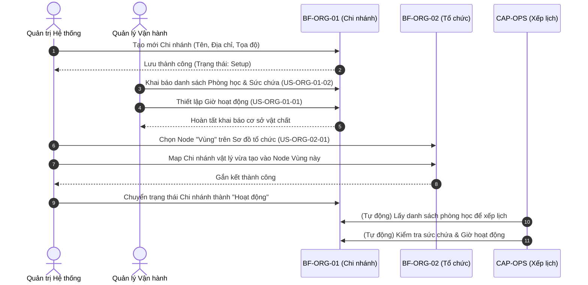

# FLOW-ORG-01: Luồng Thiết lập Cơ sở & Tổ chức

## 1. Bối cảnh Nghiệp vụ (Context)
Luồng quy trình này mô tả cách hệ thống khởi tạo một Chi nhánh vật lý mới, thiết lập cơ sở vật chất (Phòng học, Giờ hoạt động), và cách gắn chi nhánh vật lý đó vào hệ thống Sơ đồ Tổ chức (Org Tree) để đi vào vận hành chính thức. Quy trình này kết nối 2 phân hệ `BF-ORG-01` (Quản lý Chi nhánh) và `BF-ORG-02` (Sơ đồ tổ chức).

## 2. Đối tượng và Hệ thống tham gia
*   **Quản trị Hệ thống (System Admin)**: Người có quyền tạo mới Node trên Sơ đồ tổ chức.
*   **Quản lý Vận hành (Ops Manager)**: Người khai báo danh sách phòng học và thiết lập giờ mở cửa.
*   **Hệ thống CAP-HR (ORG Module)**: Quản lý cả Chi nhánh và Sơ đồ tổ chức.

## 3. Sơ đồ Trình tự

## 4. Diễn giải các bước
1.  **Bước 1-2**: Chi nhánh mới sinh ra ở trạng thái "Setup" (Chưa hoạt động). Lúc này khối Vận hành chưa thể nhìn thấy chi nhánh này để xếp lớp.
2.  **Bước 3-5**: Khai báo các rào cản vật lý. Phòng học giới hạn Sức chứa. Giờ hoạt động giới hạn Thời gian.
3.  **Bước 6-8**: Bước quan trọng nhất để hệ thống hiểu Chi nhánh này thuộc quyền quản lý của ai. Việc Map (Gắn kết) vào một Node trên sơ đồ tổ chức giúp hệ thống tự động phân quyền dữ liệu. (Ví dụ: Gắn vào Vùng miền Nam thì Giám đốc Vùng miền Nam sẽ thấy dữ liệu).
4.  **Bước 9**: Khi mọi thứ đã sẵn sàng, Admin "Mở cửa" chi nhánh trên phần mềm.
5.  **Bước 10-11**: Từ lúc này, các phân hệ khác (Xếp lớp, Điểm danh) bắt đầu tương tác với Chi nhánh để sử dụng phòng học.

## 5. Xử lý Rẽ nhánh / Ngoại lệ
*   **Tình huống Chuyển vùng quản lý**: Chi nhánh chuyển từ Vùng A sang Vùng B. Admin vào `BF-ORG-02`, Gỡ Chi nhánh khỏi Node Vùng A, và Gắn vào Node Vùng B. Các dữ liệu vật lý (Phòng học, Giờ hoạt động) ở `BF-ORG-01` vẫn giữ nguyên không thay đổi.

---

## 6. Chỉ dẫn cho AI Agent & Lập trình viên (Business Architecture)

- Các bước chuyển tiếp trong sơ đồ trên thường đi kèm việc cập nhật trạng thái nghiệp vụ. Cần thiết kế logic chuyển đổi trạng thái ở tầng Service/Domain.
- Tại các bước hệ thống tự động kiểm tra, phải đảm bảo tuân thủ nghiêm ngặt các quy tắc Business Rules tương ứng từ tài liệu BF/US.

### ⛔ Hàng rào An toàn (Guardrails)
- **KHÔNG** bỏ qua các bước Xác nhận / Phê duyệt (Approval/Confirmation) đã được quy định trong sơ đồ trình tự.
- **KHÔNG** thay đổi thứ tự hoặc tự ý bỏ bước trong luồng mà chưa được phê duyệt từ Product Owner.
- **KHÔNG** cho phép đổi trạng thái Chi nhánh thành "Hoạt động" nếu chưa khai báo ít nhất 1 Phòng học và 1 Khung giờ hoạt động.
