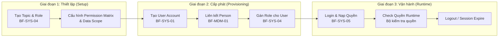

# FLOW-SYS-00: Vòng đời IAM tổng thể (IAM Lifecycle)

> Tài liệu mô tả luồng xuyên suốt (End-to-End Flow) của toàn bộ hệ thống Quản trị Danh tính & Truy cập (IAM), từ khi thiết lập quyền → tạo tài khoản → đăng nhập → kiểm tra quyền runtime → đăng xuất.

## 1. Tổng quan

Luồng IAM gồm **3 giai đoạn** tương ứng với 3 trụ cột SoD (Segregation of Duties):

## 2. Chi tiết từng Giai đoạn

### Giai đoạn 1: Thiết lập Quyền (Entitlement Setup)
**Actor:** System Admin  
**BF:** `BF-SYS-04` (Entitlement & Authorization)

| Bước | Hành động | US tham chiếu |
|------|-----------|--------------|
| 1.1 | Admin tạo Topic (nhóm phân loại): System Admin, Sale, Academic, CSM | `US-SYS-04-01` |
| 1.2 | Admin tạo Role (nhóm quyền) gắn vào Topic | `US-SYS-04-01` |
| 1.3 | Admin cấu hình Permission Matrix: bật/tắt action (read/create/update/delete) cho từng module | `US-SYS-04-01` |
| 1.4 | Admin chọn Data Scope cho Role: personal / team / descendants / global | `US-SYS-04-03` |

**Output:** Catalog quyền sẵn sàng (Topic → Role → Permission Matrix → Data Scope).

---

### Giai đoạn 2: Cấp phát Tài khoản (Identity Provisioning — Joiner)
**Actor:** System Admin  
**BFs:** `BF-SYS-01` (ILM) + `BF-MDM-01` (Person) + `BF-SYS-04` (AuthZ)

| Bước | Hành động | US tham chiếu |
|------|-----------|--------------|
| 2.1 | Kiểm tra Person đã tồn tại trong MDM chưa (tìm theo tên, SĐT, CCCD) | `US-MDM-01-01` |
| 2.2 | Nếu chưa có → Tạo Person mới trong MDM | `US-MDM-01-02` |
| 2.3 | Tạo User Account, liên kết `person_id` | `US-SYS-01-02` |
| 2.4 | Gán Role(s) cho User Account | `US-SYS-04-02` |
| 2.5 | Cấp mật khẩu tạm, bắt buộc đổi MK lần đầu | `US-SYS-01-02` |

**Output:** User Account Active, có Role, sẵn sàng đăng nhập.

---

### Giai đoạn 3: Vận hành (Runtime — Login → Operate → Logout)
**Actor:** Mọi User  
**BF:** `BF-SYS-05` (Authentication)

| Bước | Hành động | US tham chiếu |
|------|-----------|--------------|
| 3.1 | User mở `/login`, nhập email/username + mật khẩu | `US-SYS-05-01` |
| 3.2 | Hệ thống xác thực (AuthN) | `US-SYS-05-01` |
| 3.3 | Nạp Role Assignment → Tính Effective Permission (Union tất cả Role active) | `US-SYS-05-01` |
| 3.4 | Tạo Session, redirect vào menu đầu tiên được phép | `US-SYS-05-01` |
| 3.5 | Mọi thao tác trong app → Bộ kiểm tra quyền xác nhận quyền trước khi thực thi | Runtime |
| 3.6 | User đổi mật khẩu (tùy chọn) | `US-SYS-05-02` |
| 3.7 | User đăng xuất hoặc session timeout | `US-SYS-05-03` |

---

### Luồng phụ: Mover (Thay đổi Role)
| Bước | Hành động | US tham chiếu |
|------|-----------|--------------|
| M.1 | Admin thay đổi Role của User (gán thêm / gỡ bỏ) | `US-SYS-04-02` |
| M.2 | Quyền mới có hiệu lực sau lần login tiếp theo | `US-SYS-05-01` |

### Luồng phụ: Leaver (Thu hồi Tài khoản)
| Bước | Hành động | US tham chiếu |
|------|-----------|--------------|
| L.1 | Admin khóa hoặc vô hiệu hóa tài khoản | `US-SYS-01-03` |
| L.2 | Session hiện tại bị hủy (force logout) | `US-SYS-01-03` |
| L.3 | User không thể đăng nhập nữa | `US-SYS-05-01` |

## 3. Ma trận BF × Giai đoạn

| BF | Setup | Provisioning | Runtime |
|----|-------|-------------|---------|
| BF-SYS-01 (ILM) | | ✅ Tạo/Khóa User | |
| BF-SYS-04 (AuthZ) | ✅ Role/Permission | ✅ Gán Role | |
| BF-SYS-05 (AuthN) | | | ✅ Login/Logout |
| BF-MDM-01 (Person) | | ✅ Liên kết Person | |

## 4. Policy Compliance
- `[POLICY-IAM-01]` Mỗi giai đoạn do BF độc lập xử lý (SoD).
- `[POLICY-IAM-02]` Default Deny — User không có Role → không thấy menu nào.
- `[POLICY-IAM-03]` Quyền cấp qua Role, không cấp trực tiếp cho User.
- `[POLICY-MDM-03]` Phân quyền cho User Account, không phải Person.
