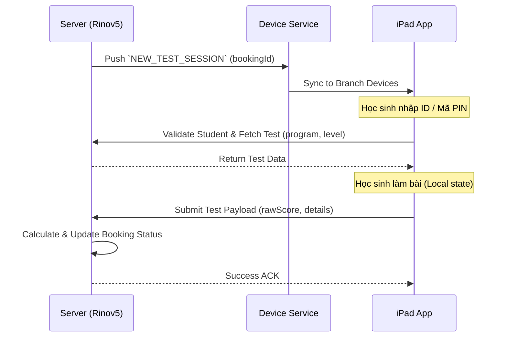

# US-BT05: Thực thi và Đồng bộ kết quả Booking Test từ iPad

> **Tham chiếu:** BF-ENR-01 · Giao diện Mẫu §4.4 (Biểu mẫu)

## 1. Yêu cầu Người dùng (User Story)
**Là một** Nhân viên Vận hành / Giáo viên, **tôi muốn** hệ thống tự động đẩy thông tin bài test sang ứng dụng iPad sau khi booking được tạo và tự động nhận lại kết quả, **để** học sinh có thể thực hiện bài test (Math/English) trực tiếp trên thiết bị mà không cần nhập liệu thủ công trên hệ thống.

> **Kiểm tra chất lượng (INVEST):**
> - [x] **I**ndependent — Triển khai độc lập (tập trung vào đồng bộ API).
> - [x] **N**egotiable — Chi tiết giao diện có thể thương lượng trên app iPad.
> - [x] **V**aluable — Mang lại giá trị rõ ràng (giảm thiểu sai sót nhập liệu).
> - [x] **E**stimable — Đủ rõ để ước lượng công sức.
> - [x] **S**mall — Hoàn thành trong 1 vòng phát triển.
> - [x] **T**estable — Có tiêu chí nghiệm thu ở mục 7.

---

## 2. Quy tắc Nghiệp vụ (Business Rules)

1. **[RULE-FORM-01] Ràng buộc thời gian:** `NẾU` bài test có giới hạn thời gian `THÌ` ứng dụng iPad phải tự động nộp bài khi hết giờ và gửi kết quả hiện tại về hệ thống.
2. **[RULE-FORM-02] Xử lý ghi đè:** `NẾU` kết quả đã tồn tại (do làm lại hoặc nhập tay) `THÌ` hệ thống sẽ lưu phiên bản mới nhất và giữ lại lịch sử (audit log).
3. **[RULE-FORM-03] Trạng thái bảng quản lý:** Ngay khi nhận được tín hiệu "Đã nộp bài" từ iPad, thông tin điểm số (LWR đối với English, hoặc Score đối với Math) trên hệ thống phải được hiển thị mới nhất và trạng thái booking tự động chuyển sang "Tested".

---

## 3. Cấu trúc Dữ liệu Đồng bộ (Payload)

**Bố cục:** API Payload (1 Cột).

### 3.1. Luồng kỹ thuật đồng bộ (Sync Flow)

Sơ đồ dưới đây mô tả cách hệ thống bắt tay (handshake) với thiết bị iPad để xử lý bài test:

### 3.2. Cấu trúc Payload trả về từ iPad

| Tên trường | Loại hiển thị | Bắt buộc | Trường dữ liệu | Ghi chú & Quy tắc |
|------------|---------------|----------|----------------|-------------------|
| ID Booking | UUID | Có | `bookingId` | Định danh booking để cập nhật đúng bản ghi. |
| Môn học | Chuỗi | Có | `subject` | Nhận giá trị `math` hoặc `english`. |
| Điểm đạt được | Số | Có | `rawScore` | Tổng điểm đạt được của học sinh. |
| Điểm tối đa | Số | Có | `maxScore` | Tổng điểm tối đa của bài test. |
| Chi tiết điểm | Đối tượng | Không | `details` | Chi tiết điểm theo từng phần (vd: L: 8, W: 7, R: 9). |
| Thời gian nộp bài | Timestamp | Có | `completedAt` | Thời điểm học sinh hoàn thành nộp bài. |
| Trạng thái | Chuỗi | Có | `status` | Thường trả về `completed` sau khi nộp thành công. |

### 3.3. Ví dụ Dữ liệu mẫu

*Giúp AI và Lập trình viên tạo dữ liệu kiểm thử chính xác.*

| Tình huống | Dữ liệu đầu vào (Payload từ iPad) | Kết quả mong đợi trên Server |
|------------|-----------------------------------|------------------------------|
| Nộp bài thành công (English) | `subject`: "english", `details`: {L: 8, W: 7, R: 9}, `status`: "completed" | Lưu thành công điểm LWR, trạng thái đổi thành "Tested". |
| Nộp bài thành công (Math) | `subject`: "math", `rawScore`: 85, `status`: "completed" | Lưu thành công điểm tổng, trạng thái đổi thành "Tested". |
| Thiết bị mất kết nối mạng | Payload không được gửi kịp thời | Ứng dụng iPad lưu cục bộ, khi có mạng tự động gửi lại. |

---

## 4. Xử lý Ngoại lệ

| # | Tình huống | Cách xử lý |
|---|-----------|-----------|
| 4.1 | Mất kết nối mạng khi đang làm bài | iPad lưu kết quả tạm thời (Local Storage). Khi có mạng lại, tự động thử gửi kết quả về hệ thống Rinov5. |
| 4.2 | Học sinh thoát ứng dụng giữa chừng | Nếu mở lại trong thời gian cho phép, học sinh làm tiếp. Nếu quá thời gian, tính kết quả đến thời điểm thoát và nộp bài. |
| 4.3 | Booking bị hủy trên dashboard khi đang test | iPad nhận tín hiệu `CANCEL_SESSION` và tự động hiển thị thông báo dừng bài test. |
| 4.4 | Sai lệch phiên bản bài test | Nếu iPad đang dùng version cũ, hệ thống từ chối nhận kết quả và yêu cầu cập nhật phiên bản. |

---

## 5. Chỉ dẫn cho AI Agent & Lập trình viên (Business Architecture)

- Tách biệt hoàn toàn API tiếp nhận kết quả (Integration) khỏi logic giao diện của hệ thống quản lý.
- Áp dụng các quy tắc kiểm tra (Validation) cho Payload trả về để đảm bảo tính toàn vẹn của kết quả test.
- Đồng bộ thời gian thực với dashboard thông qua tín hiệu websocket hoặc polling khi trạng thái booking thay đổi sang `Tested`.

### ⛔ Hàng rào An toàn (Guardrails)
- **KHÔNG** thêm trường nhập liệu ngoài danh sách ở mục 3.2 khi đồng bộ API.
- **KHÔNG** thay đổi quy tắc kiểm tra hợp lệ nghiệp vụ ở mục 2 mà chưa được phê duyệt.
- **KHÔNG** cho phép cập nhật kết quả nếu booking đã bị hủy (Canceled) trên hệ thống chính.

---

## 6. Kế hoạch Tự kiểm tra (Self-Verification)

| # | Hạng mục | Cách kiểm tra | Tiêu chuẩn Đạt |
|---|----------|---------------|-----------------|
| V-01 | Kiểm tra nhận payload | Gửi thử request mẫu (Mục 3.3) đến API tiếp nhận | Hệ thống ghi nhận đúng điểm số và đổi trạng thái. |
| V-02 | Ngoại lệ mất mạng | Giả lập mất mạng khi nộp bài và kết nối lại sau | Dữ liệu được gửi bù thành công và ghi đúng kết quả. |
| V-03 | Log lịch sử | Kiểm tra Audit Log sau khi nhận kết quả | Có ghi nhận thời gian và Device ID gửi kết quả. |

---

## 7. Tiêu chí Nghiệm thu (SMART Acceptance Criteria)

| # | Tiêu chí (Specific) | Cách đo (Measurable) | Kết quả mong đợi |
|---|--------------------|-----------------------|-------------------|
| AC-01 | Kích hoạt Session | Tạo booking thành công | Hệ thống gửi tín hiệu đến thiết bị chi nhánh tương ứng. |
| AC-02 | Nhận điểm Math | Gửi payload điểm Math thành công | Điểm tổng được cập nhật về bảng quản lý, trạng thái "Tested". |
| AC-03 | Nhận điểm English | Gửi payload điểm English (LWR) thành công | Điểm LWR phân bổ đúng vào các cột thành phần, trạng thái "Tested". |
| AC-04 | Hủy Booking khi đang test | Hủy booking từ dashboard | iPad lập tức nhận tín hiệu và dừng bài test. |
