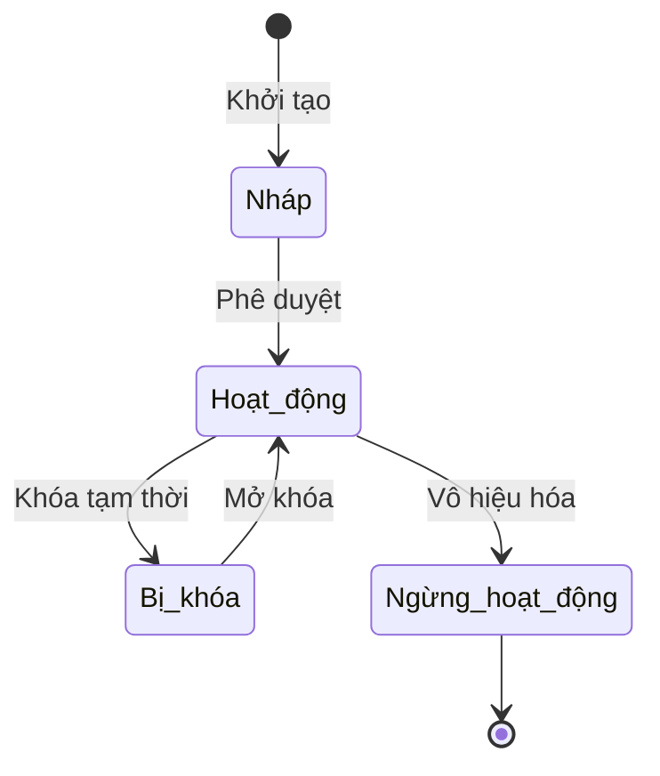

# BF-ACD-01: Quản lý Chương trình đào tạo

> **Capability:** CAP-ACD (Năng lực Học thuật & Đào tạo)
> **Giai đoạn:** 3 - Hồ sơ & Sản phẩm
> **Nhóm chức năng:** Chương trình đào tạo
> **Mã màn hình:** `program_management`

---

## 1. Mô tả tổng quan

Phân hệ quản lý việc khởi tạo và cập nhật các Chương trình đào tạo cốt lõi của trung tâm (ví dụ: Tiếng Anh Mầm Non, IELTS Đảm bảo, Toán Tư duy). Đây là đối tượng dữ liệu ở tầng cao nhất của học thuật, giúp định hình toàn bộ cấu trúc các sản phẩm giáo dục mà trung tâm cung cấp.

## 2. Đối tượng sử dụng (Vai trò)

- **Giám đốc Học thuật:** Người quyết định, tạo mới và phê duyệt các chương trình đào tạo.
- **Quản trị hệ thống:** Cấu hình và bảo trì thông tin nền tảng.

## 3. Ranh giới Nghiệp vụ (Scope)

### Có bao gồm (In Scope)
- Tạo mới, cập nhật tên và cấu trúc cơ bản của Chương trình đào tạo.
- Gắn môn học/lĩnh vực vào Chương trình đào tạo.
- Quản lý trạng thái hoạt động của Chương trình.

### Không bao gồm (Out of Scope)
- Thiết kế lộ trình học chi tiết → Đã được xử lý tại `BF-ACD-02`.
- Thiết kế chi tiết Khung chương trình (Syllabus) → Đã được xử lý tại `BF-ACD-03`.
- Bán chương trình học cho khách hàng → Thuộc về `CAP-COM`.

## 4. Mô hình Dữ liệu Nghiệp vụ (Data Entities)

| Tên Thực thể | Trường định danh | Thuộc tính quan trọng | Ràng buộc quan hệ | Diễn giải |
|--------------|------------------|-----------------------|-------------------|----------|
| Chương trình đào tạo | Mã chương trình | Tên chương trình, Trạng thái, Lĩnh vực | Độc lập | Sản phẩm giáo dục cốt lõi. |
| Lĩnh vực / Môn học | Mã lĩnh vực | Tên lĩnh vực (Toán, Tiếng Anh) | Trỏ về Mã chương trình | Danh mục phân loại. |

### 4.1. Vòng đời Trạng thái (Status Lifecycle)

*Sơ đồ dưới đây xác định tất cả trạng thái hợp lệ và các phép chuyển đổi được phép.*

**Quy tắc chuyển đổi:**

| Từ trạng thái | Sang trạng thái | Điều kiện bắt buộc | Vai trò được phép |
|---------------|-----------------|---------------------|-------------------|
| Nháp | Hoạt động | Đã điền đủ thông tin chương trình bắt buộc | Giám đốc Học thuật |
| Hoạt động | Bị khóa | Không có Lớp học nào đang mở thuộc chương trình này | Giám đốc Học thuật |
| Bị khóa | Hoạt động | Không cần điều kiện | Giám đốc Học thuật |
| Hoạt động | Ngừng hoạt động | Hộp thoại xác nhận nguy hiểm, không có học viên đang theo học | Giám đốc Học thuật |

### 4.2. Ví dụ Dữ liệu mẫu

*Giúp AI và Lập trình viên tạo dữ liệu kiểm thử chính xác.*

| Tình huống | Dữ liệu đầu vào | Kết quả mong đợi |
|------------|-----------------|-------------------|
| Tạo thành công | Tên: "IELTS Đảm bảo", Lĩnh vực: "Tiếng Anh", Trạng thái: "Nháp" | Lưu thành công, hệ thống sinh mã (vd: `PRG-IELTS-01`). |
| Chuyển trạng thái lỗi | Chương trình đang có lớp học mở, nhấn "Khóa" | Cảnh báo: "Không thể khóa do có Lớp học đang sử dụng chương trình này." |
| Tên trống | Tên: (bỏ trống) | Cảnh báo đỏ tại ô Tên, chặn lưu. |

## 5. Quy tắc Nghiệp vụ Tổng thể (Business Rules)

1. **[RULE-ACD-01-01] Ràng buộc Trạng thái:** `NẾU` chương trình ở trạng thái 'Bị khóa' hoặc 'Ngừng hoạt động', `THÌ` không được phép mở mới Lớp học thuộc chương trình này.
2. **[RULE-ACD-01-02] Quy tắc Sinh Mã:** Mã định danh sinh tự động theo định dạng `PRG-{Mã Lĩnh Vực}-{3 số thứ tự}`. Ví dụ: `PRG-ENG-001`.

## 6. Danh sách Yêu cầu Người dùng (User Stories)

| Mã Yêu cầu | Tên Yêu cầu (Loại màn hình) | Đường dẫn truy cập | Trạng thái |
|------------|-----------------------------|--------------------|------------|
| US-ACD-01-01 | Quản lý danh sách Chương trình (Danh sách) | /app/program_management | Đang soạn thảo |
| US-ACD-01-02 | Tạo/Cập nhật Chương trình (Biểu mẫu) | Không có | Đang soạn thảo |
| US-ACD-01-03 | Chi tiết Chương trình (Chi tiết) | /app/program_management/[id] | Đang soạn thảo |
