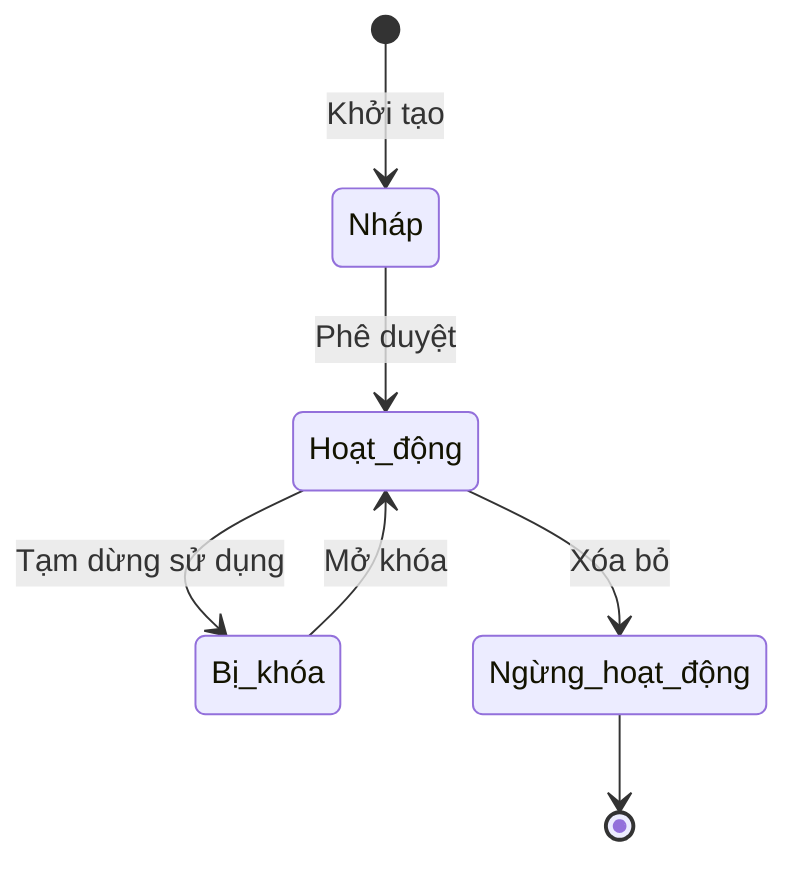

# BF-ACD-02: Lộ trình học

> **Capability:** CAP-ACD (Năng lực Học thuật & Đào tạo)
> **Giai đoạn:** 3 - Hồ sơ & Sản phẩm
> **Nhóm chức năng:** Chương trình đào tạo
> **Mã màn hình:** `learning_path`

---

## 1. Mô tả tổng quan

Phân hệ thiết lập lộ trình học thuật, bao gồm việc định nghĩa các cấp độ (level), cấp độ phụ (sub-level) cho từng Chương trình đào tạo, và xác định các tiêu chí/điều kiện bắt buộc để học viên được chuyển từ cấp độ này sang cấp độ khác (ví dụ: điểm test đầu ra tối thiểu).

## 2. Đối tượng sử dụng (Vai trò)

- **Giám đốc Học thuật:** Người xây dựng và phê duyệt lộ trình.
- **Giáo viên Trưởng / Chuyên viên Học thuật:** Đề xuất và cấu hình chi tiết tiêu chí chuyển cấp.

## 3. Ranh giới Nghiệp vụ (Scope)

### Có bao gồm (In Scope)
- Tạo danh sách các cấp độ học (Level) thuộc một Chương trình đào tạo.
- Định nghĩa điều kiện tiên quyết (Prerequisite) để học một cấp độ.
- Thiết lập tiêu chí vượt cấp (Ví dụ: Attendance > 80% & Final Test > 6.0).

### Không bao gồm (Out of Scope)
- Tạo mới Chương trình đào tạo → Đã xử lý tại `BF-ACD-01`.
- Chấm điểm thực tế cho học viên → Xử lý tại `BF-CLS-05`.
- Quyết định cho học viên lên lớp → Xử lý tại `BF-CLS-06`.

## 4. Mô hình Dữ liệu Nghiệp vụ (Data Entities)

| Tên Thực thể | Trường định danh | Thuộc tính quan trọng | Ràng buộc quan hệ | Diễn giải |
|--------------|------------------|-----------------------|-------------------|----------|
| Cấp độ học (Level) | Mã cấp độ | Tên, Thứ tự (Order), Trạng thái | Trỏ về Mã Chương trình | Ví dụ: Mầm non 1, IELTS 5.0 |
| Điều kiện chuyển cấp | Mã điều kiện | Loại điều kiện (Điểm, Điểm danh), Mức tối thiểu | Trỏ về Mã Cấp độ | Điều kiện để lulus (pass) level này. |

### 4.1. Vòng đời Trạng thái (Status Lifecycle)

*Sơ đồ dưới đây xác định tất cả trạng thái hợp lệ và các phép chuyển đổi được phép.*

**Quy tắc chuyển đổi:**

| Từ trạng thái | Sang trạng thái | Điều kiện bắt buộc | Vai trò được phép |
|---------------|-----------------|---------------------|-------------------|
| Nháp | Hoạt động | Đã điền tên và thứ tự cấp độ | Giám đốc Học thuật |
| Hoạt động | Bị khóa | Không ảnh hưởng lớp đang học | Giám đốc Học thuật |
| Bị khóa | Hoạt động | Không cần điều kiện | Giám đốc Học thuật |
| Hoạt động | Ngừng hoạt động | Xác nhận nguy hiểm, không có dữ liệu phụ thuộc | Giám đốc Học thuật |

### 4.2. Ví dụ Dữ liệu mẫu

*Giúp AI và Lập trình viên tạo dữ liệu kiểm thử chính xác.*

| Tình huống | Dữ liệu đầu vào | Kết quả mong đợi |
|------------|-----------------|-------------------|
| Tạo Cấp độ | Tên: "IELTS 5.0", Thứ tự: 1, Chương trình: IELTS | Lưu thành công, sinh mã `LVL-IELTS-01` |
| Thêm tiêu chí | Level: IELTS 5.0, Tiêu chí: Điểm cuối kỳ >= 5.0 | Cập nhật thành công |
| Trùng thứ tự | Thứ tự: 1 (đã có level khác dùng) | Báo lỗi trùng lặp thứ tự trong cùng chương trình. |

## 5. Quy tắc Nghiệp vụ Tổng thể (Business Rules)

1. **[RULE-ACD-02-01] Ràng buộc Thứ tự:** Trong cùng một Chương trình đào tạo, không được phép có hai Cấp độ (Level) trùng số Thứ tự (Order).
2. **[RULE-ACD-02-02] Tính kế thừa:** Khi một Chương trình bị khóa, tất cả Cấp độ thuộc chương trình đó sẽ không được phép sử dụng để mở lớp mới.

## 6. Danh sách Yêu cầu Người dùng (User Stories)

| Mã Yêu cầu | Tên Yêu cầu (Loại màn hình) | Đường dẫn truy cập | Trạng thái |
|------------|-----------------------------|--------------------|------------|
| US-ACD-02-01 | Quản lý danh sách Lộ trình học (Danh sách) | /app/learning_path | Đang soạn thảo |
| US-ACD-02-02 | Tạo/Cập nhật Cấp độ học (Biểu mẫu) | Không có | Đang soạn thảo |
| US-ACD-02-03 | Chi tiết Cấp độ và Điều kiện (Chi tiết) | /app/learning_path/[id] | Đang soạn thảo |
