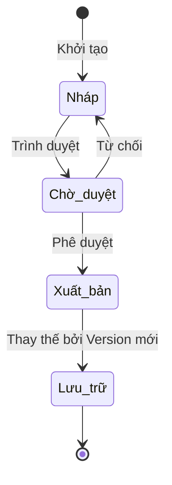

# BF-ACD-03: Khung chương trình

> **Capability:** CAP-ACD (Năng lực Học thuật & Đào tạo)
> **Giai đoạn:** 3 - Hồ sơ & Sản phẩm
> **Nhóm chức năng:** Chương trình đào tạo
> **Mã màn hình:** `syllabus`

---

## 1. Mô tả tổng quan

Phân hệ thiết kế bản thiết kế chi tiết (Syllabus) cho từng Cấp độ học (Level). Nó định nghĩa nội dung giảng dạy phân bổ theo từng bài học/buổi học, đóng vai trò như một "bản khuôn" (template) chuẩn để khi mở Lớp học mới, hệ thống vận hành có thể tự động sinh ra danh sách các buổi học thực tế (Sessions) tương ứng.

## 2. Đối tượng sử dụng (Vai trò)

- **Giám đốc Học thuật:** Phê duyệt bản thiết kế cuối cùng để áp dụng toàn hệ thống.
- **Chuyên viên Học thuật:** Xây dựng, biên soạn chi tiết từng buổi học trong Khung chương trình.

## 3. Ranh giới Nghiệp vụ (Scope)

### Có bao gồm (In Scope)
- Tạo Khung chương trình gắn với một Cấp độ học cụ thể.
- Xây dựng cấu trúc bài học theo thứ tự (Bài 1, Bài 2...).
- Gắn nội dung học thuật (Giáo trình, Chủ đề) vào từng bài học.
- Quản lý phiên bản (Version) của Khung chương trình.

### Không bao gồm (Out of Scope)
- Tạo Cấp độ học (Level) → Đã xử lý tại `BF-ACD-02`.
- Sinh ra Buổi học thực tế có ngày giờ → Thuộc Vận hành lớp học (`CAP-OPS`).
- Xếp Giáo viên đi dạy → Thuộc Vận hành (`CAP-OPS`).

## 4. Mô hình Dữ liệu Nghiệp vụ (Data Entities)

| Tên Thực thể | Trường định danh | Thuộc tính quan trọng | Ràng buộc quan hệ | Diễn giải |
|--------------|------------------|-----------------------|-------------------|----------|
| Khung chương trình | Mã khung CT | Tên, Phiên bản, Trạng thái | Trỏ về Mã Cấp độ | Bản thiết kế tổng thể. |
| Chủ đề Bài học | Mã bài học | Tên bài, Thứ tự buổi học, Loại bài (Học/Thi) | Trỏ về Mã Khung CT | Từng thành phần chi tiết tương ứng với 1 buổi. |

### 4.1. Vòng đời Trạng thái (Status Lifecycle)

*Sơ đồ dưới đây xác định tất cả trạng thái hợp lệ và các phép chuyển đổi được phép.*

**Quy tắc chuyển đổi:**

| Từ trạng thái | Sang trạng thái | Điều kiện bắt buộc | Vai trò được phép |
|---------------|-----------------|---------------------|-------------------|
| Nháp | Chờ duyệt | Phải có ít nhất 1 bài học chi tiết | Chuyên viên Học thuật |
| Chờ duyệt | Xuất bản | Không có | Giám đốc Học thuật |
| Xuất bản | Lưu trữ | Khi phiên bản mới của cùng Cấp độ được Xuất bản | Hệ thống tự động |

### 4.2. Ví dụ Dữ liệu mẫu

*Giúp AI và Lập trình viên tạo dữ liệu kiểm thử chính xác.*

| Tình huống | Dữ liệu đầu vào | Kết quả mong đợi |
|------------|-----------------|-------------------|
| Tạo mới | Tên: "IELTS 5.0 - Syllabus 2026", Phiên bản: v1.0, Cấp độ: IELTS 5.0 | Sinh thành công khung chương trình ở dạng Nháp. |
| Thêm bài học | Bài: "Unit 1: Greeting", Thứ tự: 1, Loại: Lý thuyết | Cập nhật cấu trúc khung. |
| Chuyển trạng thái lỗi | Nháp -> Xuất bản (nhưng khung trống) | Báo lỗi: "Không thể xuất bản khung chương trình trống". |

## 5. Quy tắc Nghiệp vụ Tổng thể (Business Rules)

1. **[RULE-ACD-03-01] Quản lý Phiên bản (Version Control):** Mỗi Cấp độ (Level) chỉ có duy nhất một Khung chương trình ở trạng thái 'Xuất bản'. Nếu xuất bản bản mới, bản cũ sẽ tự động chuyển sang 'Lưu trữ'.
2. **[RULE-ACD-03-02] Tính kế thừa Vận hành:** Khi Lớp học đang sử dụng Khung chương trình V1.0, nếu Phòng Học thuật cập nhật lên V2.0, Lớp học cũ VẪN GIỮ NGUYÊN V1.0. V2.0 chỉ áp dụng cho Lớp mới mở.

## 6. Danh sách Yêu cầu Người dùng (User Stories)

| Mã Yêu cầu | Tên Yêu cầu (Loại màn hình) | Đường dẫn truy cập | Trạng thái |
|------------|-----------------------------|--------------------|------------|
| US-ACD-03-01 | Quản lý danh sách Khung chương trình (Danh sách) | /app/syllabus | Đang soạn thảo |
| US-ACD-03-02 | Tạo/Cập nhật Khung chương trình (Biểu mẫu) | Không có | Đang soạn thảo |
| US-ACD-03-03 | Quản lý chi tiết Bài học trong Khung (Chi tiết) | /app/syllabus/[id] | Đang soạn thảo |
