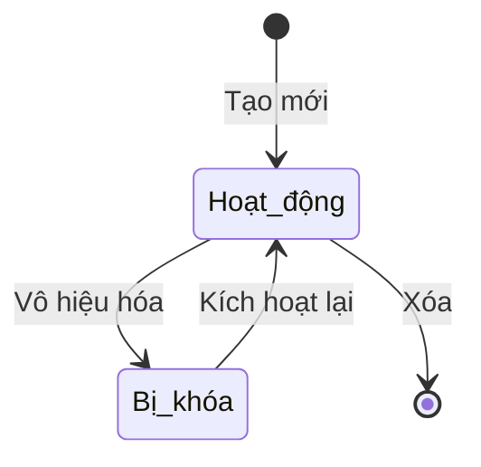

# BF-ACD-05: Nhóm kỹ năng

> **Capability:** CAP-ACD (Năng lực Học thuật & Đào tạo)
> **Giai đoạn:** 3 - Hồ sơ & Sản phẩm
> **Nhóm chức năng:** Chương trình đào tạo
> **Mã màn hình:** `skill_category`

---

## 1. Mô tả tổng quan

Phân hệ quản lý các Thang đo/Nhóm kỹ năng dùng để đánh giá năng lực của học viên. Tùy thuộc vào từng môn học hoặc chương trình đào tạo, trung tâm sẽ cần các tiêu chí chấm điểm khác nhau (Ví dụ: Tiếng Anh thì đánh giá Nghe, Nói, Đọc, Viết; Toán thì đánh giá Đại số, Hình học, Tư duy logic).

## 2. Đối tượng sử dụng (Vai trò)

- **Giám đốc Học thuật:** Định nghĩa và phê duyệt các thang đo chuẩn của trung tâm.
- **Quản trị hệ thống:** Cấu hình danh mục.

## 3. Ranh giới Nghiệp vụ (Scope)

### Có bao gồm (In Scope)
- Tạo danh mục các Nhóm kỹ năng cốt lõi (Category).
- Định nghĩa các Kỹ năng thành phần (Skill) thuộc Nhóm.
- Gắn hệ số/trọng số (Weight) cho từng kỹ năng nếu cần tính điểm trung bình.

### Không bao gồm (Out of Scope)
- Thực hiện việc chấm điểm học viên trên lớp → Xử lý tại `BF-CLS-05`.
- Làm bài kiểm tra đầu vào (Placement Test) → Xử lý tại `BF-ENR-01`.

## 4. Mô hình Dữ liệu Nghiệp vụ (Data Entities)

| Tên Thực thể | Trường định danh | Thuộc tính quan trọng | Ràng buộc quan hệ | Diễn giải |
|--------------|------------------|-----------------------|-------------------|----------|
| Nhóm kỹ năng (Category) | Mã nhóm kỹ năng | Tên nhóm, Trạng thái | Độc lập | Ví dụ: Kỹ năng Tiếng Anh |
| Kỹ năng thành phần (Skill) | Mã kỹ năng | Tên kỹ năng, Trọng số | Trỏ về Mã nhóm kỹ năng | Ví dụ: Nghe (25%), Nói (25%) |

### 4.1. Vòng đời Trạng thái (Status Lifecycle)

*Sơ đồ dưới đây xác định tất cả trạng thái hợp lệ và các phép chuyển đổi được phép.*

**Quy tắc chuyển đổi:**

| Từ trạng thái | Sang trạng thái | Điều kiện bắt buộc | Vai trò được phép |
|---------------|-----------------|---------------------|-------------------|
| Tạo mới | Hoạt động | Đầy đủ thông tin | Giám đốc Học thuật |
| Hoạt động | Bị khóa | Không giới hạn | Giám đốc Học thuật |
| Hoạt động | Xóa | Chưa từng được sử dụng để chấm điểm | Giám đốc Học thuật |

### 4.2. Ví dụ Dữ liệu mẫu

*Giúp AI và Lập trình viên tạo dữ liệu kiểm thử chính xác.*

| Tình huống | Dữ liệu đầu vào | Kết quả mong đợi |
|------------|-----------------|-------------------|
| Tạo Nhóm | Tên: "Tiếng Anh", Trạng thái: Hoạt động | Lưu thành công. |
| Thêm Kỹ năng | Tên: "Listening", Trọng số: 25%, Nhóm: Tiếng Anh | Lưu thành công. |
| Tổng trọng số > 100% | Cố tình nhập trọng số làm tổng lên 110% | Cảnh báo: "Tổng trọng số của nhóm không được vượt quá 100%". |

## 5. Quy tắc Nghiệp vụ Tổng thể (Business Rules)

1. **[RULE-ACD-05-01] Ràng buộc Xóa:** Không thể xóa Nhóm kỹ năng hoặc Kỹ năng thành phần nếu nó đã được sử dụng để lưu trữ điểm số của ít nhất 1 học viên trong hệ thống (chỉ được phép Khóa).

## 6. Danh sách Yêu cầu Người dùng (User Stories)

| Mã Yêu cầu | Tên Yêu cầu (Loại màn hình) | Đường dẫn truy cập | Trạng thái |
|------------|-----------------------------|--------------------|------------|
| US-ACD-05-01 | Quản lý danh mục Nhóm kỹ năng (Danh sách & Biểu mẫu) | /app/skill_category | Đang soạn thảo |
