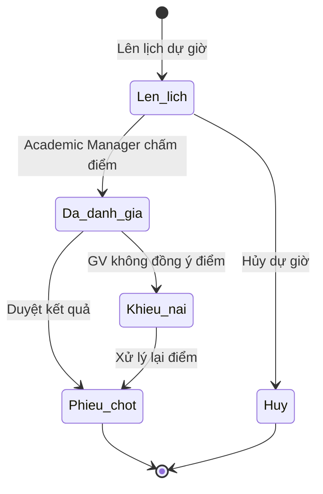

# BF-QA-01: Kiểm soát chất lượng Giáo viên (Teacher QC)

> **Capability:** CAP-ACD (Năng lực Quản lý Học thuật)
> **Giai đoạn:** 3 - Quản lý Học thuật
> **Nhóm chức năng:** Chất lượng
> **Mã màn hình:** `teacher_qc`

---

## 1. Mô tả tổng quan

Phân hệ Kiểm soát chất lượng Giáo viên (Teacher Quality Control) phục vụ việc giám sát, đánh giá và duy trì chất lượng giảng dạy của đội ngũ giáo viên. Nó số hóa quy trình Dự giờ (Class Observation), thu thập phản hồi từ Phụ huynh/Học viên, và quản lý các hình thức xử lý vi phạm chất lượng giảng dạy. Kết quả QC là cơ sở để đào tạo lại (Retraining) hoặc tính thưởng KPI.

## 2. Đối tượng sử dụng (Vai trò)

- **Trưởng bộ môn (Academic Manager):** Người trực tiếp lên lịch dự giờ và đánh giá giáo viên.
- **Giám đốc Chi nhánh (Branch Manager):** Theo dõi chất lượng giáo viên tại cơ sở mình quản lý.
- **Giáo viên (Teacher):** Nhận kết quả đánh giá dự giờ, xem phản hồi của học viên.

## 3. Ranh giới Nghiệp vụ (Scope)

### Có bao gồm (In Scope)
- Lên lịch Dự giờ (Observation Schedule) cho các Lớp học đang diễn ra.
- Thực hiện đánh giá Dự giờ theo các Rubric (Tiêu chí) định nghĩa sẵn (Chuyên môn, Tác phong, Quản lý lớp).
- Tổng hợp điểm đánh giá trung bình từ Feedback của học sinh (đã thu thập từ `BF-CLS-04`).
- Sinh Báo cáo chất lượng (QC Report) định kỳ cho từng Giáo viên.

### Không bao gồm (Out of Scope)
- Tuyển dụng và phỏng vấn đầu vào cho Giáo viên mới → Thuộc hệ thống Tuyển dụng riêng.
- Chấm công, tính lương thưởng → Thuộc hệ thống Kế toán / Payroll.
- Quản lý danh sách lớp học hiện tại của GV → Thuộc `BF-CLS-04` (Quản lý GV tại cơ sở).

## 4. Mô hình Dữ liệu Nghiệp vụ (Data Entities)

| Tên Thực thể | Trường định danh | Thuộc tính quan trọng | Ràng buộc quan hệ | Diễn giải |
|--------------|------------------|-----------------------|-------------------|----------|
| Phiếu Dự giờ (Observation) | Mã Phiếu | Ngày giờ dự, Lớp dự, Điểm tổng (%), Nhận xét | Trỏ về Mã Buổi học (`Session`) & Mã GV | Bằng chứng đánh giá chất lượng. |
| Tiêu chí Đánh giá (Rubric) | Mã Tiêu chí | Tên tiêu chí (VD: Ngữ điệu), Trọng số | Độc lập | Các thang đo chuẩn. |

### 4.1. Vòng đời Trạng thái (Status Lifecycle)

*Sơ đồ dưới đây xác định vòng đời của một Phiếu Dự giờ (Observation).*

**Quy tắc chuyển đổi:**

| Từ trạng thái | Sang trạng thái | Điều kiện bắt buộc | Vai trò được phép |
|---------------|-----------------|---------------------|-------------------|
| Lên lịch | Đã đánh giá | Phải hoàn thành tất cả các Tiêu chí bắt buộc trong Rubric | Trưởng bộ môn |
| Đã đánh giá | Khiếu nại | Bắt buộc GV phải ghi rõ lý do không đồng ý với nhận xét | Giáo viên |

### 4.2. Ví dụ Dữ liệu mẫu

*Giúp AI và Lập trình viên tạo dữ liệu kiểm thử chính xác.*

| Tình huống | Dữ liệu đầu vào | Kết quả mong đợi |
|------------|-----------------|-------------------|
| Lên lịch dự giờ | Trưởng bộ môn chọn Buổi học Tối Thứ 3 của GV Nguyễn A | Lưu Phiếu dự giờ trạng thái "Lên lịch", báo Notification cho GV A biết trước. |
| Chấm dự giờ | Nhập điểm: Chuyên môn 8/10, Tác phong 9/10 | Máy tính tự động ra điểm tổng = 85%. Phiếu chuyển sang "Đã đánh giá". |

## 5. Quy tắc Nghiệp vụ Tổng thể (Business Rules)

1. **[RULE-QA-01-01] Đánh giá theo Session:** Một Phiếu Dự giờ bắt buộc phải được gắn với một `Session` (Buổi học thực tế) cụ thể sinh ra từ `BF-OPS-02`, để làm bằng chứng về việc Trưởng bộ môn có thực sự vào lớp đó dự giờ hay không.

## 6. Danh sách Yêu cầu Người dùng (User Stories)

| Mã Yêu cầu | Tên Yêu cầu (Loại màn hình) | Đường dẫn truy cập | Trạng thái |
|------------|-----------------------------|--------------------|------------|
| US-QA-01-01 | Quản lý danh sách Phiếu dự giờ (Danh sách) | /app/teacher_qc | Đang soạn thảo |
| US-QA-01-02 | Chấm điểm Dự giờ theo Tiêu chí (Biểu mẫu) | /app/teacher_qc/[id] | Đang soạn thảo |
| US-QA-01-03 | Quản lý Bộ tiêu chí đánh giá (Rubric Setup) | Chức năng Cấu hình | Đang soạn thảo |
